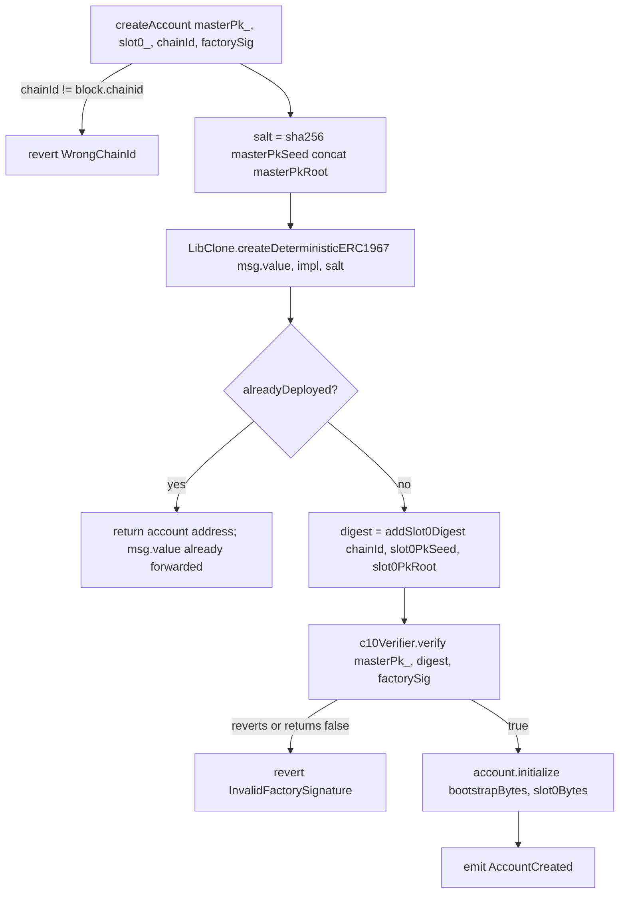
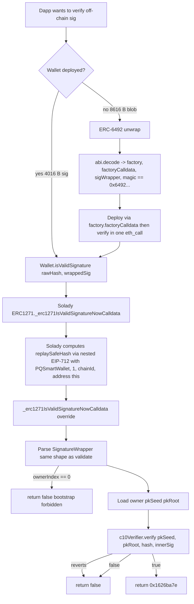
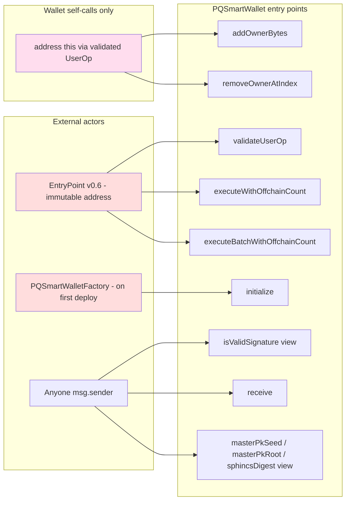

# PQSmartWallet — Diagrams, Actor Map, Invariants, Glossary

Companion to `AUDIT_REVIEW_GOALS.md` + `AUDIT_SCOPE.md`. All diagrams
are Mermaid; GitHub renders them natively, or paste into
`https://mermaid.live`.

---

## 1. Deploy + sign + execute end-to-end

```mermaid
sequenceDiagram
    participant U as User (hands)
    participant FW as PQ1 firmware (S-world)
    participant App as Companion app
    participant B as Bundler (ERC-4337 v0.6)
    participant EP as EntryPoint v0.6
    participant F as PQSmartWalletFactory
    participant W as PQSmartWallet proxy (ERC-1967)
    participant V as SPHINCsC10Asm verifier
    participant T as Target contract

    Note over FW,W: First UserOp on a new chain (FLAG_INCLUDE_INIT_CODE + FLAG_REGISTER_SLOT)
    U->>FW: Confirm on OLED (PIN already unlocked)
    FW->>FW: c10_sign(master, t1_hash)  // bootstrap sig over slot0
    FW->>FW: c10_sign(slot,   t2_hash)  // slot sig over UserOp digest
    FW->>App: initCode (4280 B) + type1 wrapper (4128) + type2 wrapper (4128)
    App->>B: eth_sendUserOperation { initCode, signature=type1Wrapper, callData=addOwnerBytes(slot0) }
    B->>EP: handleOps([UserOp])
    EP->>F: createAccount(masterPkSeed, masterPkRoot, slot0PkSeed, slot0PkRoot, chainId, factorySig)
    F->>V: verify(masterPk*, sha256(DOMAIN||chainId||slot0), factorySig)
    V-->>F: true
    F->>W: LibClone.createDeterministicERC1967  // CREATE2 ERC-1967 proxy
    F->>W: initialize(bootstrapBytes, slot0Bytes)
    EP->>W: validateUserOp(userOp, userOpHash, missingFunds)
    W->>W: _validateSignature  // ownerIndex==0 ⇒ selector must be addOwnerBytes
    W->>V: verify(masterPk*, sphincsDigest, type1Wrapper.sig)
    V-->>W: true
    W->>W: tstore _TS_PENDING_BOOTSTRAP_BUMP = 1
    EP->>W: addOwnerBytes(slot1Bytes)  // execution phase
    W->>W: _addOwner; consume _TS_PENDING_BOOTSTRAP_BUMP; _bumpBootstrapUses

    Note over FW,T: Subsequent UserOp using the slot key
    App->>B: eth_sendUserOperation { sig=type2Wrapper, callData=executeWithOffchainCount(...) }
    B->>EP: handleOps([UserOp])
    EP->>W: validateUserOp
    W->>W: _validateSignature  // ownerIndex>=1 ⇒ selector in _isSlotAllowedSelector
    W->>W: combined-cap check: slotUses[i]+offchainSigCount[i] < MAX_SLOT_USES
    W->>V: verify(slotPk*, sphincsDigest, type2Wrapper.sig)
    V-->>W: true
    W->>W: _bumpSlotUses(i); tstore _TS_VALIDATED_OWNER_INDEX_PLUS_ONE = i+1
    EP->>W: executeWithOffchainCount(i, newOffchainCount, target, value, data)
    W->>W: _consumeValidatedOwnerIndex(i); reject if target==address(this)
    W->>W: _setOffchainSigCount(i, newOffchainCount, slotUses[i], MAX_SLOT_USES)
    W->>T: target.call{value}(data)
```

---

## 2. validateUserOp dispatch (state machine)

```mermaid
flowchart TD
    A[validateUserOp called] -->|msg.sender != entryPoint| Z1[revert NotFromEntryPoint]
    A --> B[Parse SignatureWrapper: ownerIndex, sigOffset==0x40, innerLen==4008, tailPad==0]
    B -->|any check fails| Z2[return SIG_VALIDATION_FAILED = 1]
    B --> C{ownerIndex == 0?}
    C -->|yes| D[Bootstrap path]
    C -->|no| E[Slot path]

    D --> D1{selector == addOwnerBytes.selector?}
    D1 -->|no| Z2
    D1 -->|yes| D2{bootstrapUses < MAX_BOOTSTRAP_USES?}
    D2 -->|no| Z2
    D2 -->|yes| F[verify c10Verifier]

    E --> E1{selector in execute / executeBatch / removeOwnerAtIndex?}
    E1 -->|no| Z2
    E1 -->|yes| E2{slotUses[i] + offchainSigCount[i] < MAX_SLOT_USES?}
    E2 -->|no| Z2
    E2 -->|yes| F

    F -->|verify returns false or reverts| Z2
    F -->|true and ownerIndex==0| G[tstore _TS_PENDING_BOOTSTRAP_BUMP = 1]
    F -->|true and ownerIndex>=1| H[_bumpSlotUses; tstore _TS_VALIDATED_OWNER_INDEX_PLUS_ONE = i+1]
    G --> Y[return SIG_VALIDATION_SUCCESS = 0]
    H --> Y
```

---

## 3. Execute path (transient-storage token consumption)

```mermaid
flowchart TD
    A[executeWithOffchainCount i, newOC, target, value, data] -->|msg.sender != entryPoint| Z1[revert NotFromEntryPoint]
    A --> B[_consumeValidatedOwnerIndex i]
    B -->|tload then tstore 0; expectedPlusOne == 0 OR expectedPlusOne-1 != i| Z2[revert OwnerIndexMismatch]
    B --> C{target == address this?}
    C -->|yes| Z3[revert SelfCallForbidden]
    C -->|no| D[_setOffchainSigCount i, newOC, slotUses[i], MAX_SLOT_USES]
    D -->|newOC < prev| Z4[revert OffchainSigCountNotMonotonic]
    D -->|slotUses+newOC > cap| Z5[revert CombinedSlotCapExceeded]
    D --> E[target.call value data]
    E -->|inner reverts| Z6[bubble inner revert]
    E -->|ok| F[return ret bytes]
```

---

## 4. Factory CREATE2 flow



---

## 5. EIP-1271 / ERC-6492 path



---

## 6. Actor / privilege map



| Function | Caller gate | Auth source | Notes |
|---|---|---|---|
| `validateUserOp` | `msg.sender == _entryPoint` | EntryPoint v0.6, immutable | Returns sentinel, never reverts on bad sig |
| `executeWithOffchainCount` | `msg.sender == _entryPoint` + `_TS_VALIDATED_OWNER_INDEX_PLUS_ONE` match | Slot key via `_validateSignature` | Rejects `target == address(this)` (H-2 fix) |
| `executeBatchWithOffchainCount` | same | same | Per-target self-call check inside loop |
| `addOwnerBytes` | `msg.sender == address(this)` | Bootstrap key via UserOp | Consumes `_TS_PENDING_BOOTSTRAP_BUMP` (M-1 fix) |
| `removeOwnerAtIndex` | `msg.sender == address(this)` | Slot key via UserOp | Refuses index 0 |
| `initialize` | one-shot (`nextOwnerIndex() != 0` reverts) | Factory atomically post-CREATE2 | Impl is locked out via constructor-seeded dummy owner |
| `isValidSignature` (EIP-1271) | none (view) | C10 sig over Solady-nested EIP-712 hash | Bootstrap (`ownerIndex == 0`) forbidden |
| `receive()` | none | none | Bare payable; no state |
| getter views (`entryPoint`, `c10Verifier`, owners, counters) | none | none | Public reads |

### Privileged roles

- **Bootstrap key (ownerIndex == 0).** Can only sign `addOwnerBytes`
  UserOps. Forbidden from EIP-1271. Cannot be removed
  (`CannotRemoveBootstrap`). Per-chain cap: `MAX_BOOTSTRAP_USES =
  65,536`.
- **Slot keys (ownerIndex >= 1).** Can sign `execute*` and
  `removeOwnerAtIndex` UserOps + arbitrary EIP-1271 off-chain
  messages. Per-slot combined cap: `slotUses[i] +
  offchainSigCount[i] < MAX_SLOT_USES = 65,536`.
- **Factory.** Only privileged operation on the wallet is `initialize`,
  callable atomically once per proxy. Has no admin / owner of its own;
  immutable `implementation` + `c10Verifier`.
- **EntryPoint.** Standard ERC-4337 v0.6; trusted to call
  `validateUserOp` and the execute paths in the canonical order.
- **No EOA admin, no UUPS upgrade, no pause/freeze role anywhere.**

---

## 7. System + function invariants (for fuzz / Halmos / Certora)

### Storage invariants (continuously)

| ID | Invariant | Enforced by |
|---|---|---|
| S-1 | `ownerAtIndex[0]` is set on every initialised proxy and is never removed. | `_removeOwnerAtIndex` (`CannotRemoveBootstrap`). |
| S-2 | `ownerAtIndex[i].length ∈ {0, 64}`. | `_addOwnerAtIndex` (`InvalidOwnerBytesLength`). |
| S-3 | Owner bytes follow N-mask layout: bottom 16 B of both `pkSeed` and `pkRoot` are zero. | `_addOwnerAtIndex` (`InvalidNMaskLayout`). |
| S-4 | `bootstrapUses` is monotonic and `<= MAX_BOOTSTRAP_USES`. | `_bumpBootstrapUses` (`require next <= cap`). |
| S-5 | For every `i`: `slotUses[i] + offchainSigCount[i] <= MAX_SLOT_USES`. | `_bumpSlotUses` + `_setOffchainSigCount`. |
| S-6 | `offchainSigCount[i]` is monotonic. | `_setOffchainSigCount` (`OffchainSigCountNotMonotonic`). |
| S-7 | `_entryPoint` and `c10Verifier` are constant for the lifetime of the impl. | `immutable`. |
| S-8 | `implementation` is constant for the lifetime of the factory. | `immutable`. |
| S-9 | The ERC-7201 storage slot is `0x470749ee…d000`. | `_PQ_MULTI_OWNABLE_STORAGE_LOCATION` constant + `StorageSlotParity.t.sol`. |
| S-10 | `nextOwnerIndex` is monotonic. | `_addOwner` increments only. |
| S-11 | `ownerCount = nextOwnerIndex - removedOwnersCount`. | View helper. |

### Transient-storage invariants (per-transaction)

| ID | Invariant | Enforced by |
|---|---|---|
| T-1 | `_TS_PENDING_BOOTSTRAP_BUMP` set ⇔ a bootstrap UserOp was validated and `addOwnerBytes` has not yet consumed it. End-of-tx auto-clears. | `_validateSignature` set; `addOwnerBytes` consume. |
| T-2 | `_TS_VALIDATED_OWNER_INDEX_PLUS_ONE != 0` ⇔ a slot UserOp was validated and `execute*WithOffchainCount` has not yet consumed it. | `_validateSignature` set; `_consumeValidatedOwnerIndex`. |
| T-3 | `_consumeValidatedOwnerIndex(i)` reverts unless the validated `ownerIndex` equals `i`. | `OwnerIndexMismatch`. |

### Validation invariants (per-call)

| ID | Invariant | Enforced by |
|---|---|---|
| V-1 | A UserOp validated under `ownerIndex == 0` must call `addOwnerBytes` and nothing else. | `_validateSignature` selector check. |
| V-2 | A UserOp validated under `ownerIndex >= 1` must call one of `executeWithOffchainCount`, `executeBatchWithOffchainCount`, `removeOwnerAtIndex`. | `_isSlotAllowedSelector`. |
| V-3 | A wrapper with non-zero tail-pad fails validation. | tail-pad mask check. |
| V-4 | A wrapper with offset != 0x40 or innerLen != 4008 fails validation. | length + offset checks. |
| V-5 | `validateUserOp` never reverts on a malformed signature — returns SIG_VALIDATION_FAILED. | every signature-shape failure path returns 1. |
| V-6 | `validateUserOp` reverts only on `NotFromEntryPoint`. | gate at function entry. |
| V-7 | `c10Verifier.verify` returning `false` or reverting is mapped to SIG_VALIDATION_FAILED. | `try / catch`. |
| V-8 | Bootstrap (`ownerIndex == 0`) is never accepted by EIP-1271. | explicit `if (ownerIndex == 0) return false;`. |

### Address invariants (cross-chain)

| ID | Invariant | Enforced by |
|---|---|---|
| A-1 | `salt = sha256(masterPkSeed || masterPkRoot)`. | `_salt`. |
| A-2 | Same `(masterPkSeed, masterPkRoot)` → same proxy address on every chain where factory + impl are at the same addresses. | `LibClone.createDeterministicERC1967` + immutables. |
| A-3 | Factory refuses first-deploy without a bootstrap C10 sig over `(DOMAIN, chainId, slot0PkSeed, slot0PkRoot)`. | `InvalidFactorySignature`. |
| A-4 | Factory accepts `chainId == block.chainid` only. | `WrongChainId`. |

---

## 8. Glossary

| Term | Meaning |
|---|---|
| **SPHINCS+** | NIST stateless hash-based signature scheme (SLH-DSA). Quantum-resistant; security reduces to SHA-256 collision/preimage resistance only. |
| **SPHINCS+C10** | A SPHINCS+ parameter set: `h=18, d=2, a=11, k=13, w=8, l=43, target_sum=205`. Produces **4,008-byte signatures**; per-key budget is `2^h = 2^18 = 262,144` hypertree leaves (we cap at `65,536 = 2^16` for birthday-margin safety). |
| **Bootstrap key** | The wallet's "root" SPHINCS+C10 keypair at `ownerIndex == 0`. Immutable. Can only sign `addOwnerBytes(newSlotKey)` UserOps. |
| **Slot key** | A rotatable SPHINCS+C10 keypair at `ownerIndex >= 1`. Used to sign `execute*` UserOps and off-chain (EIP-1271) sigs. |
| **N-mask layout** | A 32-byte field whose value occupies the top 16 bytes; bottom 16 are zero. SPHINCS+C10 is a 128-bit-security scheme; the verifier still consumes 32-byte words because the underlying hash is SHA-256. |
| **`pkSeed`, `pkRoot`** | The two 32-byte halves of a SPHINCS+ public key (with N-mask layout). Together 64 bytes = `OWNER_BYTES_LEN`. |
| **ERC-4337 v0.6** | The account-abstraction standard version this contract targets. Frozen target — no migration to v0.7/v0.8. |
| **UserOp** | An EIP-4337 UserOperation: `(sender, nonce, initCode, callData, callGasLimit, verificationGasLimit, preVerificationGas, maxFeePerGas, maxPriorityFeePerGas, paymasterAndData, signature)`. |
| **EntryPoint** | The singleton ERC-4337 v0.6 contract that bundlers call to handle UserOps. Calls `validateUserOp` then executes the UserOp's `callData` against the wallet. |
| **`SignatureWrapper`** | `abi.encode(uint256 ownerIndex, bytes c10Sig)`. 4,128 bytes including ABI padding. The same shape is used for on-chain UserOps and off-chain EIP-1271 sigs. |
| **Type 1 sig** | A bootstrap-key (`ownerIndex == 0`) signature authorising `addOwnerBytes`. Burns 1/65,536 of `bootstrapUses`. |
| **Type 2 sig** | A slot-key (`ownerIndex >= 1`) signature authorising `execute*` or `removeOwnerAtIndex`. Burns 1/65,536 of `slotUses[i] + offchainSigCount[i]`. |
| **`sphincsDigest`** | The SHA-256 hash the firmware actually signs. Re-hashes the UserOp fields under SHA-256 (binding `chainId + entryPoint`) instead of using the EntryPoint's keccak `userOpHash`. Done because the STM32U585 has SHA-256 hardware but no keccak hardware. |
| **EIP-1271** | "Verify a signature on behalf of a smart contract." `isValidSignature(hash, sig) → bytes4`. Returns `0x1626ba7e` on success. View-only; never bumps counters. |
| **ERC-6492** | Standard for verifying signatures from **un-deployed** wallets ("counterfactual"). The blob is `abi.encode(factory, factoryCalldata, sigWrapper) || 0x6492…6492`; an aware verifier deploys-then-verifies in one `eth_call`. |
| **Nested EIP-712 (Solady)** | Solady wraps EIP-1271 message hashes with a per-wallet domain separator (`name="PQSmartWallet", version="1", chainId, verifyingContract`) so a captured sig is not replayable across wallets or chains. |
| **ERC-7201** | Namespaced storage layout standard. Locates a struct at `keccak256(abi.encode(uint256(keccak256(namespace)) - 1)) & ~bytes32(uint256(0xff))`. PQ uses `pqsigner.storage.PQMultiOwnable`. |
| **ERC-1967** | Proxy standard. The factory deploys per-user `~55-byte` proxies that `DELEGATECALL` to a shared `implementation`. Per-user deploy cost ~50k gas vs. ~1.1M direct. |
| **Squat defence** | The factory requires a bootstrap-key sig over `(chainId, slot0PkSeed, slot0PkRoot)` on first deploy, so an attacker who reads the public `masterPk*` cannot pre-populate the victim's CREATE2 address with their own slot 0. |
| **MAX_BOOTSTRAP_USES, MAX_SLOT_USES** | Both `65,536 = 2^16`. Per-chain caps tied to SPHINCS+C10's hypertree-budget safety margin. Exhaustion bricks the wallet on that chain (by design — no reset). |
| **`bootstrapUses`** | Per-chain count of accepted Type 1 sigs. Increments only in `addOwnerBytes` (deferred from `_validateSignature` per audit M-1). |
| **`slotUses[i]`** | Per-chain count of accepted Type 2 sigs for owner `i`. Increments in `_validateSignature`. |
| **`offchainSigCount[i]`** | Per-chain count of off-chain (EIP-1271) sigs the firmware reports it has produced for owner `i`. Updated via `executeWithOffchainCount(..., newOffchainCount, ...)`. Combined with `slotUses[i]` for cap enforcement. |
| **Transient storage (EIP-1153)** | `tstore`/`tload` slots that auto-clear at end-of-tx. Used for one-shot tokens (`_TS_VALIDATED_OWNER_INDEX_PLUS_ONE`, `_TS_PENDING_BOOTSTRAP_BUMP`). |
| **"Combined cap"** | The invariant `slotUses[i] + offchainSigCount[i] <= MAX_SLOT_USES` per slot. Means on-chain UserOps and off-chain sigs share one budget. |
| **Halmos** | A symbolic-execution / formal-verification tool for Foundry tests. We use it to discharge "compiles correctly" for the validate + execute paths. |
| **Certora** | A separate FV tool with its own spec language (`*.spec`). We have four spec files; runs require an API key. |
| **PQ1** | The hardware wallet product brand (consumer, retails $149). Synonymous with the secure-element + Cortex-M33 device that signs UserOps using the bootstrap and slot keys in this contract. |
