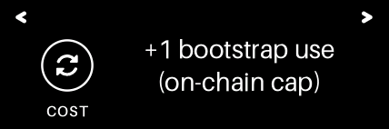
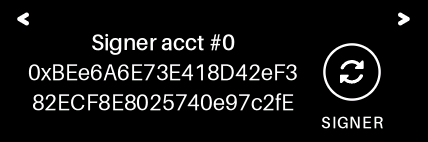
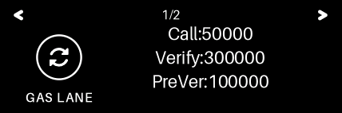

# Pixel trusted-UI screens (QEMU `make e2e-px` transcripts)

Every record below is a proven `[UI-PXR]` transcript screen; the PNG is the
settled frame the engine renders for it (`pqsigner-ui-px` `render_record`).
Regenerate with `E2E_LOG_KEEP=/tmp/e2e.log make e2e-px && python3 tools/ui_screens_export.py --px /tmp/e2e.log`.

## Scenario 0h: canonical Safe exec remains signable

| # | id | page | record text | frame |
|---|----|------|-------------|-------|
| 0 | `EXECUTE` | 1 | id=EXECUTE lab="" cap="EXECUTE SAFE TX?" |  |
| 1 | `NETWORK` | 1 | id=NETWORK lab="" cap="" \| r:on Sepolia |  |
| 2 | `SAFEACCT` | 1 | id=SAFEACCT lab="SAFE ACCT" cap="" \| r:0x5a5A5a5a5A5a5a5a5a5 \| r:A5a5A5A5a5a5A5A5A5A5A |  |
| 3 | `TXINFO` | 1 | id=TXINFO lab="TX INFO" cap="" \| r:Execute now \| r:Op: Call |  |
| 4 | `EMPTYCAL` | 1 | id=EMPTYCAL lab="EMPTY CALL" cap="" \| r:0xA5A5A5A5A5A5 \| r:A5A5A5A5a5a5a5 \| r:a5a5a5A5a5a5a5 |  |
| 5 | `CONFIRM` | 1 | id=CONFIRM lab="" cap="CONFIRM?" |  |
| 6 | `MAXFEE` | 1 | id=MAXFEE lab="MAX FEE" cap="" \| r:Fees: max / tip \| r:10 gwei \| r:2 gwei |  |
| 7 | `WORST` | 1 | id=WORST lab="WORST CASE" cap="" \| r:Worst-case: \| r:0.0045 ETH \| r:(gas: 450000) |  |
| 8 | `SIGNER` | 1 | id=SIGNER lab="SIGNER" cap="" \| s:Signer acct #0 \| r:0xBEe6A6E73E418D42eF3 \| r:82ECF8E8025740e97c2fE |  |
| 9 | `TARGET` | 1 | id=TARGET lab="TARGET" cap="" \| r:0x5a5A5a5a5A5a5a5a5a5 \| r:A5a5A5A5a5a5A5A5A5A5A |  |
| 10 | `GASLANE` | 1 | id=GASLANE lab="GAS LANE" cap="" \| r:Call:50000 \| r:Verify:300000 \| r:PreVer:100000 |  |
| 10 | `GASLANE` | 2 | id=GASLANE lab="GAS LANE" cap="" \| r:Total:450000 |  |
| 11 | `FP8213` | 1 | id=FP8213 lab="ERC-8213" cap="" \| r:8213 Fingerprint \| r:CalldataDigest |  |
| 12 | `DIGEST` | 1 | id=DIGEST lab="DIGEST" cap="" \| r:0x65a2f079b0f8a8dab455a6 \| r:d59796e93aa75e2bb981b9 \| r:d2da4c074b1c3e8bc4c4 |  |
| 13 | `EXECUTE` | 1 | id=EXECUTE lab="" cap="EXECUTE SAFE TX?" |  |

## Scenario 1: register slot 1 on chain A (Type 1 + Type 2)

| # | id | page | record text | frame |
|---|----|------|-------------|-------|
| 1.0 | `ROTATE` | 1 | id=ROTATE lab="" cap="ROTATE SLOT?" |  |
| 1.1 | `ROTATE` | 1 | id=ROTATE lab="ROTATE" cap="" \| r:New signing slot \| r:Slot 1 |  |
| 1.2 | `COST` | 1 | id=COST lab="COST" cap="" \| r:+1 bootstrap use \| r:(on-chain cap) |  |
| 1.3 | `SIGNER` | 1 | id=SIGNER lab="SIGNER" cap="" \| s:Signer acct #0 \| r:0xBEe6A6E73E418D42eF3 \| r:82ECF8E8025740e97c2fE |  |
| 1.4 | `GASLANE` | 1 | id=GASLANE lab="GAS LANE" cap="" \| r:Call:50000 \| r:Verify:300000 \| r:PreVer:100000 |  |
| 1.4 | `GASLANE` | 2 | id=GASLANE lab="GAS LANE" cap="" \| r:Total:450000 |  |
| 1.5 | `ROTATE` | 1 | id=ROTATE lab="" cap="ROTATE SLOT?" |  |
| 2.0 | `SEND` | 1 | id=SEND lab="" cap="SEND 1.000000 ETH?" |  |
| 2.1 | `NETWORK` | 1 | id=NETWORK lab="" cap="" \| r:on Sepolia |  |
| 2.2 | `TO` | 1 | id=TO lab="TO" cap="" \| r:0xabCDEF1234567890ABc \| r:DEF1234567890aBCDeF12 |  |
| 2.3 | `VALUE` | 1 | id=VALUE lab="VALUE" cap="" \| r:1.000000 ETH |  |
| 2.4 | `MAXFEE` | 1 | id=MAXFEE lab="MAX FEE" cap="" \| r:Fees: max / tip \| r:10 gwei \| r:2 gwei |  |
| 2.5 | `CONFIRM` | 1 | id=CONFIRM lab="" cap="CONFIRM?" |  |
| 2.6 | `WORST` | 1 | id=WORST lab="WORST CASE" cap="" \| r:Worst-case: \| r:0.0045 ETH \| r:(gas: 450000) |  |
| 2.7 | `DETAILS` | 1 | id=DETAILS lab="DETAILS" cap="" \| r:Nonce: 2 \| r:Data: 0 B |  |
| 2.8 | `NATIVE` | 1 | id=NATIVE lab="NATIVE VALUE" cap="" \| r:! NATIVE ETH \| r:1.000000 ETH |  |
| 2.9 | `SIGNER` | 1 | id=SIGNER lab="SIGNER" cap="" \| s:Signer acct #0 \| r:0xBEe6A6E73E418D42eF3 \| r:82ECF8E8025740e97c2fE |  |
| 2.10 | `TARGET` | 1 | id=TARGET lab="TARGET" cap="" \| r:0xabCDEF1234567890ABc \| r:DEF1234567890aBCDeF12 |  |
| 2.11 | `GASLANE` | 1 | id=GASLANE lab="GAS LANE" cap="" \| r:Call:50000 \| r:Verify:300000 \| r:PreVer:100000 |  |
| 2.11 | `GASLANE` | 2 | id=GASLANE lab="GAS LANE" cap="" \| r:Total:450000 |  |
| 2.12 | `FP8213` | 1 | id=FP8213 lab="ERC-8213" cap="" \| r:8213 Fingerprint \| r:CalldataDigest |  |
| 2.13 | `DIGEST` | 1 | id=DIGEST lab="DIGEST" cap="" \| r:0x290decd9548b62a8d60345 \| r:a988386fc84ba6bc954840 \| r:08f6362f93160ef3e563 |  |
| 2.14 | `SEND` | 1 | id=SEND lab="" cap="SEND 1.000000 ETH?" |  |

## Scenario 2: repeat sign on chain A slot 1 (Type 2 only)

| # | id | page | record text | frame |
|---|----|------|-------------|-------|
| 0 | `SEND` | 1 | id=SEND lab="" cap="SEND 0.500000 ETH?" |  |
| 1 | `NETWORK` | 1 | id=NETWORK lab="" cap="" \| r:on Sepolia |  |
| 2 | `TO` | 1 | id=TO lab="TO" cap="" \| r:0xabCDEF1234567890ABc \| r:DEF1234567890aBCDeF12 |  |
| 3 | `VALUE` | 1 | id=VALUE lab="VALUE" cap="" \| r:0.500000 ETH |  |
| 4 | `MAXFEE` | 1 | id=MAXFEE lab="MAX FEE" cap="" \| r:Fees: max / tip \| r:10 gwei \| r:2 gwei |  |
| 5 | `CONFIRM` | 1 | id=CONFIRM lab="" cap="CONFIRM?" |  |
| 6 | `WORST` | 1 | id=WORST lab="WORST CASE" cap="" \| r:Worst-case: \| r:0.0045 ETH \| r:(gas: 450000) |  |
| 7 | `DETAILS` | 1 | id=DETAILS lab="DETAILS" cap="" \| r:Nonce: 2 \| r:Data: 0 B |  |
| 8 | `NATIVE` | 1 | id=NATIVE lab="NATIVE VALUE" cap="" \| r:! NATIVE ETH \| r:0.500000 ETH |  |
| 9 | `SIGNER` | 1 | id=SIGNER lab="SIGNER" cap="" \| s:Signer acct #0 \| r:0xBEe6A6E73E418D42eF3 \| r:82ECF8E8025740e97c2fE |  |
| 10 | `TARGET` | 1 | id=TARGET lab="TARGET" cap="" \| r:0xabCDEF1234567890ABc \| r:DEF1234567890aBCDeF12 |  |
| 11 | `GASLANE` | 1 | id=GASLANE lab="GAS LANE" cap="" \| r:Call:50000 \| r:Verify:300000 \| r:PreVer:100000 |  |
| 11 | `GASLANE` | 2 | id=GASLANE lab="GAS LANE" cap="" \| r:Total:450000 |  |
| 12 | `FP8213` | 1 | id=FP8213 lab="ERC-8213" cap="" \| r:8213 Fingerprint \| r:CalldataDigest |  |
| 13 | `DIGEST` | 1 | id=DIGEST lab="DIGEST" cap="" \| r:0x290decd9548b62a8d60345 \| r:a988386fc84ba6bc954840 \| r:08f6362f93160ef3e563 |  |
| 14 | `SEND` | 1 | id=SEND lab="" cap="SEND 0.500000 ETH?" |  |

## Scenario 3: rotate to slot 2 on chain A (Type 1 + Type 2)

| # | id | page | record text | frame |
|---|----|------|-------------|-------|
| 1.0 | `ROTATE` | 1 | id=ROTATE lab="" cap="ROTATE SLOT?" |  |
| 1.1 | `ROTATE` | 1 | id=ROTATE lab="ROTATE" cap="" \| r:New signing slot \| r:Slot 2 |  |
| 1.2 | `COST` | 1 | id=COST lab="COST" cap="" \| r:+1 bootstrap use \| r:(on-chain cap) |  |
| 1.3 | `SIGNER` | 1 | id=SIGNER lab="SIGNER" cap="" \| s:Signer acct #0 \| r:0xBEe6A6E73E418D42eF3 \| r:82ECF8E8025740e97c2fE |  |
| 1.4 | `GASLANE` | 1 | id=GASLANE lab="GAS LANE" cap="" \| r:Call:50000 \| r:Verify:300000 \| r:PreVer:100000 |  |
| 1.4 | `GASLANE` | 2 | id=GASLANE lab="GAS LANE" cap="" \| r:Total:450000 |  |
| 1.5 | `ROTATE` | 1 | id=ROTATE lab="" cap="ROTATE SLOT?" |  |
| 2.0 | `SEND` | 1 | id=SEND lab="" cap="SEND 0.250000 ETH?" |  |
| 2.1 | `NETWORK` | 1 | id=NETWORK lab="" cap="" \| r:on Sepolia |  |
| 2.2 | `TO` | 1 | id=TO lab="TO" cap="" \| r:0xabCDEF1234567890ABc \| r:DEF1234567890aBCDeF12 |  |
| 2.3 | `VALUE` | 1 | id=VALUE lab="VALUE" cap="" \| r:0.250000 ETH |  |
| 2.4 | `MAXFEE` | 1 | id=MAXFEE lab="MAX FEE" cap="" \| r:Fees: max / tip \| r:10 gwei \| r:2 gwei |  |
| 2.5 | `CONFIRM` | 1 | id=CONFIRM lab="" cap="CONFIRM?" |  |
| 2.6 | `WORST` | 1 | id=WORST lab="WORST CASE" cap="" \| r:Worst-case: \| r:0.0045 ETH \| r:(gas: 450000) |  |
| 2.7 | `DETAILS` | 1 | id=DETAILS lab="DETAILS" cap="" \| r:Nonce: 4 \| r:Data: 0 B |  |
| 2.8 | `NATIVE` | 1 | id=NATIVE lab="NATIVE VALUE" cap="" \| r:! NATIVE ETH \| r:0.250000 ETH |  |
| 2.9 | `SIGNER` | 1 | id=SIGNER lab="SIGNER" cap="" \| s:Signer acct #0 \| r:0xBEe6A6E73E418D42eF3 \| r:82ECF8E8025740e97c2fE |  |
| 2.10 | `TARGET` | 1 | id=TARGET lab="TARGET" cap="" \| r:0xabCDEF1234567890ABc \| r:DEF1234567890aBCDeF12 |  |
| 2.11 | `GASLANE` | 1 | id=GASLANE lab="GAS LANE" cap="" \| r:Call:50000 \| r:Verify:300000 \| r:PreVer:100000 |  |
| 2.11 | `GASLANE` | 2 | id=GASLANE lab="GAS LANE" cap="" \| r:Total:450000 |  |
| 2.12 | `FP8213` | 1 | id=FP8213 lab="ERC-8213" cap="" \| r:8213 Fingerprint \| r:CalldataDigest |  |
| 2.13 | `DIGEST` | 1 | id=DIGEST lab="DIGEST" cap="" \| r:0x290decd9548b62a8d60345 \| r:a988386fc84ba6bc954840 \| r:08f6362f93160ef3e563 |  |
| 2.14 | `SEND` | 1 | id=SEND lab="" cap="SEND 0.250000 ETH?" |  |

## Scenario 4: register slot 1 on chain B (Type 1 + Type 2)

| # | id | page | record text | frame |
|---|----|------|-------------|-------|
| 1.0 | `ROTATE` | 1 | id=ROTATE lab="" cap="ROTATE SLOT?" |  |
| 1.1 | `ROTATE` | 1 | id=ROTATE lab="ROTATE" cap="" \| r:New signing slot \| r:Slot 1 |  |
| 1.2 | `COST` | 1 | id=COST lab="COST" cap="" \| r:+1 bootstrap use \| r:(on-chain cap) |  |
| 1.3 | `SIGNER` | 1 | id=SIGNER lab="SIGNER" cap="" \| s:Signer acct #0 \| r:0xBEe6A6E73E418D42eF3 \| r:82ECF8E8025740e97c2fE |  |
| 1.4 | `GASLANE` | 1 | id=GASLANE lab="GAS LANE" cap="" \| r:Call:50000 \| r:Verify:300000 \| r:PreVer:100000 |  |
| 1.4 | `GASLANE` | 2 | id=GASLANE lab="GAS LANE" cap="" \| r:Total:450000 |  |
| 1.5 | `ROTATE` | 1 | id=ROTATE lab="" cap="ROTATE SLOT?" |  |
| 2.0 | `SEND` | 1 | id=SEND lab="" cap="SEND 0.100000 ETH?" |  |
| 2.1 | `NETWORK` | 1 | id=NETWORK lab="" cap="" \| r:on BaseSepolia |  |
| 2.2 | `TO` | 1 | id=TO lab="TO" cap="" \| r:0xabCDEF1234567890ABc \| r:DEF1234567890aBCDeF12 |  |
| 2.3 | `VALUE` | 1 | id=VALUE lab="VALUE" cap="" \| r:0.100000 ETH |  |
| 2.4 | `MAXFEE` | 1 | id=MAXFEE lab="MAX FEE" cap="" \| r:Fees: max / tip \| r:10 gwei \| r:2 gwei |  |
| 2.5 | `CONFIRM` | 1 | id=CONFIRM lab="" cap="CONFIRM?" |  |
| 2.6 | `WORST` | 1 | id=WORST lab="WORST CASE" cap="" \| r:Worst-case: \| r:0.0045 ETH \| r:(gas: 450000) |  |
| 2.7 | `DETAILS` | 1 | id=DETAILS lab="DETAILS" cap="" \| r:Nonce: 2 \| r:Data: 0 B |  |
| 2.8 | `NATIVE` | 1 | id=NATIVE lab="NATIVE VALUE" cap="" \| r:! NATIVE ETH \| r:0.100000 ETH |  |
| 2.9 | `SIGNER` | 1 | id=SIGNER lab="SIGNER" cap="" \| s:Signer acct #0 \| r:0xBEe6A6E73E418D42eF3 \| r:82ECF8E8025740e97c2fE |  |
| 2.10 | `TARGET` | 1 | id=TARGET lab="TARGET" cap="" \| r:0xabCDEF1234567890ABc \| r:DEF1234567890aBCDeF12 |  |
| 2.11 | `GASLANE` | 1 | id=GASLANE lab="GAS LANE" cap="" \| r:Call:50000 \| r:Verify:300000 \| r:PreVer:100000 |  |
| 2.11 | `GASLANE` | 2 | id=GASLANE lab="GAS LANE" cap="" \| r:Total:450000 |  |
| 2.12 | `FP8213` | 1 | id=FP8213 lab="ERC-8213" cap="" \| r:8213 Fingerprint \| r:CalldataDigest |  |
| 2.13 | `DIGEST` | 1 | id=DIGEST lab="DIGEST" cap="" \| r:0x290decd9548b62a8d60345 \| r:a988386fc84ba6bc954840 \| r:08f6362f93160ef3e563 |  |
| 2.14 | `SEND` | 1 | id=SEND lab="" cap="SEND 0.100000 ETH?" |  |

## Scenario 4a: zero-value contract call

| # | id | page | record text | frame |
|---|----|------|-------------|-------|
| 0 | `CALL` | 1 | id=CALL lab="" cap="CONFIRM CONTRACT CALL?" |  |
| 1 | `NETWORK` | 1 | id=NETWORK lab="" cap="" \| r:on Sepolia |  |
| 2 | `TO` | 1 | id=TO lab="TO" cap="" \| r:0x9e3B5c0f7a1d24E86C3 \| r:F0B7d5A2e4C6F8b1D3a7c |  |
| 3 | `VALUE` | 1 | id=VALUE lab="VALUE" cap="" \| r:0.000000 ETH |  |
| 4 | `MAXFEE` | 1 | id=MAXFEE lab="MAX FEE" cap="" \| r:Fees: max / tip \| r:10 gwei \| r:2 gwei |  |
| 5 | `CONFIRM` | 1 | id=CONFIRM lab="" cap="CONFIRM?" |  |
| 6 | `WORST` | 1 | id=WORST lab="WORST CASE" cap="" \| r:Worst-case: \| r:0.0045 ETH \| r:(gas: 450000) |  |
| 7 | `DETAILS` | 1 | id=DETAILS lab="DETAILS" cap="" \| r:Nonce: 4 \| r:Data: 0 B |  |
| 8 | `SIGNER` | 1 | id=SIGNER lab="SIGNER" cap="" \| s:Signer acct #0 \| r:0xBEe6A6E73E418D42eF3 \| r:82ECF8E8025740e97c2fE |  |
| 9 | `TARGET` | 1 | id=TARGET lab="TARGET" cap="" \| r:0x9e3B5c0f7a1d24E86C3 \| r:F0B7d5A2e4C6F8b1D3a7c |  |
| 10 | `GASLANE` | 1 | id=GASLANE lab="GAS LANE" cap="" \| r:Call:50000 \| r:Verify:300000 \| r:PreVer:100000 |  |
| 10 | `GASLANE` | 2 | id=GASLANE lab="GAS LANE" cap="" \| r:Total:450000 |  |
| 11 | `FP8213` | 1 | id=FP8213 lab="ERC-8213" cap="" \| r:8213 Fingerprint \| r:CalldataDigest |  |
| 12 | `DIGEST` | 1 | id=DIGEST lab="DIGEST" cap="" \| r:0x290decd9548b62a8d60345 \| r:a988386fc84ba6bc954840 \| r:08f6362f93160ef3e563 |  |
| 13 | `CALL` | 1 | id=CALL lab="" cap="CONFIRM CONTRACT CALL?" |  |

## Scenario 4b: unknown-token ERC-20 transfer

| # | id | page | record text | frame |
|---|----|------|-------------|-------|
| 0 | `TRANSFER` | 1 | id=TRANSFER lab="" cap="TRANSFER UNKNOWN TOKEN?" |  |
| 1 | `NETWORK` | 1 | id=NETWORK lab="" cap="" \| r:on Sepolia |  |
| 2 | `CONTRACT` | 1 | id=CONTRACT lab="CONTRACT" cap="" \| s:! Unknown token \| r:0x3ca9e5f1B72D04e8A6c \| r:1d9b3f57e28a0c4d6B1e9 |  |
| 3 | `AMOUNT` | 1 | id=AMOUNT lab="AMOUNT" cap="" \| r:(RAW) transfer \| r:12345678901234567890 |  |
| 4 | `TO` | 1 | id=TO lab="TO" cap="" \| r:0xabCDEF1234567890ABc \| r:DEF1234567890aBCDeF12 |  |
| 5 | `CONFIRM` | 1 | id=CONFIRM lab="" cap="CONFIRM?" |  |
| 6 | `MAXFEE` | 1 | id=MAXFEE lab="MAX FEE" cap="" \| r:Fees: max / tip \| r:10 gwei \| r:2 gwei |  |
| 7 | `WORST` | 1 | id=WORST lab="WORST CASE" cap="" \| r:Worst-case: \| r:0.0045 ETH \| r:(gas: 450000) |  |
| 8 | `DETAILS` | 1 | id=DETAILS lab="DETAILS" cap="" \| r:Nonce: 5 \| r:Data: 68 B |  |
| 9 | `SIGNER` | 1 | id=SIGNER lab="SIGNER" cap="" \| s:Signer acct #0 \| r:0xBEe6A6E73E418D42eF3 \| r:82ECF8E8025740e97c2fE |  |
| 10 | `TARGET` | 1 | id=TARGET lab="TARGET" cap="" \| r:0x3ca9e5f1B72D04e8A6c \| r:1d9b3f57e28a0c4d6B1e9 |  |
| 11 | `GASLANE` | 1 | id=GASLANE lab="GAS LANE" cap="" \| r:Call:50000 \| r:Verify:300000 \| r:PreVer:100000 |  |
| 11 | `GASLANE` | 2 | id=GASLANE lab="GAS LANE" cap="" \| r:Total:450000 |  |
| 12 | `FP8213` | 1 | id=FP8213 lab="ERC-8213" cap="" \| r:8213 Fingerprint \| r:CalldataDigest |  |
| 13 | `DIGEST` | 1 | id=DIGEST lab="DIGEST" cap="" \| r:0x4cfc6bb43edee633da3d63 \| r:6f5e562fda90cc4474bd93 \| r:b6b641dabcebb2885888 |  |
| 14 | `TRANSFER` | 1 | id=TRANSFER lab="" cap="TRANSFER UNKNOWN TOKEN?" |  |

## Scenario 4c: first deploy with initCode

| # | id | page | record text | frame |
|---|----|------|-------------|-------|
| 0 | `SEND` | 1 | id=SEND lab="" cap="SEND 0.010000 ETH?" |  |
| 1 | `NETWORK` | 1 | id=NETWORK lab="" cap="" \| r:on Base |  |
| 2 | `TO` | 1 | id=TO lab="TO" cap="" \| r:0xabCDEF1234567890ABc \| r:DEF1234567890aBCDeF12 |  |
| 3 | `VALUE` | 1 | id=VALUE lab="VALUE" cap="" \| r:0.010000 ETH |  |
| 4 | `MAXFEE` | 1 | id=MAXFEE lab="MAX FEE" cap="" \| r:Fees: max / tip \| r:10 gwei \| r:2 gwei |  |
| 5 | `CONFIRM` | 1 | id=CONFIRM lab="" cap="CONFIRM?" |  |
| 6 | `WORST` | 1 | id=WORST lab="WORST CASE" cap="" \| r:Worst-case: \| r:0.0045 ETH \| r:(gas: 450000) |  |
| 7 | `DETAILS` | 1 | id=DETAILS lab="DETAILS" cap="" \| r:Nonce: 0 \| r:Data: 0 B |  |
| 8 | `NATIVE` | 1 | id=NATIVE lab="NATIVE VALUE" cap="" \| r:! NATIVE ETH \| r:0.010000 ETH |  |
| 9 | `SIGNER` | 1 | id=SIGNER lab="SIGNER" cap="" \| s:Signer acct #0 \| r:0xBEe6A6E73E418D42eF3 \| r:82ECF8E8025740e97c2fE |  |
| 10 | `TARGET` | 1 | id=TARGET lab="TARGET" cap="" \| r:0xabCDEF1234567890ABc \| r:DEF1234567890aBCDeF12 |  |
| 11 | `GASLANE` | 1 | id=GASLANE lab="GAS LANE" cap="" \| r:Call:50000 \| r:Verify:300000 \| r:PreVer:100000 |  |
| 11 | `GASLANE` | 2 | id=GASLANE lab="GAS LANE" cap="" \| r:Total:450000 |  |
| 12 | `FP8213` | 1 | id=FP8213 lab="ERC-8213" cap="" \| r:8213 Fingerprint \| r:CalldataDigest |  |
| 13 | `DIGEST` | 1 | id=DIGEST lab="DIGEST" cap="" \| r:0x290decd9548b62a8d60345 \| r:a988386fc84ba6bc954840 \| r:08f6362f93160ef3e563 |  |
| 14 | `DEPLOY` | 1 | id=DEPLOY lab="! DEPLOY" cap="" \| s:DEPLOY FACTORY: \| r:0xe8CE78CD976497447FF \| r:8B76c71b59aE42Af0d452 |  |
| 15 | `SEND` | 1 | id=SEND lab="" cap="SEND 0.010000 ETH?" |  |

## Scenario 5: Safe approveHash clear-sign

| # | id | page | record text | frame |
|---|----|------|-------------|-------|
| 0 | `APPROVE` | 1 | id=APPROVE lab="" cap="APPROVE SAFE TX?" |  |
| 1 | `NETWORK` | 1 | id=NETWORK lab="" cap="" \| r:on Sepolia |  |
| 2 | `SAFEACCT` | 1 | id=SAFEACCT lab="SAFE ACCT" cap="" \| r:0x5aFE000000000000000 \| r:000000000000000000001 |  |
| 3 | `TXINFO` | 1 | id=TXINFO lab="TX INFO" cap="" \| r:Nonce: 17 \| r:Op: Call |  |
| 4 | `UNVERIF` | 1 | id=UNVERIF lab="UNVERIFIED" cap="" \| r:ERC-20 call \| r:token unknown |  |
| 5 | `CONFIRM` | 1 | id=CONFIRM lab="" cap="CONFIRM?" |  |
| 6 | `RAWAMT` | 1 | id=RAWAMT lab="RAW AMOUNT" cap="" \| r:250000000 units |  |
| 7 | `TO` | 1 | id=TO lab="TO" cap="" \| r:0xABaBaBaBABab \| r:ABabAbAbABAbAB \| r:abababaBaBABaB |  |
| 8 | `CONTRACT` | 1 | id=CONTRACT lab="CONTRACT" cap="" \| r:0xA0b86991c6218b36c1d \| r:19D4a2e9Eb0cE3606eB48 |  |
| 9 | `MAXFEE` | 1 | id=MAXFEE lab="MAX FEE" cap="" \| r:Fees: max / tip \| r:10 gwei \| r:2 gwei |  |
| 10 | `WORST` | 1 | id=WORST lab="WORST CASE" cap="" \| r:Worst-case: \| r:0.0045 ETH \| r:(gas: 450000) |  |
| 11 | `SIGNER` | 1 | id=SIGNER lab="SIGNER" cap="" \| s:Signer acct #0 \| r:0xBEe6A6E73E418D42eF3 \| r:82ECF8E8025740e97c2fE |  |
| 12 | `TARGET` | 1 | id=TARGET lab="TARGET" cap="" \| r:0x5aFE000000000000000 \| r:000000000000000000001 |  |
| 13 | `GASLANE` | 1 | id=GASLANE lab="GAS LANE" cap="" \| r:Call:50000 \| r:Verify:300000 \| r:PreVer:100000 |  |
| 13 | `GASLANE` | 2 | id=GASLANE lab="GAS LANE" cap="" \| r:Total:450000 |  |
| 14 | `FP8213` | 1 | id=FP8213 lab="ERC-8213" cap="" \| r:8213 Fingerprint \| r:CalldataDigest |  |
| 15 | `DIGEST` | 1 | id=DIGEST lab="DIGEST" cap="" \| r:0x20d91e6a7ee38f31d0d8d8 \| r:88544c928f98b94e3e71b6 \| r:8934caef277f253c4600 |  |
| 16 | `APPROVE` | 1 | id=APPROVE lab="" cap="APPROVE SAFE TX?" |  |

## Scenario 5b: verified function-selector bundle

| # | id | page | record text | frame |
|---|----|------|-------------|-------|
| 0 | `BLIND` | 1 | id=BLIND lab="" cap="CONFIRM BLIND SIGN?" |  |
| 1 | `NETWORK` | 1 | id=NETWORK lab="" cap="" \| r:on Sepolia |  |
| 2 | `FUNCTION` | 1 | id=FUNCTION lab="FUNCTION" cap="" \| s:! BLIND SIGN \| r:balanceOf(address) |  |
| 3 | `ARG0` | 1 | id=ARG0 lab="ARG 0" cap="" \| r:0xABaBaBaBABab \| r:ABabAbAbABAbAB \| r:abababaBaBABaB |  |
| 4 | `TO` | 1 | id=TO lab="TO" cap="" \| r:0xfefeFEFeFEFEFEFEFeF \| r:efefefefeFEfEfefefEfe |  |
| 5 | `CONFIRM` | 1 | id=CONFIRM lab="" cap="CONFIRM?" |  |
| 6 | `MAXFEE` | 1 | id=MAXFEE lab="MAX FEE" cap="" \| r:Fees: max / tip \| r:10 gwei \| r:2 gwei |  |
| 7 | `WORST` | 1 | id=WORST lab="WORST CASE" cap="" \| r:Worst-case: \| r:0.0045 ETH \| r:(gas: 450000) |  |
| 8 | `DETAILS` | 1 | id=DETAILS lab="DETAILS" cap="" \| r:Nonce: 5 \| r:Data: 36 B |  |
| 9 | `SIGNER` | 1 | id=SIGNER lab="SIGNER" cap="" \| s:Signer acct #0 \| r:0xBEe6A6E73E418D42eF3 \| r:82ECF8E8025740e97c2fE |  |
| 10 | `TARGET` | 1 | id=TARGET lab="TARGET" cap="" \| r:0xfefeFEFeFEFEFEFEFeF \| r:efefefefeFEfEfefefEfe |  |
| 11 | `GASLANE` | 1 | id=GASLANE lab="GAS LANE" cap="" \| r:Call:50000 \| r:Verify:300000 \| r:PreVer:100000 |  |
| 11 | `GASLANE` | 2 | id=GASLANE lab="GAS LANE" cap="" \| r:Total:450000 |  |
| 12 | `FP8213` | 1 | id=FP8213 lab="ERC-8213" cap="" \| r:8213 Fingerprint \| r:CalldataDigest |  |
| 13 | `DIGEST` | 1 | id=DIGEST lab="DIGEST" cap="" \| r:0x29a9350d4d0b50ba49a7f2 \| r:457e9b95ba29bacacaef97 \| r:354f9ec01d0cb404ea22 |  |
| 14 | `BLIND` | 1 | id=BLIND lab="" cap="CONFIRM BLIND SIGN?" |  |

## Scenario 5v: companion-supplied ERC-20 metadata trailer

| # | id | page | record text | frame |
|---|----|------|-------------|-------|
| 1.0 | `ROTATE` | 1 | id=ROTATE lab="" cap="ROTATE SLOT?" |  |
| 1.1 | `ROTATE` | 1 | id=ROTATE lab="ROTATE" cap="" \| r:New signing slot \| r:Slot 5 |  |
| 1.2 | `COST` | 1 | id=COST lab="COST" cap="" \| r:+1 bootstrap use \| r:(on-chain cap) |  |
| 1.3 | `SIGNER` | 1 | id=SIGNER lab="SIGNER" cap="" \| s:Signer acct #0 \| r:0xBEe6A6E73E418D42eF3 \| r:82ECF8E8025740e97c2fE |  |
| 1.4 | `GASLANE` | 1 | id=GASLANE lab="GAS LANE" cap="" \| r:Call:50000 \| r:Verify:300000 \| r:PreVer:100000 |  |
| 1.4 | `GASLANE` | 2 | id=GASLANE lab="GAS LANE" cap="" \| r:Total:450000 |  |
| 1.5 | `ROTATE` | 1 | id=ROTATE lab="" cap="ROTATE SLOT?" |  |
| 2.0 | `SEND` | 1 | id=SEND lab="" cap="SEND 123.45 TEL?" |  |
| 2.1 | `NETWORK` | 1 | id=NETWORK lab="" cap="" \| r:on Base |  |
| 2.2 | `TO` | 1 | id=TO lab="TO" cap="" \| r:0xCdCDCdCdcdcd \| r:cdCdcDcDCdcDcD \| r:CdCdcdCdcDCDcD |  |
| 2.3 | `AMOUNT` | 1 | id=AMOUNT lab="SEND" cap="" \| r:123.45 TEL |  |
| 2.4 | `CONTRACT` | 1 | id=CONTRACT lab="CONTRACT" cap="" \| s:Telcoin \| r:0x09bE1692ca16e06f536 \| r:F0038fF11D1dA8524aDB1 |  |
| 2.5 | `CONFIRM` | 1 | id=CONFIRM lab="" cap="CONFIRM?" |  |
| 2.6 | `MAXFEE` | 1 | id=MAXFEE lab="MAX FEE" cap="" \| r:Fees: max / tip \| r:10 gwei \| r:2 gwei |  |
| 2.7 | `WORST` | 1 | id=WORST lab="WORST CASE" cap="" \| r:Worst-case: \| r:0.0045 ETH \| r:(gas: 450000) |  |
| 2.8 | `DETAILS` | 1 | id=DETAILS lab="DETAILS" cap="" \| r:Nonce: 7 \| r:Data: 68 B |  |
| 2.9 | `SIGNER` | 1 | id=SIGNER lab="SIGNER" cap="" \| s:Signer acct #0 \| r:0xBEe6A6E73E418D42eF3 \| r:82ECF8E8025740e97c2fE |  |
| 2.10 | `TARGET` | 1 | id=TARGET lab="TARGET" cap="" \| r:0x09bE1692ca16e06f536 \| r:F0038fF11D1dA8524aDB1 |  |
| 2.11 | `GASLANE` | 1 | id=GASLANE lab="GAS LANE" cap="" \| r:Call:50000 \| r:Verify:300000 \| r:PreVer:100000 |  |
| 2.11 | `GASLANE` | 2 | id=GASLANE lab="GAS LANE" cap="" \| r:Total:450000 |  |
| 2.12 | `FP8213` | 1 | id=FP8213 lab="ERC-8213" cap="" \| r:8213 Fingerprint \| r:CalldataDigest |  |
| 2.13 | `DIGEST` | 1 | id=DIGEST lab="DIGEST" cap="" \| r:0x15228560450644904b77c1 \| r:80fd36b793f2088410cbad \| r:d6886f38aca39ab36ca9 |  |
| 2.14 | `SEND` | 1 | id=SEND lab="" cap="SEND 123.45 TEL?" |  |

## Scenario 5m-nested: ERC-7730 nested proof set matches + signs

| # | id | page | record text | frame |
|---|----|------|-------------|-------|
| 0 | `ROTATE` | 1 | id=ROTATE lab="" cap="ROTATE SLOT?" |  |
| 1 | `ROTATE` | 1 | id=ROTATE lab="ROTATE" cap="" \| r:New signing slot \| r:Slot 1 |  |
| 2 | `COST` | 1 | id=COST lab="COST" cap="" \| r:+1 bootstrap use \| r:(on-chain cap) |  |
| 3 | `SIGNER` | 1 | id=SIGNER lab="SIGNER" cap="" \| s:Signer acct #0 \| r:0xBEe6A6E73E418D42eF3 \| r:82ECF8E8025740e97c2fE |  |
| 4 | `GASLANE` | 1 | id=GASLANE lab="GAS LANE" cap="" \| r:Call:50000 \| r:Verify:300000 \| r:PreVer:100000 |  |
| 4 | `GASLANE` | 2 | id=GASLANE lab="GAS LANE" cap="" \| r:Total:450000 |  |
| 5 | `ROTATE` | 1 | id=ROTATE lab="" cap="ROTATE SLOT?" |  |

## Scenario 5w: companion-supplied address-name trailer

| # | id | page | record text | frame |
|---|----|------|-------------|-------|
| 1.0 | `ROTATE` | 1 | id=ROTATE lab="" cap="ROTATE SLOT?" |  |
| 1.1 | `ROTATE` | 1 | id=ROTATE lab="ROTATE" cap="" \| r:New signing slot \| r:Slot 6 |  |
| 1.2 | `COST` | 1 | id=COST lab="COST" cap="" \| r:+1 bootstrap use \| r:(on-chain cap) |  |
| 1.3 | `SIGNER` | 1 | id=SIGNER lab="SIGNER" cap="" \| s:Signer acct #0 \| r:0xBEe6A6E73E418D42eF3 \| r:82ECF8E8025740e97c2fE |  |
| 1.4 | `GASLANE` | 1 | id=GASLANE lab="GAS LANE" cap="" \| r:Call:50000 \| r:Verify:300000 \| r:PreVer:100000 |  |
| 1.4 | `GASLANE` | 2 | id=GASLANE lab="GAS LANE" cap="" \| r:Total:450000 |  |
| 1.5 | `ROTATE` | 1 | id=ROTATE lab="" cap="ROTATE SLOT?" |  |
| 2.0 | `SEND` | 1 | id=SEND lab="" cap="SEND 0.000001 ETH?" |  |
| 2.1 | `NETWORK` | 1 | id=NETWORK lab="" cap="" \| r:on Base |  |
| 2.2 | `TO` | 1 | id=TO lab="TO" cap="" \| s:Uniswap V3 Router \| r:0xE592427A0AEce92De3E \| r:dee1F18E0157C05861564 |  |
| 2.3 | `VALUE` | 1 | id=VALUE lab="VALUE" cap="" \| r:0.000001 ETH |  |
| 2.4 | `MAXFEE` | 1 | id=MAXFEE lab="MAX FEE" cap="" \| r:Fees: max / tip \| r:10 gwei \| r:2 gwei |  |
| 2.5 | `CONFIRM` | 1 | id=CONFIRM lab="" cap="CONFIRM?" |  |
| 2.6 | `WORST` | 1 | id=WORST lab="WORST CASE" cap="" \| r:Worst-case: \| r:0.0045 ETH \| r:(gas: 450000) |  |
| 2.7 | `DETAILS` | 1 | id=DETAILS lab="DETAILS" cap="" \| r:Nonce: 8 \| r:Data: 0 B |  |
| 2.8 | `NATIVE` | 1 | id=NATIVE lab="NATIVE VALUE" cap="" \| r:! NATIVE ETH \| r:0.000001 ETH |  |
| 2.9 | `SIGNER` | 1 | id=SIGNER lab="SIGNER" cap="" \| s:Signer acct #0 \| r:0xBEe6A6E73E418D42eF3 \| r:82ECF8E8025740e97c2fE |  |
| 2.10 | `TARGET` | 1 | id=TARGET lab="TARGET" cap="" \| r:0xE592427A0AEce92De3E \| r:dee1F18E0157C05861564 |  |
| 2.11 | `GASLANE` | 1 | id=GASLANE lab="GAS LANE" cap="" \| r:Call:50000 \| r:Verify:300000 \| r:PreVer:100000 |  |
| 2.11 | `GASLANE` | 2 | id=GASLANE lab="GAS LANE" cap="" \| r:Total:450000 |  |
| 2.12 | `FP8213` | 1 | id=FP8213 lab="ERC-8213" cap="" \| r:8213 Fingerprint \| r:CalldataDigest |  |
| 2.13 | `DIGEST` | 1 | id=DIGEST lab="DIGEST" cap="" \| r:0x290decd9548b62a8d60345 \| r:a988386fc84ba6bc954840 \| r:08f6362f93160ef3e563 |  |
| 2.14 | `SEND` | 1 | id=SEND lab="" cap="SEND 0.000001 ETH?" |  |

## Scenario 5c: cross-check rejects mismatched selector

| # | id | page | record text | frame |
|---|----|------|-------------|-------|
| 0 | `UNKNOWN` | 1 | id=UNKNOWN lab="" cap="CONFIRM UNKNOWN CALL?" |  |
| 1 | `NETWORK` | 1 | id=NETWORK lab="" cap="" \| r:on Sepolia |  |
| 2 | `BLINDSGN` | 1 | id=BLINDSGN lab="BLIND SIGN" cap="" \| r:Unknown call \| r:Verify on dapp |  |
| 3 | `TO` | 1 | id=TO lab="TO" cap="" \| r:0xfefeFEFeFEFEFEFEFeF \| r:efefefefeFEfEfefefEfe |  |
| 4 | `AMOUNT` | 1 | id=AMOUNT lab="AMOUNT" cap="" \| r:0 ETH |  |
| 5 | `CONFIRM` | 1 | id=CONFIRM lab="" cap="CONFIRM?" |  |
| 6 | `CALLDATA` | 1 | id=CALLDATA lab="CALL DATA" cap="" \| r:Selector: 0x70a08231 \| r:Data: 36 B |  |
| 7 | `DATAHASH` | 1 | id=DATAHASH lab="DATA HASH" cap="" \| r:0xfb7d093103926e09abdf24 \| r:01b035d74cdee4ed9f448c \| r:fea20659cce733370e23 |  |
| 8 | `MAXFEE` | 1 | id=MAXFEE lab="MAX FEE" cap="" \| r:Fees: max / tip \| r:10 gwei \| r:2 gwei |  |
| 9 | `WORST` | 1 | id=WORST lab="WORST CASE" cap="" \| r:Worst-case: \| r:0.0045 ETH \| r:(gas: 450000) |  |
| 10 | `DETAILS` | 1 | id=DETAILS lab="DETAILS" cap="" \| r:Nonce: 6 \| r:Data: 36 B |  |
| 11 | `SIGNER` | 1 | id=SIGNER lab="SIGNER" cap="" \| s:Signer acct #0 \| r:0xBEe6A6E73E418D42eF3 \| r:82ECF8E8025740e97c2fE |  |
| 12 | `TARGET` | 1 | id=TARGET lab="TARGET" cap="" \| r:0xfefeFEFeFEFEFEFEFeF \| r:efefefefeFEfEfefefEfe |  |
| 13 | `GASLANE` | 1 | id=GASLANE lab="GAS LANE" cap="" \| r:Call:50000 \| r:Verify:300000 \| r:PreVer:100000 |  |
| 13 | `GASLANE` | 2 | id=GASLANE lab="GAS LANE" cap="" \| r:Total:450000 |  |
| 14 | `FP8213` | 1 | id=FP8213 lab="ERC-8213" cap="" \| r:8213 Fingerprint \| r:CalldataDigest |  |
| 15 | `DIGEST` | 1 | id=DIGEST lab="DIGEST" cap="" \| r:0x29a9350d4d0b50ba49a7f2 \| r:457e9b95ba29bacacaef97 \| r:354f9ec01d0cb404ea22 |  |
| 16 | `UNKNOWN` | 1 | id=UNKNOWN lab="" cap="CONFIRM UNKNOWN CALL?" |  |

## Scenario 5d: typed walker declines, blind-sign fallback

| # | id | page | record text | frame |
|---|----|------|-------------|-------|
| 0 | `UNKNOWN` | 1 | id=UNKNOWN lab="" cap="CONFIRM UNKNOWN CALL?" |  |
| 1 | `NETWORK` | 1 | id=NETWORK lab="" cap="" \| r:on Sepolia |  |
| 2 | `BLINDSGN` | 1 | id=BLINDSGN lab="BLIND SIGN" cap="" \| r:Unknown call \| r:Verify on dapp |  |
| 3 | `FUNCTION` | 1 | id=FUNCTION lab="FUNCTION" cap="" \| r:transfer(address, \| r:uint256) |  |
| 4 | `TO` | 1 | id=TO lab="TO" cap="" \| r:0xfefeFEFeFEFEFEFEFeF \| r:efefefefeFEfEfefefEfe |  |
| 5 | `CONFIRM` | 1 | id=CONFIRM lab="" cap="CONFIRM?" |  |
| 6 | `AMOUNT` | 1 | id=AMOUNT lab="AMOUNT" cap="" \| r:0 ETH |  |
| 7 | `CALLDATA` | 1 | id=CALLDATA lab="CALL DATA" cap="" \| r:Selector: 0xa9059cbb \| r:Data: 36 B |  |
| 8 | `DATAHASH` | 1 | id=DATAHASH lab="DATA HASH" cap="" \| r:0x7eba394a6103e6585dddbc \| r:83a85e64ec5abdb339bd13 \| r:bf4e995fbcbe4735416a |  |
| 9 | `MAXFEE` | 1 | id=MAXFEE lab="MAX FEE" cap="" \| r:Fees: max / tip \| r:10 gwei \| r:2 gwei |  |
| 10 | `WORST` | 1 | id=WORST lab="WORST CASE" cap="" \| r:Worst-case: \| r:0.0045 ETH \| r:(gas: 450000) |  |
| 11 | `DETAILS` | 1 | id=DETAILS lab="DETAILS" cap="" \| r:Nonce: 7 \| r:Data: 36 B |  |
| 12 | `SIGNER` | 1 | id=SIGNER lab="SIGNER" cap="" \| s:Signer acct #0 \| r:0xBEe6A6E73E418D42eF3 \| r:82ECF8E8025740e97c2fE |  |
| 13 | `TARGET` | 1 | id=TARGET lab="TARGET" cap="" \| r:0xfefeFEFeFEFEFEFEFeF \| r:efefefefeFEfEfefefEfe |  |
| 14 | `GASLANE` | 1 | id=GASLANE lab="GAS LANE" cap="" \| r:Call:50000 \| r:Verify:300000 \| r:PreVer:100000 |  |
| 14 | `GASLANE` | 2 | id=GASLANE lab="GAS LANE" cap="" \| r:Total:450000 |  |
| 15 | `FP8213` | 1 | id=FP8213 lab="ERC-8213" cap="" \| r:8213 Fingerprint \| r:CalldataDigest |  |
| 16 | `DIGEST` | 1 | id=DIGEST lab="DIGEST" cap="" \| r:0x56abc700fd68d31a422773 \| r:9c599304ab9f7626d60db0 \| r:a348ce4d0d10c55d6a00 |  |
| 17 | `UNKNOWN` | 1 | id=UNKNOWN lab="" cap="CONFIRM UNKNOWN CALL?" |  |

## Scenario 5j: self-attest typed render

| # | id | page | record text | frame |
|---|----|------|-------------|-------|
| 0 | `BLIND` | 1 | id=BLIND lab="" cap="CONFIRM UNVERIFIED CALL?" |  |
| 1 | `NETWORK` | 1 | id=NETWORK lab="" cap="" \| r:on Sepolia |  |
| 2 | `GUESS` | 1 | id=GUESS lab="GUESS" cap="" \| s:! UNVERIFIED \| r:transfer(uint256) |  |
| 3 | `ARG0` | 1 | id=ARG0 lab="ARG 0" cap="" \| s:uint256: \| r:1000 |  |
| 4 | `TO` | 1 | id=TO lab="TO" cap="" \| r:0xfefeFEFeFEFEFEFEFeF \| r:efefefefeFEfEfefefEfe |  |
| 5 | `CONFIRM` | 1 | id=CONFIRM lab="" cap="CONFIRM?" |  |
| 6 | `MAXFEE` | 1 | id=MAXFEE lab="MAX FEE" cap="" \| r:Fees: max / tip \| r:10 gwei \| r:2 gwei |  |
| 7 | `WORST` | 1 | id=WORST lab="WORST CASE" cap="" \| r:Worst-case: \| r:0.0045 ETH \| r:(gas: 450000) |  |
| 8 | `DETAILS` | 1 | id=DETAILS lab="DETAILS" cap="" \| r:Nonce: 8 \| r:Data: 36 B |  |
| 9 | `SIGNER` | 1 | id=SIGNER lab="SIGNER" cap="" \| s:Signer acct #0 \| r:0xBEe6A6E73E418D42eF3 \| r:82ECF8E8025740e97c2fE |  |
| 10 | `TARGET` | 1 | id=TARGET lab="TARGET" cap="" \| r:0xfefeFEFeFEFEFEFEFeF \| r:efefefefeFEfEfefefEfe |  |
| 11 | `GASLANE` | 1 | id=GASLANE lab="GAS LANE" cap="" \| r:Call:50000 \| r:Verify:300000 \| r:PreVer:100000 |  |
| 11 | `GASLANE` | 2 | id=GASLANE lab="GAS LANE" cap="" \| r:Total:450000 |  |
| 12 | `FP8213` | 1 | id=FP8213 lab="ERC-8213" cap="" \| r:8213 Fingerprint \| r:CalldataDigest |  |
| 13 | `DIGEST` | 1 | id=DIGEST lab="DIGEST" cap="" \| r:0x5dda91b7c370b5b4f4af26 \| r:138448ff367c360764b4d6 \| r:e1854b58a38b94ccf54a |  |
| 14 | `BLIND` | 1 | id=BLIND lab="" cap="CONFIRM UNVERIFIED CALL?" |  |

## Scenario 5k: self-attest keccak mismatch dropped

| # | id | page | record text | frame |
|---|----|------|-------------|-------|
| 0 | `UNKNOWN` | 1 | id=UNKNOWN lab="" cap="CONFIRM UNKNOWN CALL?" |  |
| 1 | `NETWORK` | 1 | id=NETWORK lab="" cap="" \| r:on Sepolia |  |
| 2 | `BLINDSGN` | 1 | id=BLINDSGN lab="BLIND SIGN" cap="" \| r:Unknown call \| r:Verify on dapp |  |
| 3 | `TO` | 1 | id=TO lab="TO" cap="" \| r:0xfefeFEFeFEFEFEFEFeF \| r:efefefefeFEfEfefefEfe |  |
| 4 | `AMOUNT` | 1 | id=AMOUNT lab="AMOUNT" cap="" \| r:0 ETH |  |
| 5 | `CONFIRM` | 1 | id=CONFIRM lab="" cap="CONFIRM?" |  |
| 6 | `CALLDATA` | 1 | id=CALLDATA lab="CALL DATA" cap="" \| r:Selector: 0x12514bba \| r:Data: 36 B |  |
| 7 | `DATAHASH` | 1 | id=DATAHASH lab="DATA HASH" cap="" \| r:0x029082bb13b30b74c3c6b9 \| r:743efc970fe06e6782a9e9 \| r:f62d9f75ed5e27ad3ee6 |  |
| 8 | `MAXFEE` | 1 | id=MAXFEE lab="MAX FEE" cap="" \| r:Fees: max / tip \| r:10 gwei \| r:2 gwei |  |
| 9 | `WORST` | 1 | id=WORST lab="WORST CASE" cap="" \| r:Worst-case: \| r:0.0045 ETH \| r:(gas: 450000) |  |
| 10 | `DETAILS` | 1 | id=DETAILS lab="DETAILS" cap="" \| r:Nonce: 9 \| r:Data: 36 B |  |
| 11 | `SIGNER` | 1 | id=SIGNER lab="SIGNER" cap="" \| s:Signer acct #0 \| r:0xBEe6A6E73E418D42eF3 \| r:82ECF8E8025740e97c2fE |  |
| 12 | `TARGET` | 1 | id=TARGET lab="TARGET" cap="" \| r:0xfefeFEFeFEFEFEFEFeF \| r:efefefefeFEfEfefefEfe |  |
| 13 | `GASLANE` | 1 | id=GASLANE lab="GAS LANE" cap="" \| r:Call:50000 \| r:Verify:300000 \| r:PreVer:100000 |  |
| 13 | `GASLANE` | 2 | id=GASLANE lab="GAS LANE" cap="" \| r:Total:450000 |  |
| 14 | `FP8213` | 1 | id=FP8213 lab="ERC-8213" cap="" \| r:8213 Fingerprint \| r:CalldataDigest |  |
| 15 | `DIGEST` | 1 | id=DIGEST lab="DIGEST" cap="" \| r:0x0a67b1709a8404c63d8213 \| r:c205a30d97c06321160671 \| r:00c7357acfeb24dd6c36 |  |
| 16 | `UNKNOWN` | 1 | id=UNKNOWN lab="" cap="CONFIRM UNKNOWN CALL?" |  |

## Scenario 5q: Safe-wrapped CoW presign clear-sign

| # | id | page | record text | frame |
|---|----|------|-------------|-------|
| 0 | `APPROVE` | 1 | id=APPROVE lab="" cap="APPROVE SAFE TX?" |  |
| 1 | `NETWORK` | 1 | id=NETWORK lab="" cap="" \| r:on Sepolia |  |
| 2 | `SAFEACCT` | 1 | id=SAFEACCT lab="SAFE ACCT" cap="" \| r:0x5AFE000000000000000 \| r:000000000000000000002 |  |
| 3 | `TXINFO` | 1 | id=TXINFO lab="TX INFO" cap="" \| r:Nonce: 18 \| r:Op: Call |  |
| 4 | `COWORDER` | 1 | id=COWORDER lab="COW ORDER" cap="" \| r:SELL order \| r:owner: this Safe |  |
| 5 | `CONFIRM` | 1 | id=CONFIRM lab="" cap="CONFIRM?" |  |
| 6 | `SELLTOK` | 1 | id=SELLTOK lab="SELL TOKEN" cap="" \| r:0xA0b86991c6218b36c1d \| r:19D4a2e9Eb0cE3606eB48 |  |
| 7 | `SELLAMT` | 1 | id=SELLAMT lab="SELL" cap="" \| r:0x0000000000000000000000 \| r:0000000000000000000000 \| r:0000000000003b9aca00 |  |
| 8 | `BUYTOK` | 1 | id=BUYTOK lab="BUY TOKEN" cap="" \| r:0xC02aaA39b223 \| r:FE8D0A0e5C4F27 \| r:eAD9083C756Cc2 |  |
| 9 | `BUYAMT` | 1 | id=BUYAMT lab="BUY MIN" cap="" \| r:0x0000000000000000000000 \| r:0000000000000000000000 \| r:000006f05b59d3b20000 |  |
| 10 | `RECEIVER` | 1 | id=RECEIVER lab="RECEIVER" cap="" \| r:= the Safe |  |
| 11 | `EXPIRES` | 1 | id=EXPIRES lab="EXPIRES" cap="" \| r:unix 1744830464 \| r:Partial: no |  |
| 12 | `FEE` | 1 | id=FEE lab="FEE (SELL)" cap="" \| r:0 units |  |
| 13 | `SOURCES` | 1 | id=SOURCES lab="SOURCES" cap="" \| r:sell: erc20 \| r:buy: erc20 |  |
| 14 | `APPDATA` | 1 | id=APPDATA lab="APP DATA" cap="" \| r:0x0000000000000000 \| r:0000000000000000 |  |
| 14 | `APPDATA` | 2 | id=APPDATA lab="APP DATA" cap="" \| r:0000000000000000 \| r:0000000000000000 |  |
| 15 | `MAXFEE` | 1 | id=MAXFEE lab="MAX FEE" cap="" \| r:Fees: max / tip \| r:10 gwei \| r:2 gwei |  |
| 16 | `WORST` | 1 | id=WORST lab="WORST CASE" cap="" \| r:Worst-case: \| r:0.0045 ETH \| r:(gas: 450000) |  |
| 17 | `SIGNER` | 1 | id=SIGNER lab="SIGNER" cap="" \| s:Signer acct #0 \| r:0xBEe6A6E73E418D42eF3 \| r:82ECF8E8025740e97c2fE |  |
| 18 | `TARGET` | 1 | id=TARGET lab="TARGET" cap="" \| r:0x5AFE000000000000000 \| r:000000000000000000002 |  |
| 19 | `GASLANE` | 1 | id=GASLANE lab="GAS LANE" cap="" \| r:Call:50000 \| r:Verify:300000 \| r:PreVer:100000 |  |
| 19 | `GASLANE` | 2 | id=GASLANE lab="GAS LANE" cap="" \| r:Total:450000 |  |
| 20 | `FP8213` | 1 | id=FP8213 lab="ERC-8213" cap="" \| r:8213 Fingerprint \| r:CalldataDigest |  |
| 21 | `DIGEST` | 1 | id=DIGEST lab="DIGEST" cap="" \| r:0x3dee5d6d0369427ec99609 \| r:55135f1f30f980b42d9067 \| r:469b908aed5a14b959fd |  |
| 22 | `APPROVE` | 1 | id=APPROVE lab="" cap="APPROVE SAFE TX?" |  |

## Scenario 5s: multiSend (approve+presign) safe-wrapped CoW clear-sign

| # | id | page | record text | frame |
|---|----|------|-------------|-------|
| 0 | `APPROVE` | 1 | id=APPROVE lab="" cap="APPROVE SAFE TX?" |  |
| 1 | `NETWORK` | 1 | id=NETWORK lab="" cap="" \| r:on Sepolia |  |
| 2 | `SAFEACCT` | 1 | id=SAFEACCT lab="SAFE ACCT" cap="" \| r:0x5AFE000000000000000 \| r:000000000000000000002 |  |
| 3 | `TXINFO` | 1 | id=TXINFO lab="TX INFO" cap="" \| r:Nonce: 20 \| r:Op: MultiSend x2 |  |
| 4 | `RECORD1` | 1 | id=RECORD1 lab="RECORD 1/2" cap="" \| r:0xA0b86991c6218b36c1d \| r:19D4a2e9Eb0cE3606eB48 |  |
| 5 | `CONFIRM` | 1 | id=CONFIRM lab="" cap="CONFIRM?" |  |
| 6 | `UNVERIF` | 1 | id=UNVERIF lab="UNVERIFIED" cap="" \| r:ERC-20 call \| r:token unknown |  |
| 7 | `RAWAMT` | 1 | id=RAWAMT lab="RAW AMOUNT" cap="" \| r:1000000000 units |  |
| 8 | `SPENDER` | 1 | id=SPENDER lab="SPENDER" cap="" \| s:CoW VaultRelayer \| r:0xC92E8bdf79f0507f65a \| r:392b0ab4667716BFE0110 |  |
| 9 | `CONTRACT` | 1 | id=CONTRACT lab="CONTRACT" cap="" \| r:0xA0b86991c6218b36c1d \| r:19D4a2e9Eb0cE3606eB48 |  |
| 10 | `RECORD2` | 1 | id=RECORD2 lab="RECORD 2/2" cap="" \| r:0x9008D19f58AAbD9eD0D \| r:60971565AA8510560ab41 |  |
| 11 | `COWORDER` | 1 | id=COWORDER lab="COW ORDER" cap="" \| r:SELL order \| r:owner: this Safe |  |
| 12 | `SELLTOK` | 1 | id=SELLTOK lab="SELL TOKEN" cap="" \| r:0xA0b86991c6218b36c1d \| r:19D4a2e9Eb0cE3606eB48 |  |
| 13 | `SELLAMT` | 1 | id=SELLAMT lab="SELL" cap="" \| r:0x0000000000000000000000 \| r:0000000000000000000000 \| r:0000000000003b9aca00 |  |
| 14 | `BUYTOK` | 1 | id=BUYTOK lab="BUY TOKEN" cap="" \| r:0xC02aaA39b223 \| r:FE8D0A0e5C4F27 \| r:eAD9083C756Cc2 |  |
| 15 | `BUYAMT` | 1 | id=BUYAMT lab="BUY MIN" cap="" \| r:0x0000000000000000000000 \| r:0000000000000000000000 \| r:000006f05b59d3b20000 |  |
| 16 | `RECEIVER` | 1 | id=RECEIVER lab="RECEIVER" cap="" \| r:= the Safe |  |
| 17 | `EXPIRES` | 1 | id=EXPIRES lab="EXPIRES" cap="" \| r:unix 1744830464 \| r:Partial: no |  |
| 18 | `FEE` | 1 | id=FEE lab="FEE (SELL)" cap="" \| r:0 units |  |
| 19 | `SOURCES` | 1 | id=SOURCES lab="SOURCES" cap="" \| r:sell: erc20 \| r:buy: erc20 |  |
| 20 | `APPDATA` | 1 | id=APPDATA lab="APP DATA" cap="" \| r:0x0000000000000000 \| r:0000000000000000 |  |
| 20 | `APPDATA` | 2 | id=APPDATA lab="APP DATA" cap="" \| r:0000000000000000 \| r:0000000000000000 |  |
| 21 | `MAXFEE` | 1 | id=MAXFEE lab="MAX FEE" cap="" \| r:Fees: max / tip \| r:10 gwei \| r:2 gwei |  |
| 22 | `WORST` | 1 | id=WORST lab="WORST CASE" cap="" \| r:Worst-case: \| r:0.0045 ETH \| r:(gas: 450000) |  |
| 23 | `SIGNER` | 1 | id=SIGNER lab="SIGNER" cap="" \| s:Signer acct #0 \| r:0xBEe6A6E73E418D42eF3 \| r:82ECF8E8025740e97c2fE |  |
| 24 | `TARGET` | 1 | id=TARGET lab="TARGET" cap="" \| r:0x5AFE000000000000000 \| r:000000000000000000002 |  |
| 25 | `GASLANE` | 1 | id=GASLANE lab="GAS LANE" cap="" \| r:Call:50000 \| r:Verify:300000 \| r:PreVer:100000 |  |
| 25 | `GASLANE` | 2 | id=GASLANE lab="GAS LANE" cap="" \| r:Total:450000 |  |
| 26 | `FP8213` | 1 | id=FP8213 lab="ERC-8213" cap="" \| r:8213 Fingerprint \| r:CalldataDigest |  |
| 27 | `DIGEST` | 1 | id=DIGEST lab="DIGEST" cap="" \| r:0x01760b8c573c5a9b15a4bd \| r:64d44cb09516189a01ba1b \| r:b28f7229e0264e03682c |  |
| 28 | `APPROVE` | 1 | id=APPROVE lab="" cap="APPROVE SAFE TX?" |  |

