# Pixel trusted-UI screens (QEMU `make e2e-px` transcripts)

Every record below is a proven `[UI-PXR]` transcript screen; the PNG is the
settled frame the engine renders for it (`pqsigner-ui-px` `render_record`).
Regenerate with `E2E_LOG_KEEP=/tmp/e2e.log make e2e-px && python3 tools/ui_screens_export.py --px /tmp/e2e.log`.

## Scenario 0h: canonical Safe exec remains signable

| # | id | page | record text | frame |
|---|----|------|-------------|-------|
| 0 | `EXECUTE` | 1 | id=EXECUTE lab="" cap="EXECUTE SAFE TX?" |  |
| 1 | `NETWORK` | 1 | id=NETWORK lab="" cap="" \| r:on Sepolia |  |
| 2 | `SAFEACCT` | 1 | id=SAFEACCT lab="SAFE ACCT" cap="" \| r:0x5a5A5a5a5A5a5a5a5a5 \| r:A5a5A5A5a5a5A5A5A5A5A |  |
| 3 | `TXINFO` | 1 | id=TXINFO lab="TX INFO" cap="" \| r:Execute now \| r:Op: Call |  |
| 4 | `EMPTYCAL` | 1 | id=EMPTYCAL lab="EMPTY CALL" cap="" \| r:0xA5A5A5A5A5A5 \| r:A5A5A5A5a5a5a5 \| r:a5a5a5A5a5a5a5 |  |
| 5 | `CONFIRM` | 1 | id=CONFIRM lab="" cap="CONFIRM?" |  |
| 6 | `MAXFEE` | 1 | id=MAXFEE lab="MAX FEE" cap="" \| r:Fees: max / tip \| r:10 gwei \| r:2 gwei |  |
| 7 | `WORST` | 1 | id=WORST lab="WORST CASE" cap="" \| r:Worst-case: \| r:0.0045 ETH \| r:(gas: 450000) |  |
| 8 | `SIGNER` | 1 | id=SIGNER lab="SIGNER" cap="" \| s:Signer acct #0 \| r:0xBEe6A6E73E418D42eF3 \| r:82ECF8E8025740e97c2fE |  |
| 9 | `TARGET` | 1 | id=TARGET lab="TARGET" cap="" \| r:0x5a5A5a5a5A5a5a5a5a5 \| r:A5a5A5A5a5a5A5A5A5A5A |  |
| 10 | `GASLANE` | 1 | id=GASLANE lab="GAS LANE" cap="" \| r:Call:50000 \| r:Verify:300000 \| r:PreVer:100000 |  |
| 10 | `GASLANE` | 2 | id=GASLANE lab="GAS LANE" cap="" \| r:Total:450000 |  |
| 11 | `FP8213` | 1 | id=FP8213 lab="ERC-8213" cap="" \| r:8213 Fingerprint \| r:CalldataDigest |  |
| 12 | `DIGEST` | 1 | id=DIGEST lab="DIGEST" cap="" \| r:0x65a2f079b0f8a8dab455a6 \| r:d59796e93aa75e2bb981b9 \| r:d2da4c074b1c3e8bc4c4 |  |
| 13 | `EXECUTE` | 1 | id=EXECUTE lab="" cap="EXECUTE SAFE TX?" |  |

## Scenario 1: register slot 1 on chain A (Type 1 + Type 2)

| # | id | page | record text | frame |
|---|----|------|-------------|-------|
| 1.0 | `ROTATE` | 1 | id=ROTATE lab="" cap="ROTATE SLOT?" |  |
| 1.1 | `ROTATE` | 1 | id=ROTATE lab="ROTATE" cap="" \| r:New signing slot \| r:Slot 1 |  |
| 1.2 | `COST` | 1 | id=COST lab="COST" cap="" \| r:+1 bootstrap use \| r:(on-chain cap) |  |
| 1.3 | `SIGNER` | 1 | id=SIGNER lab="SIGNER" cap="" \| s:Signer acct #0 \| r:0xBEe6A6E73E418D42eF3 \| r:82ECF8E8025740e97c2fE |  |
| 1.4 | `GASLANE` | 1 | id=GASLANE lab="GAS LANE" cap="" \| r:Call:50000 \| r:Verify:300000 \| r:PreVer:100000 |  |
| 1.4 | `GASLANE` | 2 | id=GASLANE lab="GAS LANE" cap="" \| r:Total:450000 | 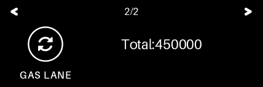 |
| 1.5 | `ROTATE` | 1 | id=ROTATE lab="" cap="ROTATE SLOT?" |  |
| 2.0 | `SEND` | 1 | id=SEND lab="" cap="SEND 1.000000 ETH?" |  |
| 2.1 | `NETWORK` | 1 | id=NETWORK lab="" cap="" \| r:on Sepolia |  |
| 2.2 | `TO` | 1 | id=TO lab="TO" cap="" \| r:0xabCDEF1234567890ABc \| r:DEF1234567890aBCDeF12 |  |
| 2.3 | `VALUE` | 1 | id=VALUE lab="VALUE" cap="" \| r:1.000000 ETH |  |
| 2.4 | `MAXFEE` | 1 | id=MAXFEE lab="MAX FEE" cap="" \| r:Fees: max / tip \| r:10 gwei \| r:2 gwei |  |
| 2.5 | `CONFIRM` | 1 | id=CONFIRM lab="" cap="CONFIRM?" |  |
| 2.6 | `WORST` | 1 | id=WORST lab="WORST CASE" cap="" \| r:Worst-case: \| r:0.0045 ETH \| r:(gas: 450000) |  |
| 2.7 | `DETAILS` | 1 | id=DETAILS lab="DETAILS" cap="" \| r:Nonce: 2 \| r:Data: 0 B |  |
| 2.8 | `NATIVE` | 1 | id=NATIVE lab="NATIVE VALUE" cap="" \| r:! NATIVE ETH \| r:1.000000 ETH | 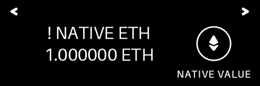 |
| 2.9 | `SIGNER` | 1 | id=SIGNER lab="SIGNER" cap="" \| s:Signer acct #0 \| r:0xBEe6A6E73E418D42eF3 \| r:82ECF8E8025740e97c2fE |  |
| 2.10 | `TARGET` | 1 | id=TARGET lab="TARGET" cap="" \| r:0xabCDEF1234567890ABc \| r:DEF1234567890aBCDeF12 |  |
| 2.11 | `GASLANE` | 1 | id=GASLANE lab="GAS LANE" cap="" \| r:Call:50000 \| r:Verify:300000 \| r:PreVer:100000 |  |
| 2.11 | `GASLANE` | 2 | id=GASLANE lab="GAS LANE" cap="" \| r:Total:450000 |  |
| 2.12 | `FP8213` | 1 | id=FP8213 lab="ERC-8213" cap="" \| r:8213 Fingerprint \| r:CalldataDigest |  |
| 2.13 | `DIGEST` | 1 | id=DIGEST lab="DIGEST" cap="" \| r:0x290decd9548b62a8d60345 \| r:a988386fc84ba6bc954840 \| r:08f6362f93160ef3e563 |  |
| 2.14 | `SEND` | 1 | id=SEND lab="" cap="SEND 1.000000 ETH?" |  |

## Scenario 2: repeat sign on chain A slot 1 (Type 2 only)

| # | id | page | record text | frame |
|---|----|------|-------------|-------|
| 0 | `SEND` | 1 | id=SEND lab="" cap="SEND 0.500000 ETH?" |  |
| 1 | `NETWORK` | 1 | id=NETWORK lab="" cap="" \| r:on Sepolia |  |
| 2 | `TO` | 1 | id=TO lab="TO" cap="" \| r:0xabCDEF1234567890ABc \| r:DEF1234567890aBCDeF12 | 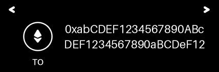 |
| 3 | `VALUE` | 1 | id=VALUE lab="VALUE" cap="" \| r:0.500000 ETH | 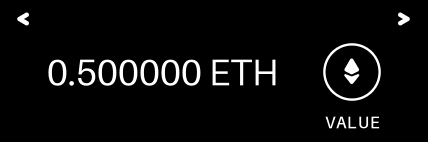 |
| 4 | `MAXFEE` | 1 | id=MAXFEE lab="MAX FEE" cap="" \| r:Fees: max / tip \| r:10 gwei \| r:2 gwei |  |
| 5 | `CONFIRM` | 1 | id=CONFIRM lab="" cap="CONFIRM?" |  |
| 6 | `WORST` | 1 | id=WORST lab="WORST CASE" cap="" \| r:Worst-case: \| r:0.0045 ETH \| r:(gas: 450000) |  |
| 7 | `DETAILS` | 1 | id=DETAILS lab="DETAILS" cap="" \| r:Nonce: 2 \| r:Data: 0 B |  |
| 8 | `NATIVE` | 1 | id=NATIVE lab="NATIVE VALUE" cap="" \| r:! NATIVE ETH \| r:0.500000 ETH |  |
| 9 | `SIGNER` | 1 | id=SIGNER lab="SIGNER" cap="" \| s:Signer acct #0 \| r:0xBEe6A6E73E418D42eF3 \| r:82ECF8E8025740e97c2fE |  |
| 10 | `TARGET` | 1 | id=TARGET lab="TARGET" cap="" \| r:0xabCDEF1234567890ABc \| r:DEF1234567890aBCDeF12 |  |
| 11 | `GASLANE` | 1 | id=GASLANE lab="GAS LANE" cap="" \| r:Call:50000 \| r:Verify:300000 \| r:PreVer:100000 |  |
| 11 | `GASLANE` | 2 | id=GASLANE lab="GAS LANE" cap="" \| r:Total:450000 |  |
| 12 | `FP8213` | 1 | id=FP8213 lab="ERC-8213" cap="" \| r:8213 Fingerprint \| r:CalldataDigest |  |
| 13 | `DIGEST` | 1 | id=DIGEST lab="DIGEST" cap="" \| r:0x290decd9548b62a8d60345 \| r:a988386fc84ba6bc954840 \| r:08f6362f93160ef3e563 |  |
| 14 | `SEND` | 1 | id=SEND lab="" cap="SEND 0.500000 ETH?" |  |

## Scenario 3: rotate to slot 2 on chain A (Type 1 + Type 2)

| # | id | page | record text | frame |
|---|----|------|-------------|-------|
| 1.0 | `ROTATE` | 1 | id=ROTATE lab="" cap="ROTATE SLOT?" |  |
| 1.1 | `ROTATE` | 1 | id=ROTATE lab="ROTATE" cap="" \| r:New signing slot \| r:Slot 2 |  |
| 1.2 | `COST` | 1 | id=COST lab="COST" cap="" \| r:+1 bootstrap use \| r:(on-chain cap) |  |
| 1.3 | `SIGNER` | 1 | id=SIGNER lab="SIGNER" cap="" \| s:Signer acct #0 \| r:0xBEe6A6E73E418D42eF3 \| r:82ECF8E8025740e97c2fE |  |
| 1.4 | `GASLANE` | 1 | id=GASLANE lab="GAS LANE" cap="" \| r:Call:50000 \| r:Verify:300000 \| r:PreVer:100000 |  |
| 1.4 | `GASLANE` | 2 | id=GASLANE lab="GAS LANE" cap="" \| r:Total:450000 |  |
| 1.5 | `ROTATE` | 1 | id=ROTATE lab="" cap="ROTATE SLOT?" |  |
| 2.0 | `SEND` | 1 | id=SEND lab="" cap="SEND 0.250000 ETH?" |  |
| 2.1 | `NETWORK` | 1 | id=NETWORK lab="" cap="" \| r:on Sepolia |  |
| 2.2 | `TO` | 1 | id=TO lab="TO" cap="" \| r:0xabCDEF1234567890ABc \| r:DEF1234567890aBCDeF12 |  |
| 2.3 | `VALUE` | 1 | id=VALUE lab="VALUE" cap="" \| r:0.250000 ETH |  |
| 2.4 | `MAXFEE` | 1 | id=MAXFEE lab="MAX FEE" cap="" \| r:Fees: max / tip \| r:10 gwei \| r:2 gwei |  |
| 2.5 | `CONFIRM` | 1 | id=CONFIRM lab="" cap="CONFIRM?" |  |
| 2.6 | `WORST` | 1 | id=WORST lab="WORST CASE" cap="" \| r:Worst-case: \| r:0.0045 ETH \| r:(gas: 450000) |  |
| 2.7 | `DETAILS` | 1 | id=DETAILS lab="DETAILS" cap="" \| r:Nonce: 4 \| r:Data: 0 B |  |
| 2.8 | `NATIVE` | 1 | id=NATIVE lab="NATIVE VALUE" cap="" \| r:! NATIVE ETH \| r:0.250000 ETH |  |
| 2.9 | `SIGNER` | 1 | id=SIGNER lab="SIGNER" cap="" \| s:Signer acct #0 \| r:0xBEe6A6E73E418D42eF3 \| r:82ECF8E8025740e97c2fE | 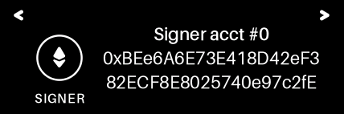 |
| 2.10 | `TARGET` | 1 | id=TARGET lab="TARGET" cap="" \| r:0xabCDEF1234567890ABc \| r:DEF1234567890aBCDeF12 | 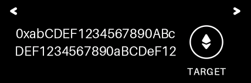 |
| 2.11 | `GASLANE` | 1 | id=GASLANE lab="GAS LANE" cap="" \| r:Call:50000 \| r:Verify:300000 \| r:PreVer:100000 |  |
| 2.11 | `GASLANE` | 2 | id=GASLANE lab="GAS LANE" cap="" \| r:Total:450000 |  |
| 2.12 | `FP8213` | 1 | id=FP8213 lab="ERC-8213" cap="" \| r:8213 Fingerprint \| r:CalldataDigest |  |
| 2.13 | `DIGEST` | 1 | id=DIGEST lab="DIGEST" cap="" \| r:0x290decd9548b62a8d60345 \| r:a988386fc84ba6bc954840 \| r:08f6362f93160ef3e563 |  |
| 2.14 | `SEND` | 1 | id=SEND lab="" cap="SEND 0.250000 ETH?" |  |

## Scenario 4: register slot 1 on chain B (Type 1 + Type 2)

| # | id | page | record text | frame |
|---|----|------|-------------|-------|
| 1.0 | `ROTATE` | 1 | id=ROTATE lab="" cap="ROTATE SLOT?" |  |
| 1.1 | `ROTATE` | 1 | id=ROTATE lab="ROTATE" cap="" \| r:New signing slot \| r:Slot 1 |  |
| 1.2 | `COST` | 1 | id=COST lab="COST" cap="" \| r:+1 bootstrap use \| r:(on-chain cap) |  |
| 1.3 | `SIGNER` | 1 | id=SIGNER lab="SIGNER" cap="" \| s:Signer acct #0 \| r:0xBEe6A6E73E418D42eF3 \| r:82ECF8E8025740e97c2fE |  |
| 1.4 | `GASLANE` | 1 | id=GASLANE lab="GAS LANE" cap="" \| r:Call:50000 \| r:Verify:300000 \| r:PreVer:100000 |  |
| 1.4 | `GASLANE` | 2 | id=GASLANE lab="GAS LANE" cap="" \| r:Total:450000 |  |
| 1.5 | `ROTATE` | 1 | id=ROTATE lab="" cap="ROTATE SLOT?" |  |
| 2.0 | `SEND` | 1 | id=SEND lab="" cap="SEND 0.100000 ETH?" |  |
| 2.1 | `NETWORK` | 1 | id=NETWORK lab="" cap="" \| r:on BaseSepolia |  |
| 2.2 | `TO` | 1 | id=TO lab="TO" cap="" \| r:0xabCDEF1234567890ABc \| r:DEF1234567890aBCDeF12 |  |
| 2.3 | `VALUE` | 1 | id=VALUE lab="VALUE" cap="" \| r:0.100000 ETH |  |
| 2.4 | `MAXFEE` | 1 | id=MAXFEE lab="MAX FEE" cap="" \| r:Fees: max / tip \| r:10 gwei \| r:2 gwei |  |
| 2.5 | `CONFIRM` | 1 | id=CONFIRM lab="" cap="CONFIRM?" |  |
| 2.6 | `WORST` | 1 | id=WORST lab="WORST CASE" cap="" \| r:Worst-case: \| r:0.0045 ETH \| r:(gas: 450000) |  |
| 2.7 | `DETAILS` | 1 | id=DETAILS lab="DETAILS" cap="" \| r:Nonce: 2 \| r:Data: 0 B |  |
| 2.8 | `NATIVE` | 1 | id=NATIVE lab="NATIVE VALUE" cap="" \| r:! NATIVE ETH \| r:0.100000 ETH |  |
| 2.9 | `SIGNER` | 1 | id=SIGNER lab="SIGNER" cap="" \| s:Signer acct #0 \| r:0xBEe6A6E73E418D42eF3 \| r:82ECF8E8025740e97c2fE |  |
| 2.10 | `TARGET` | 1 | id=TARGET lab="TARGET" cap="" \| r:0xabCDEF1234567890ABc \| r:DEF1234567890aBCDeF12 |  |
| 2.11 | `GASLANE` | 1 | id=GASLANE lab="GAS LANE" cap="" \| r:Call:50000 \| r:Verify:300000 \| r:PreVer:100000 |  |
| 2.11 | `GASLANE` | 2 | id=GASLANE lab="GAS LANE" cap="" \| r:Total:450000 | 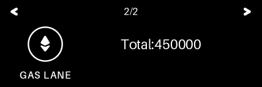 |
| 2.12 | `FP8213` | 1 | id=FP8213 lab="ERC-8213" cap="" \| r:8213 Fingerprint \| r:CalldataDigest |  |
| 2.13 | `DIGEST` | 1 | id=DIGEST lab="DIGEST" cap="" \| r:0x290decd9548b62a8d60345 \| r:a988386fc84ba6bc954840 \| r:08f6362f93160ef3e563 |  |
| 2.14 | `SEND` | 1 | id=SEND lab="" cap="SEND 0.100000 ETH?" |  |

## Scenario 4a: zero-value contract call

| # | id | page | record text | frame |
|---|----|------|-------------|-------|
| 0 | `CALL` | 1 | id=CALL lab="" cap="CONFIRM CONTRACT CALL?" |  |
| 1 | `NETWORK` | 1 | id=NETWORK lab="" cap="" \| r:on Sepolia |  |
| 2 | `TO` | 1 | id=TO lab="TO" cap="" \| r:0x9e3B5c0f7a1d24E86C3 \| r:F0B7d5A2e4C6F8b1D3a7c | 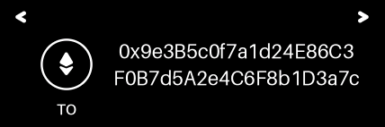 |
| 3 | `VALUE` | 1 | id=VALUE lab="VALUE" cap="" \| r:0.000000 ETH |  |
| 4 | `MAXFEE` | 1 | id=MAXFEE lab="MAX FEE" cap="" \| r:Fees: max / tip \| r:10 gwei \| r:2 gwei |  |
| 5 | `CONFIRM` | 1 | id=CONFIRM lab="" cap="CONFIRM?" |  |
| 6 | `WORST` | 1 | id=WORST lab="WORST CASE" cap="" \| r:Worst-case: \| r:0.0045 ETH \| r:(gas: 450000) |  |
| 7 | `DETAILS` | 1 | id=DETAILS lab="DETAILS" cap="" \| r:Nonce: 4 \| r:Data: 0 B |  |
| 8 | `SIGNER` | 1 | id=SIGNER lab="SIGNER" cap="" \| s:Signer acct #0 \| r:0xBEe6A6E73E418D42eF3 \| r:82ECF8E8025740e97c2fE |  |
| 9 | `TARGET` | 1 | id=TARGET lab="TARGET" cap="" \| r:0x9e3B5c0f7a1d24E86C3 \| r:F0B7d5A2e4C6F8b1D3a7c | 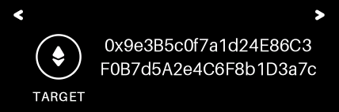 |
| 10 | `GASLANE` | 1 | id=GASLANE lab="GAS LANE" cap="" \| r:Call:50000 \| r:Verify:300000 \| r:PreVer:100000 | 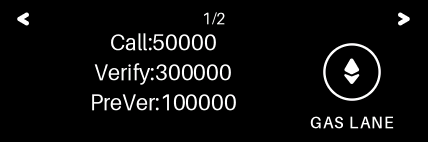 |
| 10 | `GASLANE` | 2 | id=GASLANE lab="GAS LANE" cap="" \| r:Total:450000 | 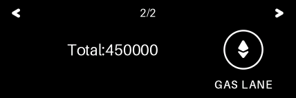 |
| 11 | `FP8213` | 1 | id=FP8213 lab="ERC-8213" cap="" \| r:8213 Fingerprint \| r:CalldataDigest |  |
| 12 | `DIGEST` | 1 | id=DIGEST lab="DIGEST" cap="" \| r:0x290decd9548b62a8d60345 \| r:a988386fc84ba6bc954840 \| r:08f6362f93160ef3e563 |  |
| 13 | `CALL` | 1 | id=CALL lab="" cap="CONFIRM CONTRACT CALL?" |  |

## Scenario 4b: unknown-token ERC-20 transfer

| # | id | page | record text | frame |
|---|----|------|-------------|-------|
| 0 | `TRANSFER` | 1 | id=TRANSFER lab="" cap="TRANSFER UNKNOWN TOKEN?" |  |
| 1 | `NETWORK` | 1 | id=NETWORK lab="" cap="" \| r:on Sepolia |  |
| 2 | `CONTRACT` | 1 | id=CONTRACT lab="CONTRACT" cap="" \| s:! Unknown token \| r:0x3ca9e5f1B72D04e8A6c \| r:1d9b3f57e28a0c4d6B1e9 | 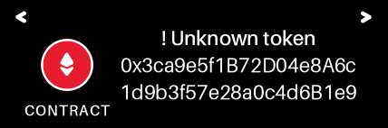 |
| 3 | `AMOUNT` | 1 | id=AMOUNT lab="AMOUNT" cap="" \| r:(RAW) transfer \| r:12345678901234567890 | 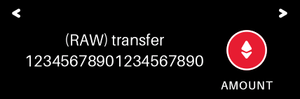 |
| 4 | `TO` | 1 | id=TO lab="TO" cap="" \| r:0xabCDEF1234567890ABc \| r:DEF1234567890aBCDeF12 | 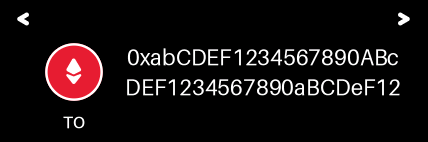 |
| 5 | `CONFIRM` | 1 | id=CONFIRM lab="" cap="CONFIRM?" |  |
| 6 | `MAXFEE` | 1 | id=MAXFEE lab="MAX FEE" cap="" \| r:Fees: max / tip \| r:10 gwei \| r:2 gwei |  |
| 7 | `WORST` | 1 | id=WORST lab="WORST CASE" cap="" \| r:Worst-case: \| r:0.0045 ETH \| r:(gas: 450000) | 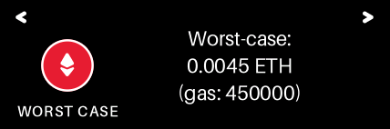 |
| 8 | `DETAILS` | 1 | id=DETAILS lab="DETAILS" cap="" \| r:Nonce: 5 \| r:Data: 68 B |  |
| 9 | `SIGNER` | 1 | id=SIGNER lab="SIGNER" cap="" \| s:Signer acct #0 \| r:0xBEe6A6E73E418D42eF3 \| r:82ECF8E8025740e97c2fE | 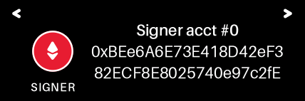 |
| 10 | `TARGET` | 1 | id=TARGET lab="TARGET" cap="" \| r:0x3ca9e5f1B72D04e8A6c \| r:1d9b3f57e28a0c4d6B1e9 | 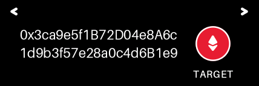 |
| 11 | `GASLANE` | 1 | id=GASLANE lab="GAS LANE" cap="" \| r:Call:50000 \| r:Verify:300000 \| r:PreVer:100000 | 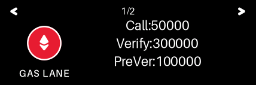 |
| 11 | `GASLANE` | 2 | id=GASLANE lab="GAS LANE" cap="" \| r:Total:450000 |  |
| 12 | `FP8213` | 1 | id=FP8213 lab="ERC-8213" cap="" \| r:8213 Fingerprint \| r:CalldataDigest | 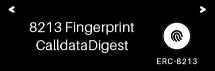 |
| 13 | `DIGEST` | 1 | id=DIGEST lab="DIGEST" cap="" \| r:0x4cfc6bb43edee633da3d63 \| r:6f5e562fda90cc4474bd93 \| r:b6b641dabcebb2885888 | 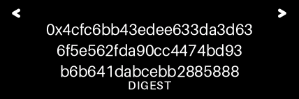 |
| 14 | `TRANSFER` | 1 | id=TRANSFER lab="" cap="TRANSFER UNKNOWN TOKEN?" |  |

## Scenario 4c: first deploy with initCode

| # | id | page | record text | frame |
|---|----|------|-------------|-------|
| 0 | `SEND` | 1 | id=SEND lab="" cap="SEND 0.010000 ETH?" |  |
| 1 | `NETWORK` | 1 | id=NETWORK lab="" cap="" \| r:on Base |  |
| 2 | `TO` | 1 | id=TO lab="TO" cap="" \| r:0xabCDEF1234567890ABc \| r:DEF1234567890aBCDeF12 |  |
| 3 | `VALUE` | 1 | id=VALUE lab="VALUE" cap="" \| r:0.010000 ETH |  |
| 4 | `MAXFEE` | 1 | id=MAXFEE lab="MAX FEE" cap="" \| r:Fees: max / tip \| r:10 gwei \| r:2 gwei |  |
| 5 | `CONFIRM` | 1 | id=CONFIRM lab="" cap="CONFIRM?" |  |
| 6 | `WORST` | 1 | id=WORST lab="WORST CASE" cap="" \| r:Worst-case: \| r:0.0045 ETH \| r:(gas: 450000) | 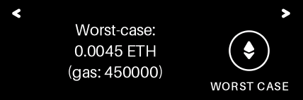 |
| 7 | `DETAILS` | 1 | id=DETAILS lab="DETAILS" cap="" \| r:Nonce: 0 \| r:Data: 0 B |  |
| 8 | `NATIVE` | 1 | id=NATIVE lab="NATIVE VALUE" cap="" \| r:! NATIVE ETH \| r:0.010000 ETH | 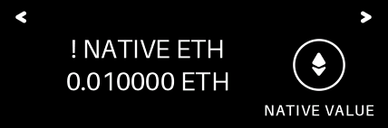 |
| 9 | `SIGNER` | 1 | id=SIGNER lab="SIGNER" cap="" \| s:Signer acct #0 \| r:0xBEe6A6E73E418D42eF3 \| r:82ECF8E8025740e97c2fE |  |
| 10 | `TARGET` | 1 | id=TARGET lab="TARGET" cap="" \| r:0xabCDEF1234567890ABc \| r:DEF1234567890aBCDeF12 |  |
| 11 | `GASLANE` | 1 | id=GASLANE lab="GAS LANE" cap="" \| r:Call:50000 \| r:Verify:300000 \| r:PreVer:100000 |  |
| 11 | `GASLANE` | 2 | id=GASLANE lab="GAS LANE" cap="" \| r:Total:450000 |  |
| 12 | `FP8213` | 1 | id=FP8213 lab="ERC-8213" cap="" \| r:8213 Fingerprint \| r:CalldataDigest |  |
| 13 | `DIGEST` | 1 | id=DIGEST lab="DIGEST" cap="" \| r:0x290decd9548b62a8d60345 \| r:a988386fc84ba6bc954840 \| r:08f6362f93160ef3e563 |  |
| 14 | `DEPLOY` | 1 | id=DEPLOY lab="! DEPLOY" cap="" \| s:DEPLOY FACTORY: \| r:0xe8CE78CD976497447FF \| r:8B76c71b59aE42Af0d452 | 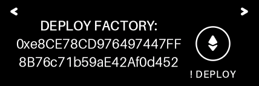 |
| 15 | `SEND` | 1 | id=SEND lab="" cap="SEND 0.010000 ETH?" |  |

## Scenario 5: Safe approveHash clear-sign

| # | id | page | record text | frame |
|---|----|------|-------------|-------|
| 0 | `APPROVE` | 1 | id=APPROVE lab="" cap="APPROVE SAFE TX?" |  |
| 1 | `NETWORK` | 1 | id=NETWORK lab="" cap="" \| r:on Sepolia |  |
| 2 | `SAFEACCT` | 1 | id=SAFEACCT lab="SAFE ACCT" cap="" \| r:0x5aFE000000000000000 \| r:000000000000000000001 |  |
| 3 | `TXINFO` | 1 | id=TXINFO lab="TX INFO" cap="" \| r:Nonce: 17 \| r:Op: Call |  |
| 4 | `UNVERIF` | 1 | id=UNVERIF lab="UNVERIFIED" cap="" \| r:ERC-20 call \| r:token unknown |  |
| 5 | `CONFIRM` | 1 | id=CONFIRM lab="" cap="CONFIRM?" |  |
| 6 | `RAWAMT` | 1 | id=RAWAMT lab="RAW AMOUNT" cap="" \| r:250000000 units |  |
| 7 | `TO` | 1 | id=TO lab="TO" cap="" \| r:0xABaBaBaBABab \| r:ABabAbAbABAbAB \| r:abababaBaBABaB |  |
| 8 | `CONTRACT` | 1 | id=CONTRACT lab="CONTRACT" cap="" \| r:0xA0b86991c6218b36c1d \| r:19D4a2e9Eb0cE3606eB48 |  |
| 9 | `MAXFEE` | 1 | id=MAXFEE lab="MAX FEE" cap="" \| r:Fees: max / tip \| r:10 gwei \| r:2 gwei |  |
| 10 | `WORST` | 1 | id=WORST lab="WORST CASE" cap="" \| r:Worst-case: \| r:0.0045 ETH \| r:(gas: 450000) |  |
| 11 | `SIGNER` | 1 | id=SIGNER lab="SIGNER" cap="" \| s:Signer acct #0 \| r:0xBEe6A6E73E418D42eF3 \| r:82ECF8E8025740e97c2fE |  |
| 12 | `TARGET` | 1 | id=TARGET lab="TARGET" cap="" \| r:0x5aFE000000000000000 \| r:000000000000000000001 |  |
| 13 | `GASLANE` | 1 | id=GASLANE lab="GAS LANE" cap="" \| r:Call:50000 \| r:Verify:300000 \| r:PreVer:100000 |  |
| 13 | `GASLANE` | 2 | id=GASLANE lab="GAS LANE" cap="" \| r:Total:450000 |  |
| 14 | `FP8213` | 1 | id=FP8213 lab="ERC-8213" cap="" \| r:8213 Fingerprint \| r:CalldataDigest |  |
| 15 | `DIGEST` | 1 | id=DIGEST lab="DIGEST" cap="" \| r:0x20d91e6a7ee38f31d0d8d8 \| r:88544c928f98b94e3e71b6 \| r:8934caef277f253c4600 |  |
| 16 | `APPROVE` | 1 | id=APPROVE lab="" cap="APPROVE SAFE TX?" |  |

## Scenario 5b: verified function-selector bundle

| # | id | page | record text | frame |
|---|----|------|-------------|-------|
| 0 | `BLIND` | 1 | id=BLIND lab="" cap="CONFIRM BLIND SIGN?" |  |
| 1 | `NETWORK` | 1 | id=NETWORK lab="" cap="" \| r:on Sepolia |  |
| 2 | `FUNCTION` | 1 | id=FUNCTION lab="FUNCTION" cap="" \| s:! BLIND SIGN \| r:balanceOf(address) |  |
| 3 | `ARG0` | 1 | id=ARG0 lab="ARG 0" cap="" \| r:0xABaBaBaBABab \| r:ABabAbAbABAbAB \| r:abababaBaBABaB | 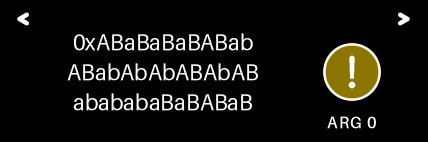 |
| 4 | `TO` | 1 | id=TO lab="TO" cap="" \| r:0xfefeFEFeFEFEFEFEFeF \| r:efefefefeFEfEfefefEfe | 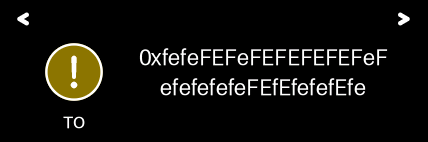 |
| 5 | `CONFIRM` | 1 | id=CONFIRM lab="" cap="CONFIRM?" |  |
| 6 | `MAXFEE` | 1 | id=MAXFEE lab="MAX FEE" cap="" \| r:Fees: max / tip \| r:10 gwei \| r:2 gwei | 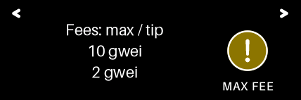 |
| 7 | `WORST` | 1 | id=WORST lab="WORST CASE" cap="" \| r:Worst-case: \| r:0.0045 ETH \| r:(gas: 450000) |  |
| 8 | `DETAILS` | 1 | id=DETAILS lab="DETAILS" cap="" \| r:Nonce: 5 \| r:Data: 36 B |  |
| 9 | `SIGNER` | 1 | id=SIGNER lab="SIGNER" cap="" \| s:Signer acct #0 \| r:0xBEe6A6E73E418D42eF3 \| r:82ECF8E8025740e97c2fE |  |
| 10 | `TARGET` | 1 | id=TARGET lab="TARGET" cap="" \| r:0xfefeFEFeFEFEFEFEFeF \| r:efefefefeFEfEfefefEfe |  |
| 11 | `GASLANE` | 1 | id=GASLANE lab="GAS LANE" cap="" \| r:Call:50000 \| r:Verify:300000 \| r:PreVer:100000 |  |
| 11 | `GASLANE` | 2 | id=GASLANE lab="GAS LANE" cap="" \| r:Total:450000 | 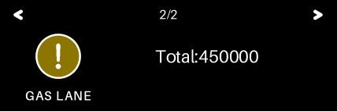 |
| 12 | `FP8213` | 1 | id=FP8213 lab="ERC-8213" cap="" \| r:8213 Fingerprint \| r:CalldataDigest |  |
| 13 | `DIGEST` | 1 | id=DIGEST lab="DIGEST" cap="" \| r:0x29a9350d4d0b50ba49a7f2 \| r:457e9b95ba29bacacaef97 \| r:354f9ec01d0cb404ea22 |  |
| 14 | `BLIND` | 1 | id=BLIND lab="" cap="CONFIRM BLIND SIGN?" |  |

## Scenario 5v: companion-supplied ERC-20 metadata trailer

| # | id | page | record text | frame |
|---|----|------|-------------|-------|
| 1.0 | `ROTATE` | 1 | id=ROTATE lab="" cap="ROTATE SLOT?" |  |
| 1.1 | `ROTATE` | 1 | id=ROTATE lab="ROTATE" cap="" \| r:New signing slot \| r:Slot 5 |  |
| 1.2 | `COST` | 1 | id=COST lab="COST" cap="" \| r:+1 bootstrap use \| r:(on-chain cap) |  |
| 1.3 | `SIGNER` | 1 | id=SIGNER lab="SIGNER" cap="" \| s:Signer acct #0 \| r:0xBEe6A6E73E418D42eF3 \| r:82ECF8E8025740e97c2fE |  |
| 1.4 | `GASLANE` | 1 | id=GASLANE lab="GAS LANE" cap="" \| r:Call:50000 \| r:Verify:300000 \| r:PreVer:100000 |  |
| 1.4 | `GASLANE` | 2 | id=GASLANE lab="GAS LANE" cap="" \| r:Total:450000 |  |
| 1.5 | `ROTATE` | 1 | id=ROTATE lab="" cap="ROTATE SLOT?" |  |
| 2.0 | `SEND` | 1 | id=SEND lab="" cap="SEND 123.45 TEL?" |  |
| 2.1 | `NETWORK` | 1 | id=NETWORK lab="" cap="" \| r:on Base |  |
| 2.2 | `TO` | 1 | id=TO lab="TO" cap="" \| r:0xCdCDCdCdcdcd \| r:cdCdcDcDCdcDcD \| r:CdCdcdCdcDCDcD | 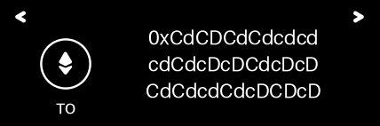 |
| 2.3 | `AMOUNT` | 1 | id=AMOUNT lab="SEND" cap="" \| r:123.45 TEL | 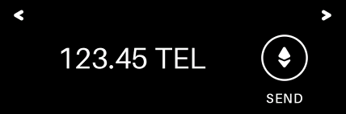 |
| 2.4 | `CONTRACT` | 1 | id=CONTRACT lab="CONTRACT" cap="" \| s:Telcoin \| r:0x09bE1692ca16e06f536 \| r:F0038fF11D1dA8524aDB1 | 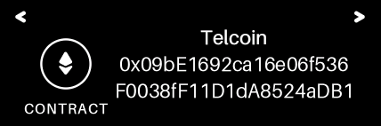 |
| 2.5 | `CONFIRM` | 1 | id=CONFIRM lab="" cap="CONFIRM?" |  |
| 2.6 | `MAXFEE` | 1 | id=MAXFEE lab="MAX FEE" cap="" \| r:Fees: max / tip \| r:10 gwei \| r:2 gwei |  |
| 2.7 | `WORST` | 1 | id=WORST lab="WORST CASE" cap="" \| r:Worst-case: \| r:0.0045 ETH \| r:(gas: 450000) |  |
| 2.8 | `DETAILS` | 1 | id=DETAILS lab="DETAILS" cap="" \| r:Nonce: 7 \| r:Data: 68 B |  |
| 2.9 | `SIGNER` | 1 | id=SIGNER lab="SIGNER" cap="" \| s:Signer acct #0 \| r:0xBEe6A6E73E418D42eF3 \| r:82ECF8E8025740e97c2fE |  |
| 2.10 | `TARGET` | 1 | id=TARGET lab="TARGET" cap="" \| r:0x09bE1692ca16e06f536 \| r:F0038fF11D1dA8524aDB1 | 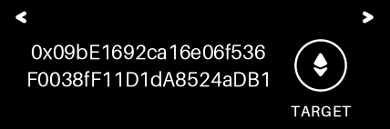 |
| 2.11 | `GASLANE` | 1 | id=GASLANE lab="GAS LANE" cap="" \| r:Call:50000 \| r:Verify:300000 \| r:PreVer:100000 | 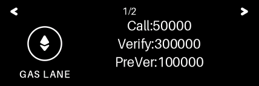 |
| 2.11 | `GASLANE` | 2 | id=GASLANE lab="GAS LANE" cap="" \| r:Total:450000 |  |
| 2.12 | `FP8213` | 1 | id=FP8213 lab="ERC-8213" cap="" \| r:8213 Fingerprint \| r:CalldataDigest |  |
| 2.13 | `DIGEST` | 1 | id=DIGEST lab="DIGEST" cap="" \| r:0x15228560450644904b77c1 \| r:80fd36b793f2088410cbad \| r:d6886f38aca39ab36ca9 | 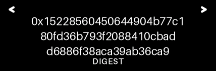 |
| 2.14 | `SEND` | 1 | id=SEND lab="" cap="SEND 123.45 TEL?" |  |

## Scenario 5m-nested: ERC-7730 nested proof set matches + signs

| # | id | page | record text | frame |
|---|----|------|-------------|-------|
| 1.0 | `ROTATE` | 1 | id=ROTATE lab="" cap="ROTATE SLOT?" |  |
| 1.1 | `ROTATE` | 1 | id=ROTATE lab="ROTATE" cap="" \| r:New signing slot \| r:Slot 1 |  |
| 1.2 | `COST` | 1 | id=COST lab="COST" cap="" \| r:+1 bootstrap use \| r:(on-chain cap) |  |
| 1.3 | `SIGNER` | 1 | id=SIGNER lab="SIGNER" cap="" \| s:Signer acct #0 \| r:0xBEe6A6E73E418D42eF3 \| r:82ECF8E8025740e97c2fE |  |
| 1.4 | `GASLANE` | 1 | id=GASLANE lab="GAS LANE" cap="" \| r:Call:50000 \| r:Verify:300000 \| r:PreVer:100000 |  |
| 1.4 | `GASLANE` | 2 | id=GASLANE lab="GAS LANE" cap="" \| r:Total:450000 |  |
| 1.5 | `ROTATE` | 1 | id=ROTATE lab="" cap="ROTATE SLOT?" |  |
| 2.0 | `SIGN` | 1 | id=SIGN lab="" cap="SIGN FORWARD CALL?" |  |
| 2.1 | `DEV` | 1 | id=DEV lab="! DEV BUILD" cap="" \| r:Unattested \| r:descriptor | 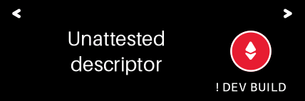 |
| 2.2 | `INTENT` | 1 | id=INTENT lab="INTENT" cap="" \| s:Forward call \| r:PQSigner \| r:NestedForwarder | 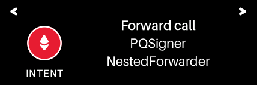 |
| 2.3 | `F2` | 1 | id=F2 lab="TARGET" cap="" \| r:0x5656565656565656565 \| r:656565656565656565656 | 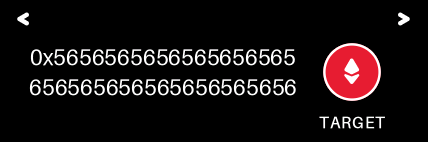 |
| 2.4 | `F3` | 1 | id=F3 lab="CALL CALL" cap="" \| r:0x5656565656565656565 \| r:656565656565656565656 | 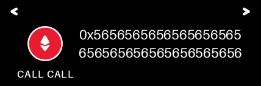 |
| 2.5 | `CONFIRM` | 1 | id=CONFIRM lab="" cap="CONFIRM?" |  |
| 2.6 | `F4` | 1 | id=F4 lab="" cap="" \| s:** DEV BUILD ** \| r:Unattested \| r:descriptor | 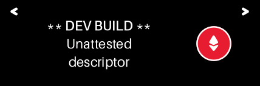 |
| 2.7 | `F5` | 1 | id=F5 lab="TRANSFER" cap="" \| r:PQSigner \| r:NestedToken | 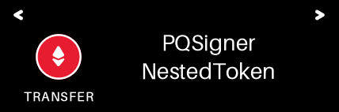 |
| 2.8 | `F6` | 1 | id=F6 lab="RECIPIENT" cap="" \| r:0x7878787878787878787 \| r:878787878787878787878 | 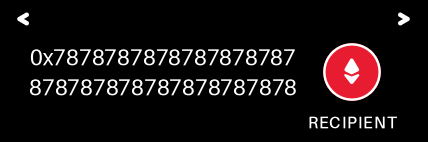 |
| 2.9 | `F7` | 1 | id=F7 lab="AMOUNT" cap="" \| r:0000000000000000 \| r:0000000000000000 | 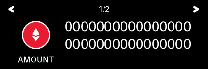 |
| 2.9 | `F7` | 2 | id=F7 lab="AMOUNT" cap="" \| r:0000000000000000 \| r:000000000001e240 | 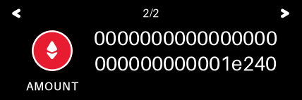 |
| 2.10 | `NETWORK` | 1 | id=NETWORK lab="" cap="" \| r:Chain 31337 |  |
| 2.11 | `F10` | 1 | id=F10 lab="MAX FEE/BASE" cap="" \| r:10000000000 \| r:Tip/base: \| r:2000000000 | 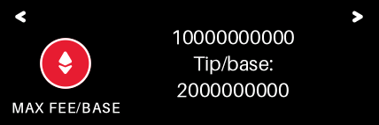 |
| 2.12 | `F11` | 1 | id=F11 lab="GAS:450000" cap="" \| r:Max total/base: \| r:4500000000000000 | 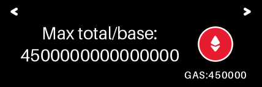 |
| 2.13 | `NONCE` | 1 | id=NONCE lab="NONCE (HEX)" cap="" \| r:0000000000000000 \| r:0000000000000000 \| r:0000000000000000 |  |
| 2.13 | `NONCE` | 2 | id=NONCE lab="NONCE (HEX)" cap="" \| r:000000000000002d | 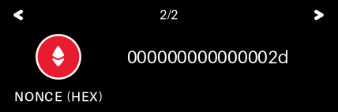 |
| 2.14 | `SIGNER` | 1 | id=SIGNER lab="SIGNER" cap="" \| s:Signer acct #0 \| r:0xBEe6A6E73E418D42eF3 \| r:82ECF8E8025740e97c2fE |  |
| 2.15 | `TARGET` | 1 | id=TARGET lab="TARGET" cap="" \| r:0x3434343434343434343 \| r:434343434343434343434 | 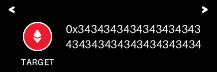 |
| 2.16 | `GASLANE` | 1 | id=GASLANE lab="GAS LANE" cap="" \| r:Call:50000 \| r:Verify:300000 \| r:PreVer:100000 |  |
| 2.16 | `GASLANE` | 2 | id=GASLANE lab="GAS LANE" cap="" \| r:Total:450000 | 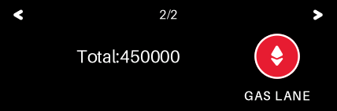 |
| 2.17 | `FP8213` | 1 | id=FP8213 lab="ERC-8213" cap="" \| r:8213 Fingerprint \| r:CalldataDigest |  |
| 2.18 | `DIGEST` | 1 | id=DIGEST lab="DIGEST" cap="" \| r:0x656ac999bd3392b7aa674b \| r:1ae24ca0e5ef17b0f00544 \| r:6ea86edb49ad633e6f12 | 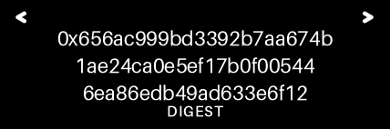 |
| 2.19 | `SIGN` | 1 | id=SIGN lab="" cap="SIGN FORWARD CALL?" |  |

## Scenario 5m-multi-tail: ERC-7730 two-string tails match + signs

| # | id | page | record text | frame |
|---|----|------|-------------|-------|
| 0 | `SIGN` | 1 | id=SIGN lab="" cap="SIGN ANNOTATE?" |  |
| 1 | `DEV` | 1 | id=DEV lab="! DEV BUILD" cap="" \| r:Unattested \| r:descriptor | 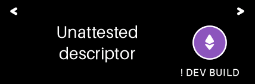 |
| 2 | `INTENT` | 1 | id=INTENT lab="INTENT" cap="" \| s:Annotate \| r:PQSigner \| r:MultiTailNotes | 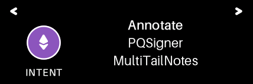 |
| 3 | `F2` | 1 | id=F2 lab="SUBJECT" cap="" \| r:alpha subject \| r:13 bytes |  |
| 4 | `F3` | 1 | id=F3 lab="MEMO" cap="" \| r:exact memo \| r:10 bytes |  |
| 5 | `CONFIRM` | 1 | id=CONFIRM lab="" cap="CONFIRM?" |  |
| 6 | `NETWORK` | 1 | id=NETWORK lab="" cap="" \| r:Chain 31337 |  |
| 7 | `F5` | 1 | id=F5 lab="MAX FEE/BASE" cap="" \| r:10000000000 \| r:Tip/base: \| r:2000000000 |  |
| 8 | `F6` | 1 | id=F6 lab="GAS:450000" cap="" \| r:Max total/base: \| r:4500000000000000 |  |
| 9 | `NONCE` | 1 | id=NONCE lab="NONCE (HEX)" cap="" \| r:0000000000000000 \| r:0000000000000000 \| r:0000000000000000 |  |
| 9 | `NONCE` | 2 | id=NONCE lab="NONCE (HEX)" cap="" \| r:000000000000002d |  |
| 10 | `SIGNER` | 1 | id=SIGNER lab="SIGNER" cap="" \| s:Signer acct #0 \| r:0xBEe6A6E73E418D42eF3 \| r:82ECF8E8025740e97c2fE |  |
| 11 | `TARGET` | 1 | id=TARGET lab="TARGET" cap="" \| r:0x7878787878787878787 \| r:878787878787878787878 |  |
| 12 | `GASLANE` | 1 | id=GASLANE lab="GAS LANE" cap="" \| r:Call:50000 \| r:Verify:300000 \| r:PreVer:100000 |  |
| 12 | `GASLANE` | 2 | id=GASLANE lab="GAS LANE" cap="" \| r:Total:450000 |  |
| 13 | `FP8213` | 1 | id=FP8213 lab="ERC-8213" cap="" \| r:8213 Fingerprint \| r:CalldataDigest |  |
| 14 | `DIGEST` | 1 | id=DIGEST lab="DIGEST" cap="" \| r:0xd9baf3cf86728a714a6db2 \| r:05d884da6658c1c5657384 \| r:1f2f62d2967823331588 |  |
| 15 | `SIGN` | 1 | id=SIGN lab="" cap="SIGN ANNOTATE?" |  |

## Scenario 5w: companion-supplied address-name trailer

| # | id | page | record text | frame |
|---|----|------|-------------|-------|
| 1.0 | `ROTATE` | 1 | id=ROTATE lab="" cap="ROTATE SLOT?" |  |
| 1.1 | `ROTATE` | 1 | id=ROTATE lab="ROTATE" cap="" \| r:New signing slot \| r:Slot 6 |  |
| 1.2 | `COST` | 1 | id=COST lab="COST" cap="" \| r:+1 bootstrap use \| r:(on-chain cap) |  |
| 1.3 | `SIGNER` | 1 | id=SIGNER lab="SIGNER" cap="" \| s:Signer acct #0 \| r:0xBEe6A6E73E418D42eF3 \| r:82ECF8E8025740e97c2fE |  |
| 1.4 | `GASLANE` | 1 | id=GASLANE lab="GAS LANE" cap="" \| r:Call:50000 \| r:Verify:300000 \| r:PreVer:100000 |  |
| 1.4 | `GASLANE` | 2 | id=GASLANE lab="GAS LANE" cap="" \| r:Total:450000 |  |
| 1.5 | `ROTATE` | 1 | id=ROTATE lab="" cap="ROTATE SLOT?" |  |
| 2.0 | `SEND` | 1 | id=SEND lab="" cap="SEND 0.000001 ETH?" |  |
| 2.1 | `NETWORK` | 1 | id=NETWORK lab="" cap="" \| r:on Base |  |
| 2.2 | `TO` | 1 | id=TO lab="TO" cap="" \| s:Uniswap V3 Router \| r:0xE592427A0AEce92De3E \| r:dee1F18E0157C05861564 |  |
| 2.3 | `VALUE` | 1 | id=VALUE lab="VALUE" cap="" \| r:0.000001 ETH |  |
| 2.4 | `MAXFEE` | 1 | id=MAXFEE lab="MAX FEE" cap="" \| r:Fees: max / tip \| r:10 gwei \| r:2 gwei |  |
| 2.5 | `CONFIRM` | 1 | id=CONFIRM lab="" cap="CONFIRM?" |  |
| 2.6 | `WORST` | 1 | id=WORST lab="WORST CASE" cap="" \| r:Worst-case: \| r:0.0045 ETH \| r:(gas: 450000) |  |
| 2.7 | `DETAILS` | 1 | id=DETAILS lab="DETAILS" cap="" \| r:Nonce: 8 \| r:Data: 0 B |  |
| 2.8 | `NATIVE` | 1 | id=NATIVE lab="NATIVE VALUE" cap="" \| r:! NATIVE ETH \| r:0.000001 ETH |  |
| 2.9 | `SIGNER` | 1 | id=SIGNER lab="SIGNER" cap="" \| s:Signer acct #0 \| r:0xBEe6A6E73E418D42eF3 \| r:82ECF8E8025740e97c2fE |  |
| 2.10 | `TARGET` | 1 | id=TARGET lab="TARGET" cap="" \| r:0xE592427A0AEce92De3E \| r:dee1F18E0157C05861564 |  |
| 2.11 | `GASLANE` | 1 | id=GASLANE lab="GAS LANE" cap="" \| r:Call:50000 \| r:Verify:300000 \| r:PreVer:100000 |  |
| 2.11 | `GASLANE` | 2 | id=GASLANE lab="GAS LANE" cap="" \| r:Total:450000 |  |
| 2.12 | `FP8213` | 1 | id=FP8213 lab="ERC-8213" cap="" \| r:8213 Fingerprint \| r:CalldataDigest |  |
| 2.13 | `DIGEST` | 1 | id=DIGEST lab="DIGEST" cap="" \| r:0x290decd9548b62a8d60345 \| r:a988386fc84ba6bc954840 \| r:08f6362f93160ef3e563 |  |
| 2.14 | `SEND` | 1 | id=SEND lab="" cap="SEND 0.000001 ETH?" |  |

## Scenario 5c: cross-check rejects mismatched selector

| # | id | page | record text | frame |
|---|----|------|-------------|-------|
| 0 | `UNKNOWN` | 1 | id=UNKNOWN lab="" cap="CONFIRM UNKNOWN CALL?" |  |
| 1 | `NETWORK` | 1 | id=NETWORK lab="" cap="" \| r:on Sepolia |  |
| 2 | `BLINDSGN` | 1 | id=BLINDSGN lab="BLIND SIGN" cap="" \| r:Unknown call \| r:Verify on dapp |  |
| 3 | `TO` | 1 | id=TO lab="TO" cap="" \| r:0xfefeFEFeFEFEFEFEFeF \| r:efefefefeFEfEfefefEfe |  |
| 4 | `AMOUNT` | 1 | id=AMOUNT lab="AMOUNT" cap="" \| r:0 ETH |  |
| 5 | `CONFIRM` | 1 | id=CONFIRM lab="" cap="CONFIRM?" |  |
| 6 | `CALLDATA` | 1 | id=CALLDATA lab="CALL DATA" cap="" \| r:Selector: 0x70a08231 \| r:Data: 36 B |  |
| 7 | `DATAHASH` | 1 | id=DATAHASH lab="DATA HASH" cap="" \| r:0xfb7d093103926e09abdf24 \| r:01b035d74cdee4ed9f448c \| r:fea20659cce733370e23 |  |
| 8 | `MAXFEE` | 1 | id=MAXFEE lab="MAX FEE" cap="" \| r:Fees: max / tip \| r:10 gwei \| r:2 gwei |  |
| 9 | `WORST` | 1 | id=WORST lab="WORST CASE" cap="" \| r:Worst-case: \| r:0.0045 ETH \| r:(gas: 450000) |  |
| 10 | `DETAILS` | 1 | id=DETAILS lab="DETAILS" cap="" \| r:Nonce: 6 \| r:Data: 36 B |  |
| 11 | `SIGNER` | 1 | id=SIGNER lab="SIGNER" cap="" \| s:Signer acct #0 \| r:0xBEe6A6E73E418D42eF3 \| r:82ECF8E8025740e97c2fE |  |
| 12 | `TARGET` | 1 | id=TARGET lab="TARGET" cap="" \| r:0xfefeFEFeFEFEFEFEFeF \| r:efefefefeFEfEfefefEfe |  |
| 13 | `GASLANE` | 1 | id=GASLANE lab="GAS LANE" cap="" \| r:Call:50000 \| r:Verify:300000 \| r:PreVer:100000 |  |
| 13 | `GASLANE` | 2 | id=GASLANE lab="GAS LANE" cap="" \| r:Total:450000 |  |
| 14 | `FP8213` | 1 | id=FP8213 lab="ERC-8213" cap="" \| r:8213 Fingerprint \| r:CalldataDigest |  |
| 15 | `DIGEST` | 1 | id=DIGEST lab="DIGEST" cap="" \| r:0x29a9350d4d0b50ba49a7f2 \| r:457e9b95ba29bacacaef97 \| r:354f9ec01d0cb404ea22 |  |
| 16 | `UNKNOWN` | 1 | id=UNKNOWN lab="" cap="CONFIRM UNKNOWN CALL?" |  |

## Scenario 5d: typed walker declines, blind-sign fallback

| # | id | page | record text | frame |
|---|----|------|-------------|-------|
| 0 | `UNKNOWN` | 1 | id=UNKNOWN lab="" cap="CONFIRM UNKNOWN CALL?" |  |
| 1 | `NETWORK` | 1 | id=NETWORK lab="" cap="" \| r:on Sepolia |  |
| 2 | `BLINDSGN` | 1 | id=BLINDSGN lab="BLIND SIGN" cap="" \| r:Unknown call \| r:Verify on dapp |  |
| 3 | `FUNCTION` | 1 | id=FUNCTION lab="FUNCTION" cap="" \| r:transfer(address, \| r:uint256) |  |
| 4 | `TO` | 1 | id=TO lab="TO" cap="" \| r:0xfefeFEFeFEFEFEFEFeF \| r:efefefefeFEfEfefefEfe |  |
| 5 | `CONFIRM` | 1 | id=CONFIRM lab="" cap="CONFIRM?" |  |
| 6 | `AMOUNT` | 1 | id=AMOUNT lab="AMOUNT" cap="" \| r:0 ETH |  |
| 7 | `CALLDATA` | 1 | id=CALLDATA lab="CALL DATA" cap="" \| r:Selector: 0xa9059cbb \| r:Data: 36 B |  |
| 8 | `DATAHASH` | 1 | id=DATAHASH lab="DATA HASH" cap="" \| r:0x7eba394a6103e6585dddbc \| r:83a85e64ec5abdb339bd13 \| r:bf4e995fbcbe4735416a |  |
| 9 | `MAXFEE` | 1 | id=MAXFEE lab="MAX FEE" cap="" \| r:Fees: max / tip \| r:10 gwei \| r:2 gwei |  |
| 10 | `WORST` | 1 | id=WORST lab="WORST CASE" cap="" \| r:Worst-case: \| r:0.0045 ETH \| r:(gas: 450000) |  |
| 11 | `DETAILS` | 1 | id=DETAILS lab="DETAILS" cap="" \| r:Nonce: 7 \| r:Data: 36 B |  |
| 12 | `SIGNER` | 1 | id=SIGNER lab="SIGNER" cap="" \| s:Signer acct #0 \| r:0xBEe6A6E73E418D42eF3 \| r:82ECF8E8025740e97c2fE |  |
| 13 | `TARGET` | 1 | id=TARGET lab="TARGET" cap="" \| r:0xfefeFEFeFEFEFEFEFeF \| r:efefefefeFEfEfefefEfe |  |
| 14 | `GASLANE` | 1 | id=GASLANE lab="GAS LANE" cap="" \| r:Call:50000 \| r:Verify:300000 \| r:PreVer:100000 |  |
| 14 | `GASLANE` | 2 | id=GASLANE lab="GAS LANE" cap="" \| r:Total:450000 |  |
| 15 | `FP8213` | 1 | id=FP8213 lab="ERC-8213" cap="" \| r:8213 Fingerprint \| r:CalldataDigest |  |
| 16 | `DIGEST` | 1 | id=DIGEST lab="DIGEST" cap="" \| r:0x56abc700fd68d31a422773 \| r:9c599304ab9f7626d60db0 \| r:a348ce4d0d10c55d6a00 |  |
| 17 | `UNKNOWN` | 1 | id=UNKNOWN lab="" cap="CONFIRM UNKNOWN CALL?" |  |

## Scenario 5j: self-attest typed render

| # | id | page | record text | frame |
|---|----|------|-------------|-------|
| 0 | `BLIND` | 1 | id=BLIND lab="" cap="CONFIRM UNVERIFIED CALL?" |  |
| 1 | `NETWORK` | 1 | id=NETWORK lab="" cap="" \| r:on Sepolia |  |
| 2 | `GUESS` | 1 | id=GUESS lab="GUESS" cap="" \| s:! UNVERIFIED \| r:transfer(uint256) |  |
| 3 | `ARG0` | 1 | id=ARG0 lab="ARG 0" cap="" \| s:uint256: \| r:1000 |  |
| 4 | `TO` | 1 | id=TO lab="TO" cap="" \| r:0xfefeFEFeFEFEFEFEFeF \| r:efefefefeFEfEfefefEfe |  |
| 5 | `CONFIRM` | 1 | id=CONFIRM lab="" cap="CONFIRM?" |  |
| 6 | `MAXFEE` | 1 | id=MAXFEE lab="MAX FEE" cap="" \| r:Fees: max / tip \| r:10 gwei \| r:2 gwei |  |
| 7 | `WORST` | 1 | id=WORST lab="WORST CASE" cap="" \| r:Worst-case: \| r:0.0045 ETH \| r:(gas: 450000) |  |
| 8 | `DETAILS` | 1 | id=DETAILS lab="DETAILS" cap="" \| r:Nonce: 8 \| r:Data: 36 B |  |
| 9 | `SIGNER` | 1 | id=SIGNER lab="SIGNER" cap="" \| s:Signer acct #0 \| r:0xBEe6A6E73E418D42eF3 \| r:82ECF8E8025740e97c2fE |  |
| 10 | `TARGET` | 1 | id=TARGET lab="TARGET" cap="" \| r:0xfefeFEFeFEFEFEFEFeF \| r:efefefefeFEfEfefefEfe |  |
| 11 | `GASLANE` | 1 | id=GASLANE lab="GAS LANE" cap="" \| r:Call:50000 \| r:Verify:300000 \| r:PreVer:100000 |  |
| 11 | `GASLANE` | 2 | id=GASLANE lab="GAS LANE" cap="" \| r:Total:450000 |  |
| 12 | `FP8213` | 1 | id=FP8213 lab="ERC-8213" cap="" \| r:8213 Fingerprint \| r:CalldataDigest |  |
| 13 | `DIGEST` | 1 | id=DIGEST lab="DIGEST" cap="" \| r:0x5dda91b7c370b5b4f4af26 \| r:138448ff367c360764b4d6 \| r:e1854b58a38b94ccf54a |  |
| 14 | `BLIND` | 1 | id=BLIND lab="" cap="CONFIRM UNVERIFIED CALL?" |  |

## Scenario 5k: self-attest keccak mismatch dropped

| # | id | page | record text | frame |
|---|----|------|-------------|-------|
| 0 | `UNKNOWN` | 1 | id=UNKNOWN lab="" cap="CONFIRM UNKNOWN CALL?" |  |
| 1 | `NETWORK` | 1 | id=NETWORK lab="" cap="" \| r:on Sepolia |  |
| 2 | `BLINDSGN` | 1 | id=BLINDSGN lab="BLIND SIGN" cap="" \| r:Unknown call \| r:Verify on dapp |  |
| 3 | `TO` | 1 | id=TO lab="TO" cap="" \| r:0xfefeFEFeFEFEFEFEFeF \| r:efefefefeFEfEfefefEfe |  |
| 4 | `AMOUNT` | 1 | id=AMOUNT lab="AMOUNT" cap="" \| r:0 ETH |  |
| 5 | `CONFIRM` | 1 | id=CONFIRM lab="" cap="CONFIRM?" |  |
| 6 | `CALLDATA` | 1 | id=CALLDATA lab="CALL DATA" cap="" \| r:Selector: 0x12514bba \| r:Data: 36 B |  |
| 7 | `DATAHASH` | 1 | id=DATAHASH lab="DATA HASH" cap="" \| r:0x029082bb13b30b74c3c6b9 \| r:743efc970fe06e6782a9e9 \| r:f62d9f75ed5e27ad3ee6 |  |
| 8 | `MAXFEE` | 1 | id=MAXFEE lab="MAX FEE" cap="" \| r:Fees: max / tip \| r:10 gwei \| r:2 gwei |  |
| 9 | `WORST` | 1 | id=WORST lab="WORST CASE" cap="" \| r:Worst-case: \| r:0.0045 ETH \| r:(gas: 450000) |  |
| 10 | `DETAILS` | 1 | id=DETAILS lab="DETAILS" cap="" \| r:Nonce: 9 \| r:Data: 36 B |  |
| 11 | `SIGNER` | 1 | id=SIGNER lab="SIGNER" cap="" \| s:Signer acct #0 \| r:0xBEe6A6E73E418D42eF3 \| r:82ECF8E8025740e97c2fE |  |
| 12 | `TARGET` | 1 | id=TARGET lab="TARGET" cap="" \| r:0xfefeFEFeFEFEFEFEFeF \| r:efefefefeFEfEfefefEfe |  |
| 13 | `GASLANE` | 1 | id=GASLANE lab="GAS LANE" cap="" \| r:Call:50000 \| r:Verify:300000 \| r:PreVer:100000 |  |
| 13 | `GASLANE` | 2 | id=GASLANE lab="GAS LANE" cap="" \| r:Total:450000 |  |
| 14 | `FP8213` | 1 | id=FP8213 lab="ERC-8213" cap="" \| r:8213 Fingerprint \| r:CalldataDigest |  |
| 15 | `DIGEST` | 1 | id=DIGEST lab="DIGEST" cap="" \| r:0x0a67b1709a8404c63d8213 \| r:c205a30d97c06321160671 \| r:00c7357acfeb24dd6c36 |  |
| 16 | `UNKNOWN` | 1 | id=UNKNOWN lab="" cap="CONFIRM UNKNOWN CALL?" |  |

## Scenario 5e: atomic batch sign (3 inner txs)

| # | id | page | record text | frame |
|---|----|------|-------------|-------|
| 1.0 | `SEND` | 1 | id=SEND lab="" cap="SEND 0.100000 ETH?" |  |
| 1.1 | `BATCH` | 1 | id=BATCH lab="BATCH" cap="" \| s:BATCH SIGN \| r:Tx 1 of 3 |  |
| 1.2 | `NETWORK` | 1 | id=NETWORK lab="" cap="" \| r:on Sepolia |  |
| 1.3 | `TO` | 1 | id=TO lab="TO" cap="" \| r:0xA0a0a0A0A0A0a0a0A0A \| r:0a0A0a0A0a0A0A0A0a0a0 |  |
| 1.4 | `VALUE` | 1 | id=VALUE lab="VALUE" cap="" \| r:0.100000 ETH |  |
| 1.5 | `CONFIRM` | 1 | id=CONFIRM lab="" cap="CONFIRM?" |  |
| 1.6 | `MAXFEE` | 1 | id=MAXFEE lab="MAX FEE" cap="" \| r:Fees: max / tip \| r:10 gwei \| r:2 gwei |  |
| 1.7 | `WORST` | 1 | id=WORST lab="WORST CASE" cap="" \| r:Worst-case: \| r:0.0058 ETH \| r:(gas: 580000) |  |
| 1.8 | `DETAILS` | 1 | id=DETAILS lab="DETAILS" cap="" \| r:Nonce: 8 \| r:Data: 0 B |  |
| 1.9 | `NATIVE` | 1 | id=NATIVE lab="NATIVE VALUE" cap="" \| r:! NATIVE ETH \| r:0.100000 ETH |  |
| 1.10 | `SIGNER` | 1 | id=SIGNER lab="SIGNER" cap="" \| s:Signer acct #0 \| r:0xBEe6A6E73E418D42eF3 \| r:82ECF8E8025740e97c2fE |  |
| 1.11 | `TARGET` | 1 | id=TARGET lab="TARGET" cap="" \| r:0xA0a0a0A0A0A0a0a0A0A \| r:0a0A0a0A0a0A0A0A0a0a0 |  |
| 1.12 | `GASLANE` | 1 | id=GASLANE lab="GAS LANE" cap="" \| r:Call:60000 \| r:Verify:400000 \| r:PreVer:120000 |  |
| 1.12 | `GASLANE` | 2 | id=GASLANE lab="GAS LANE" cap="" \| r:Total:580000 |  |
| 1.13 | `FP8213` | 1 | id=FP8213 lab="ERC-8213" cap="" \| r:8213 Fingerprint \| r:CalldataDigest |  |
| 1.14 | `DIGEST` | 1 | id=DIGEST lab="DIGEST" cap="" \| r:0x290decd9548b62a8d60345 \| r:a988386fc84ba6bc954840 \| r:08f6362f93160ef3e563 |  |
| 1.15 | `SEND` | 1 | id=SEND lab="" cap="SEND 0.100000 ETH?" |  |
| 2.0 | `TRANSFER` | 1 | id=TRANSFER lab="" cap="TRANSFER UNKNOWN TOKEN?" |  |
| 2.1 | `BATCH` | 1 | id=BATCH lab="BATCH" cap="" \| s:BATCH SIGN \| r:Tx 2 of 3 |  |
| 2.2 | `NETWORK` | 1 | id=NETWORK lab="" cap="" \| r:on Sepolia |  |
| 2.3 | `CONTRACT` | 1 | id=CONTRACT lab="CONTRACT" cap="" \| s:! Unknown token \| r:0xA1A1a1a1A1A1A1A1A1a \| r:1a1a1a1a1A1A1a1A1a1a1 |  |
| 2.4 | `AMOUNT` | 1 | id=AMOUNT lab="AMOUNT" cap="" \| r:(RAW) transfer \| r:250000000 |  |
| 2.5 | `CONFIRM` | 1 | id=CONFIRM lab="" cap="CONFIRM?" |  |
| 2.6 | `TO` | 1 | id=TO lab="TO" cap="" \| r:0xABaBaBaBABab \| r:ABabAbAbABAbAB \| r:abababaBaBABaB |  |
| 2.7 | `MAXFEE` | 1 | id=MAXFEE lab="MAX FEE" cap="" \| r:Fees: max / tip \| r:10 gwei \| r:2 gwei |  |
| 2.8 | `WORST` | 1 | id=WORST lab="WORST CASE" cap="" \| r:Worst-case: \| r:0.0058 ETH \| r:(gas: 580000) |  |
| 2.9 | `DETAILS` | 1 | id=DETAILS lab="DETAILS" cap="" \| r:Nonce: 8 \| r:Data: 68 B |  |
| 2.10 | `SIGNER` | 1 | id=SIGNER lab="SIGNER" cap="" \| s:Signer acct #0 \| r:0xBEe6A6E73E418D42eF3 \| r:82ECF8E8025740e97c2fE |  |
| 2.11 | `TARGET` | 1 | id=TARGET lab="TARGET" cap="" \| r:0xA1A1a1a1A1A1A1A1A1a \| r:1a1a1a1a1A1A1a1A1a1a1 |  |
| 2.12 | `GASLANE` | 1 | id=GASLANE lab="GAS LANE" cap="" \| r:Call:60000 \| r:Verify:400000 \| r:PreVer:120000 |  |
| 2.12 | `GASLANE` | 2 | id=GASLANE lab="GAS LANE" cap="" \| r:Total:580000 |  |
| 2.13 | `FP8213` | 1 | id=FP8213 lab="ERC-8213" cap="" \| r:8213 Fingerprint \| r:CalldataDigest |  |
| 2.14 | `DIGEST` | 1 | id=DIGEST lab="DIGEST" cap="" \| r:0x80abe80e197e36fff456e8 \| r:985f29f9f4f0fa3432afb0 \| r:8f38a8a92f410446a003 |  |
| 2.15 | `TRANSFER` | 1 | id=TRANSFER lab="" cap="TRANSFER UNKNOWN TOKEN?" |  |
| 3.0 | `UNKNOWN` | 1 | id=UNKNOWN lab="" cap="CONFIRM UNKNOWN CALL?" |  |
| 3.1 | `BATCH` | 1 | id=BATCH lab="BATCH" cap="" \| s:BATCH SIGN \| r:Tx 3 of 3 |  |
| 3.2 | `NETWORK` | 1 | id=NETWORK lab="" cap="" \| r:on Sepolia |  |
| 3.3 | `BLINDSGN` | 1 | id=BLINDSGN lab="BLIND SIGN" cap="" \| r:Unknown call \| r:Verify on dapp |  |
| 3.4 | `TO` | 1 | id=TO lab="TO" cap="" \| r:0xa2A2a2A2A2A2A2a2a2a \| r:2a2A2A2A2A2a2A2A2a2a2 |  |
| 3.5 | `CONFIRM` | 1 | id=CONFIRM lab="" cap="CONFIRM?" |  |
| 3.6 | `AMOUNT` | 1 | id=AMOUNT lab="AMOUNT" cap="" \| r:0 ETH |  |
| 3.7 | `CALLDATA` | 1 | id=CALLDATA lab="CALL DATA" cap="" \| r:Selector: 0x12345678 \| r:Data: 9 B |  |
| 3.8 | `DATAHASH` | 1 | id=DATAHASH lab="DATA HASH" cap="" \| r:0x69f98b03597fd56be5fc3b \| r:54a5fd0e67efc7b9c93cc0 \| r:3cd5130ea7019af14fe9 |  |
| 3.9 | `MAXFEE` | 1 | id=MAXFEE lab="MAX FEE" cap="" \| r:Fees: max / tip \| r:10 gwei \| r:2 gwei |  |
| 3.10 | `WORST` | 1 | id=WORST lab="WORST CASE" cap="" \| r:Worst-case: \| r:0.0058 ETH \| r:(gas: 580000) |  |
| 3.11 | `DETAILS` | 1 | id=DETAILS lab="DETAILS" cap="" \| r:Nonce: 8 \| r:Data: 9 B |  |
| 3.12 | `SIGNER` | 1 | id=SIGNER lab="SIGNER" cap="" \| s:Signer acct #0 \| r:0xBEe6A6E73E418D42eF3 \| r:82ECF8E8025740e97c2fE |  |
| 3.13 | `TARGET` | 1 | id=TARGET lab="TARGET" cap="" \| r:0xa2A2a2A2A2A2A2a2a2a \| r:2a2A2A2A2A2a2A2A2a2a2 |  |
| 3.14 | `GASLANE` | 1 | id=GASLANE lab="GAS LANE" cap="" \| r:Call:60000 \| r:Verify:400000 \| r:PreVer:120000 |  |
| 3.14 | `GASLANE` | 2 | id=GASLANE lab="GAS LANE" cap="" \| r:Total:580000 |  |
| 3.15 | `FP8213` | 1 | id=FP8213 lab="ERC-8213" cap="" \| r:8213 Fingerprint \| r:CalldataDigest |  |
| 3.16 | `DIGEST` | 1 | id=DIGEST lab="DIGEST" cap="" \| r:0x50d527cb697bd53269541b \| r:f85d48da0823f09d8bcab1 \| r:f1af2369d29c34ab9949 |  |
| 3.17 | `UNKNOWN` | 1 | id=UNKNOWN lab="" cap="CONFIRM UNKNOWN CALL?" |  |
| 4.0 | `SIGN` | 1 | id=SIGN lab="" cap="SIGN 3 TXS?" |  |
| 4.1 | `BATCH` | 1 | id=BATCH lab="BATCH" cap="" \| r:Txs in batch: 3 \| r:each confirmed \| r:one signature |  |
| 4.2 | `SIGNER` | 1 | id=SIGNER lab="SIGNER" cap="" \| s:Signer acct #0 \| r:0xBEe6A6E73E418D42eF3 \| r:82ECF8E8025740e97c2fE |  |
| 4.3 | `GASLANE` | 1 | id=GASLANE lab="GAS LANE" cap="" \| r:Call:60000 \| r:Verify:400000 \| r:PreVer:120000 |  |
| 4.3 | `GASLANE` | 2 | id=GASLANE lab="GAS LANE" cap="" \| r:Total:580000 |  |
| 4.4 | `FP8213` | 1 | id=FP8213 lab="ERC-8213" cap="" \| r:8213 Fingerprint \| r:Raw32 Hash |  |
| 4.5 | `DIGEST` | 1 | id=DIGEST lab="DIGEST" cap="" \| r:0xf5ba42bd33eb7ea1e60b54 \| r:73d8bdc5be937ed200995c \| r:41855bbfffcf4b53b68f |  |
| 4.6 | `SIGN` | 1 | id=SIGN lab="" cap="SIGN 3 TXS?" |  |

## Scenario 5e-7730: batch ERC-7730 trailer matches + signs

| # | id | page | record text | frame |
|---|----|------|-------------|-------|
| 1.0 | `SIGN` | 1 | id=SIGN lab="" cap="SIGN WRAP?" |  |
| 1.1 | `BATCH` | 1 | id=BATCH lab="BATCH" cap="" \| s:BATCH SIGN \| r:Tx 1 of 1 |  |
| 1.2 | `DEV` | 1 | id=DEV lab="! DEV BUILD" cap="" \| r:Unattested \| r:descriptor |  |
| 1.3 | `INTENT` | 1 | id=INTENT lab="INTENT" cap="" \| s:Wrap \| r:WETH \| r:WETH |  |
| 1.4 | `F2` | 1 | id=F2 lab="AMOUNT" cap="" \| r:0.01 ETH |  |
| 1.5 | `CONFIRM` | 1 | id=CONFIRM lab="" cap="CONFIRM?" |  |
| 1.6 | `NETWORK` | 1 | id=NETWORK lab="" cap="" \| r:on Sepolia |  |
| 1.7 | `F4` | 1 | id=F4 lab="MAX FEE/GWEI" cap="" \| r:10 \| r:Tip/gwei: \| r:2 |  |
| 1.8 | `F5` | 1 | id=F5 lab="" cap="" \| s:Max total/ETH: \| r:0.0058 \| r:Gas:580000 |  |
| 1.9 | `NONCE` | 1 | id=NONCE lab="NONCE (HEX)" cap="" \| r:0000000000000000 \| r:0000000000000000 \| r:0000000000000000 |  |
| 1.9 | `NONCE` | 2 | id=NONCE lab="NONCE (HEX)" cap="" \| r:0000000000000051 |  |
| 1.10 | `NATIVE` | 1 | id=NATIVE lab="NATIVE VALUE" cap="" \| r:! NATIVE ETH \| r:0.010000 ETH |  |
| 1.11 | `SIGNER` | 1 | id=SIGNER lab="SIGNER" cap="" \| s:Signer acct #0 \| r:0xBEe6A6E73E418D42eF3 \| r:82ECF8E8025740e97c2fE |  |
| 1.12 | `TARGET` | 1 | id=TARGET lab="TARGET" cap="" \| r:0xfFf9976782d46CC0563 \| r:0D1f6eBAb18b2324d6B14 |  |
| 1.13 | `GASLANE` | 1 | id=GASLANE lab="GAS LANE" cap="" \| r:Call:60000 \| r:Verify:400000 \| r:PreVer:120000 |  |
| 1.13 | `GASLANE` | 2 | id=GASLANE lab="GAS LANE" cap="" \| r:Total:580000 |  |
| 1.14 | `FP8213` | 1 | id=FP8213 lab="ERC-8213" cap="" \| r:8213 Fingerprint \| r:CalldataDigest |  |
| 1.15 | `DIGEST` | 1 | id=DIGEST lab="DIGEST" cap="" \| r:0x9e0e1b38823d3ef404d2bf \| r:8305dbf9a8d25df6806279 \| r:99452c844afce8db8319 |  |
| 1.16 | `SIGN` | 1 | id=SIGN lab="" cap="SIGN WRAP?" |  |
| 2.0 | `SIGN` | 1 | id=SIGN lab="" cap="SIGN 1 TXS?" |  |
| 2.1 | `BATCH` | 1 | id=BATCH lab="BATCH" cap="" \| r:Txs in batch: 1 \| r:each confirmed \| r:one signature |  |
| 2.2 | `SIGNER` | 1 | id=SIGNER lab="SIGNER" cap="" \| s:Signer acct #0 \| r:0xBEe6A6E73E418D42eF3 \| r:82ECF8E8025740e97c2fE |  |
| 2.3 | `GASLANE` | 1 | id=GASLANE lab="GAS LANE" cap="" \| r:Call:60000 \| r:Verify:400000 \| r:PreVer:120000 |  |
| 2.3 | `GASLANE` | 2 | id=GASLANE lab="GAS LANE" cap="" \| r:Total:580000 |  |
| 2.4 | `FP8213` | 1 | id=FP8213 lab="ERC-8213" cap="" \| r:8213 Fingerprint \| r:Raw32 Hash |  |
| 2.5 | `DIGEST` | 1 | id=DIGEST lab="DIGEST" cap="" \| r:0xf15966fd0b079a995e7eba \| r:c8e84108ec6066be280bb2 \| r:7d911b813154d3007931 |  |
| 2.6 | `SIGN` | 1 | id=SIGN lab="" cap="SIGN 1 TXS?" |  |

## Scenario 5e-rt-erc20: invalid Safe cannot gate ERC-7730 token metadata

| # | id | page | record text | frame |
|---|----|------|-------------|-------|
| 1.0 | `SIGN` | 1 | id=SIGN lab="" cap="SIGN DEPOSIT COLLATERAL?" |  |
| 1.1 | `BATCH` | 1 | id=BATCH lab="BATCH" cap="" \| s:BATCH SIGN \| r:Tx 1 of 2 |  |
| 1.2 | `DEV` | 1 | id=DEV lab="! DEV BUILD" cap="" \| r:Unattested \| r:descriptor |  |
| 1.3 | `INTENT` | 1 | id=INTENT lab="INTENT" cap="" \| s:Deposit collateral \| r:PositionsManage |  |
| 1.4 | `F2` | 1 | id=F2 lab="AMOUNT" cap="" \| r:100 USDT |  |
| 1.5 | `CONFIRM` | 1 | id=CONFIRM lab="" cap="CONFIRM?" |  |
| 1.6 | `F3` | 1 | id=F3 lab="" cap="" \| s:Token contract \| r:0x1CDD2EaB61112697626 \| r:F7b4bB0e23Da4FeBF7B7C |  |
| 1.7 | `NETWORK` | 1 | id=NETWORK lab="" cap="" \| r:on Mainnet |  |
| 1.8 | `F5` | 1 | id=F5 lab="MAX FEE/GWEI" cap="" \| r:10 \| r:Tip/gwei: \| r:2 |  |
| 1.9 | `F6` | 1 | id=F6 lab="" cap="" \| s:Max total/ETH: \| r:0.0058 \| r:Gas:580000 |  |
| 1.10 | `NONCE` | 1 | id=NONCE lab="NONCE (HEX)" cap="" \| r:0000000000000000 \| r:0000000000000000 \| r:0000000000000000 |  |
| 1.10 | `NONCE` | 2 | id=NONCE lab="NONCE (HEX)" cap="" \| r:0000000000000053 |  |
| 1.11 | `SIGNER` | 1 | id=SIGNER lab="SIGNER" cap="" \| s:Signer acct #0 \| r:0xBEe6A6E73E418D42eF3 \| r:82ECF8E8025740e97c2fE |  |
| 1.12 | `TARGET` | 1 | id=TARGET lab="TARGET" cap="" \| r:0xbe4050a73a7Fb384c65 \| r:E885a15C33461A4B20055 |  |
| 1.13 | `GASLANE` | 1 | id=GASLANE lab="GAS LANE" cap="" \| r:Call:60000 \| r:Verify:400000 \| r:PreVer:120000 |  |
| 1.13 | `GASLANE` | 2 | id=GASLANE lab="GAS LANE" cap="" \| r:Total:580000 |  |
| 1.14 | `FP8213` | 1 | id=FP8213 lab="ERC-8213" cap="" \| r:8213 Fingerprint \| r:CalldataDigest |  |
| 1.15 | `DIGEST` | 1 | id=DIGEST lab="DIGEST" cap="" \| r:0x55fea8fa20d61df0015cfb \| r:2209e72846a391a1fbce11 \| r:20398e4f71abe9efc133 |  |
| 1.16 | `SIGN` | 1 | id=SIGN lab="" cap="SIGN DEPOSIT COLLATERAL?" |  |
| 2.0 | `SIGN` | 1 | id=SIGN lab="" cap="SIGN DEPOSIT COLLATERAL?" |  |
| 2.1 | `BATCH` | 1 | id=BATCH lab="BATCH" cap="" \| s:BATCH SIGN \| r:Tx 2 of 2 |  |
| 2.2 | `DEV` | 1 | id=DEV lab="! DEV BUILD" cap="" \| r:Unattested \| r:descriptor |  |
| 2.3 | `INTENT` | 1 | id=INTENT lab="INTENT" cap="" \| s:Deposit collateral \| r:PositionsManage |  |
| 2.4 | `F2` | 1 | id=F2 lab="AMOUNT" cap="" \| r:100 USDT |  |
| 2.5 | `CONFIRM` | 1 | id=CONFIRM lab="" cap="CONFIRM?" |  |
| 2.6 | `F3` | 1 | id=F3 lab="" cap="" \| s:Token contract \| r:0xdAC17F958D2ee523a22 \| r:06206994597C13D831ec7 |  |
| 2.7 | `NETWORK` | 1 | id=NETWORK lab="" cap="" \| r:on Mainnet |  |
| 2.8 | `F5` | 1 | id=F5 lab="MAX FEE/GWEI" cap="" \| r:10 \| r:Tip/gwei: \| r:2 |  |
| 2.9 | `F6` | 1 | id=F6 lab="" cap="" \| s:Max total/ETH: \| r:0.0058 \| r:Gas:580000 |  |
| 2.10 | `NONCE` | 1 | id=NONCE lab="NONCE (HEX)" cap="" \| r:0000000000000000 \| r:0000000000000000 \| r:0000000000000000 |  |
| 2.10 | `NONCE` | 2 | id=NONCE lab="NONCE (HEX)" cap="" \| r:0000000000000053 |  |
| 2.11 | `SIGNER` | 1 | id=SIGNER lab="SIGNER" cap="" \| s:Signer acct #0 \| r:0xBEe6A6E73E418D42eF3 \| r:82ECF8E8025740e97c2fE |  |
| 2.12 | `TARGET` | 1 | id=TARGET lab="TARGET" cap="" \| r:0xbe4050a73a7Fb384c65 \| r:E885a15C33461A4B20055 |  |
| 2.13 | `GASLANE` | 1 | id=GASLANE lab="GAS LANE" cap="" \| r:Call:60000 \| r:Verify:400000 \| r:PreVer:120000 |  |
| 2.13 | `GASLANE` | 2 | id=GASLANE lab="GAS LANE" cap="" \| r:Total:580000 |  |
| 2.14 | `FP8213` | 1 | id=FP8213 lab="ERC-8213" cap="" \| r:8213 Fingerprint \| r:CalldataDigest |  |
| 2.15 | `DIGEST` | 1 | id=DIGEST lab="DIGEST" cap="" \| r:0x7c6995addaedc5a6fe877e \| r:e8d04bc4ccb87091fe736a \| r:fa33cd7face5becf55a7 |  |
| 2.16 | `SIGN` | 1 | id=SIGN lab="" cap="SIGN DEPOSIT COLLATERAL?" |  |
| 3.0 | `SIGN` | 1 | id=SIGN lab="" cap="SIGN 2 TXS?" |  |
| 3.1 | `BATCH` | 1 | id=BATCH lab="BATCH" cap="" \| r:Txs in batch: 2 \| r:each confirmed \| r:one signature |  |
| 3.2 | `SIGNER` | 1 | id=SIGNER lab="SIGNER" cap="" \| s:Signer acct #0 \| r:0xBEe6A6E73E418D42eF3 \| r:82ECF8E8025740e97c2fE |  |
| 3.3 | `GASLANE` | 1 | id=GASLANE lab="GAS LANE" cap="" \| r:Call:60000 \| r:Verify:400000 \| r:PreVer:120000 |  |
| 3.3 | `GASLANE` | 2 | id=GASLANE lab="GAS LANE" cap="" \| r:Total:580000 |  |
| 3.4 | `FP8213` | 1 | id=FP8213 lab="ERC-8213" cap="" \| r:8213 Fingerprint \| r:Raw32 Hash |  |
| 3.5 | `DIGEST` | 1 | id=DIGEST lab="DIGEST" cap="" \| r:0x6578f34faa792757c2783f \| r:9738f2b3778bd1f417e414 \| r:3375f8b5e5c8fcef99a6 |  |
| 3.6 | `SIGN` | 1 | id=SIGN lab="" cap="SIGN 2 TXS?" |  |

## Scenario 5f: degenerate 1-tx batch

| # | id | page | record text | frame |
|---|----|------|-------------|-------|
| 1.0 | `SEND` | 1 | id=SEND lab="" cap="SEND ETH?" |  |
| 1.1 | `BATCH` | 1 | id=BATCH lab="BATCH" cap="" \| s:BATCH SIGN \| r:Tx 1 of 1 |  |
| 1.2 | `NETWORK` | 1 | id=NETWORK lab="" cap="" \| r:on Sepolia |  |
| 1.3 | `TO` | 1 | id=TO lab="TO" cap="" \| r:0xB0B0b0B0B0B0 \| r:B0b0B0B0B0b0b0 \| r:b0b0B0b0b0B0B0 |  |
| 1.4 | `VALUE` | 1 | id=VALUE lab="VALUE" cap="" \| r:1 wei |  |
| 1.5 | `CONFIRM` | 1 | id=CONFIRM lab="" cap="CONFIRM?" |  |
| 1.6 | `MAXFEE` | 1 | id=MAXFEE lab="MAX FEE" cap="" \| r:Fees: max / tip \| r:10 gwei \| r:2 gwei |  |
| 1.7 | `WORST` | 1 | id=WORST lab="WORST CASE" cap="" \| r:Worst-case: \| r:0.0058 ETH \| r:(gas: 580000) |  |
| 1.8 | `DETAILS` | 1 | id=DETAILS lab="DETAILS" cap="" \| r:Nonce: 9 \| r:Data: 0 B |  |
| 1.9 | `NATIVE` | 1 | id=NATIVE lab="NATIVE VALUE" cap="" \| r:! NATIVE ETH \| r:1 \| r:wei |  |
| 1.10 | `SIGNER` | 1 | id=SIGNER lab="SIGNER" cap="" \| s:Signer acct #0 \| r:0xBEe6A6E73E418D42eF3 \| r:82ECF8E8025740e97c2fE |  |
| 1.11 | `TARGET` | 1 | id=TARGET lab="TARGET" cap="" \| r:0xB0B0b0B0B0B0 \| r:B0b0B0B0B0b0b0 \| r:b0b0B0b0b0B0B0 |  |
| 1.12 | `GASLANE` | 1 | id=GASLANE lab="GAS LANE" cap="" \| r:Call:60000 \| r:Verify:400000 \| r:PreVer:120000 |  |
| 1.12 | `GASLANE` | 2 | id=GASLANE lab="GAS LANE" cap="" \| r:Total:580000 |  |
| 1.13 | `FP8213` | 1 | id=FP8213 lab="ERC-8213" cap="" \| r:8213 Fingerprint \| r:CalldataDigest |  |
| 1.14 | `DIGEST` | 1 | id=DIGEST lab="DIGEST" cap="" \| r:0x290decd9548b62a8d60345 \| r:a988386fc84ba6bc954840 \| r:08f6362f93160ef3e563 |  |
| 1.15 | `SEND` | 1 | id=SEND lab="" cap="SEND ETH?" |  |
| 2.0 | `SIGN` | 1 | id=SIGN lab="" cap="SIGN 1 TXS?" |  |
| 2.1 | `BATCH` | 1 | id=BATCH lab="BATCH" cap="" \| r:Txs in batch: 1 \| r:each confirmed \| r:one signature |  |
| 2.2 | `SIGNER` | 1 | id=SIGNER lab="SIGNER" cap="" \| s:Signer acct #0 \| r:0xBEe6A6E73E418D42eF3 \| r:82ECF8E8025740e97c2fE |  |
| 2.3 | `GASLANE` | 1 | id=GASLANE lab="GAS LANE" cap="" \| r:Call:60000 \| r:Verify:400000 \| r:PreVer:120000 |  |
| 2.3 | `GASLANE` | 2 | id=GASLANE lab="GAS LANE" cap="" \| r:Total:580000 |  |
| 2.4 | `FP8213` | 1 | id=FP8213 lab="ERC-8213" cap="" \| r:8213 Fingerprint \| r:Raw32 Hash |  |
| 2.5 | `DIGEST` | 1 | id=DIGEST lab="DIGEST" cap="" \| r:0x13bb430379e55c3c8ec8e0 \| r:948c462d9991432ce38607 \| r:c053d4300a418e9cf1b5 |  |
| 2.6 | `SIGN` | 1 | id=SIGN lab="" cap="SIGN 1 TXS?" |  |

## Scenario 5g: max-size batch (N=MAX_BATCH_TXS)

| # | id | page | record text | frame |
|---|----|------|-------------|-------|
| 1.0 | `CALL` | 1 | id=CALL lab="" cap="CONFIRM CONTRACT CALL?" |  |
| 1.1 | `BATCH` | 1 | id=BATCH lab="BATCH" cap="" \| s:BATCH SIGN \| r:Tx 1 of 4 |  |
| 1.2 | `NETWORK` | 1 | id=NETWORK lab="" cap="" \| r:on Sepolia |  |
| 1.3 | `TO` | 1 | id=TO lab="TO" cap="" \| r:0xC0C0c0c0C0C0 \| r:c0c0c0C0c0C0C0 \| r:C0C0C0C0C0c0c0 |  |
| 1.4 | `VALUE` | 1 | id=VALUE lab="VALUE" cap="" \| r:0.000000 ETH |  |
| 1.5 | `CONFIRM` | 1 | id=CONFIRM lab="" cap="CONFIRM?" |  |
| 1.6 | `MAXFEE` | 1 | id=MAXFEE lab="MAX FEE" cap="" \| r:Fees: max / tip \| r:10 gwei \| r:2 gwei |  |
| 1.7 | `WORST` | 1 | id=WORST lab="WORST CASE" cap="" \| r:Worst-case: \| r:0.0058 ETH \| r:(gas: 580000) |  |
| 1.8 | `DETAILS` | 1 | id=DETAILS lab="DETAILS" cap="" \| r:Nonce: 10 \| r:Data: 0 B |  |
| 1.9 | `SIGNER` | 1 | id=SIGNER lab="SIGNER" cap="" \| s:Signer acct #0 \| r:0xBEe6A6E73E418D42eF3 \| r:82ECF8E8025740e97c2fE |  |
| 1.10 | `TARGET` | 1 | id=TARGET lab="TARGET" cap="" \| r:0xC0C0c0c0C0C0 \| r:c0c0c0C0c0C0C0 \| r:C0C0C0C0C0c0c0 |  |
| 1.11 | `GASLANE` | 1 | id=GASLANE lab="GAS LANE" cap="" \| r:Call:60000 \| r:Verify:400000 \| r:PreVer:120000 |  |
| 1.11 | `GASLANE` | 2 | id=GASLANE lab="GAS LANE" cap="" \| r:Total:580000 |  |
| 1.12 | `FP8213` | 1 | id=FP8213 lab="ERC-8213" cap="" \| r:8213 Fingerprint \| r:CalldataDigest |  |
| 1.13 | `DIGEST` | 1 | id=DIGEST lab="DIGEST" cap="" \| r:0x290decd9548b62a8d60345 \| r:a988386fc84ba6bc954840 \| r:08f6362f93160ef3e563 |  |
| 1.14 | `CALL` | 1 | id=CALL lab="" cap="CONFIRM CONTRACT CALL?" |  |
| 2.0 | `SEND` | 1 | id=SEND lab="" cap="SEND 0.000001 ETH?" |  |
| 2.1 | `BATCH` | 1 | id=BATCH lab="BATCH" cap="" \| s:BATCH SIGN \| r:Tx 2 of 4 |  |
| 2.2 | `NETWORK` | 1 | id=NETWORK lab="" cap="" \| r:on Sepolia |  |
| 2.3 | `TO` | 1 | id=TO lab="TO" cap="" \| r:0xC1C1c1c1C1C1 \| r:C1c1c1C1C1C1c1 \| r:C1C1C1c1C1c1c1 |  |
| 2.4 | `VALUE` | 1 | id=VALUE lab="VALUE" cap="" \| r:0.000001 ETH |  |
| 2.5 | `CONFIRM` | 1 | id=CONFIRM lab="" cap="CONFIRM?" |  |
| 2.6 | `MAXFEE` | 1 | id=MAXFEE lab="MAX FEE" cap="" \| r:Fees: max / tip \| r:10 gwei \| r:2 gwei |  |
| 2.7 | `WORST` | 1 | id=WORST lab="WORST CASE" cap="" \| r:Worst-case: \| r:0.0058 ETH \| r:(gas: 580000) |  |
| 2.8 | `DETAILS` | 1 | id=DETAILS lab="DETAILS" cap="" \| r:Nonce: 10 \| r:Data: 0 B |  |
| 2.9 | `NATIVE` | 1 | id=NATIVE lab="NATIVE VALUE" cap="" \| r:! NATIVE ETH \| r:0.000001 ETH |  |
| 2.10 | `SIGNER` | 1 | id=SIGNER lab="SIGNER" cap="" \| s:Signer acct #0 \| r:0xBEe6A6E73E418D42eF3 \| r:82ECF8E8025740e97c2fE |  |
| 2.11 | `TARGET` | 1 | id=TARGET lab="TARGET" cap="" \| r:0xC1C1c1c1C1C1 \| r:C1c1c1C1C1C1c1 \| r:C1C1C1c1C1c1c1 |  |
| 2.12 | `GASLANE` | 1 | id=GASLANE lab="GAS LANE" cap="" \| r:Call:60000 \| r:Verify:400000 \| r:PreVer:120000 |  |
| 2.12 | `GASLANE` | 2 | id=GASLANE lab="GAS LANE" cap="" \| r:Total:580000 |  |
| 2.13 | `FP8213` | 1 | id=FP8213 lab="ERC-8213" cap="" \| r:8213 Fingerprint \| r:CalldataDigest |  |
| 2.14 | `DIGEST` | 1 | id=DIGEST lab="DIGEST" cap="" \| r:0x290decd9548b62a8d60345 \| r:a988386fc84ba6bc954840 \| r:08f6362f93160ef3e563 |  |
| 2.15 | `SEND` | 1 | id=SEND lab="" cap="SEND 0.000001 ETH?" |  |
| 3.0 | `SEND` | 1 | id=SEND lab="" cap="SEND 0.000002 ETH?" |  |
| 3.1 | `BATCH` | 1 | id=BATCH lab="BATCH" cap="" \| s:BATCH SIGN \| r:Tx 3 of 4 |  |
| 3.2 | `NETWORK` | 1 | id=NETWORK lab="" cap="" \| r:on Sepolia |  |
| 3.3 | `TO` | 1 | id=TO lab="TO" cap="" \| r:0xc2C2C2C2C2C2 \| r:c2c2c2c2C2C2c2 \| r:C2C2C2C2C2c2C2 |  |
| 3.4 | `VALUE` | 1 | id=VALUE lab="VALUE" cap="" \| r:0.000002 ETH |  |
| 3.5 | `CONFIRM` | 1 | id=CONFIRM lab="" cap="CONFIRM?" |  |
| 3.6 | `MAXFEE` | 1 | id=MAXFEE lab="MAX FEE" cap="" \| r:Fees: max / tip \| r:10 gwei \| r:2 gwei |  |
| 3.7 | `WORST` | 1 | id=WORST lab="WORST CASE" cap="" \| r:Worst-case: \| r:0.0058 ETH \| r:(gas: 580000) |  |
| 3.8 | `DETAILS` | 1 | id=DETAILS lab="DETAILS" cap="" \| r:Nonce: 10 \| r:Data: 0 B |  |
| 3.9 | `NATIVE` | 1 | id=NATIVE lab="NATIVE VALUE" cap="" \| r:! NATIVE ETH \| r:0.000002 ETH |  |
| 3.10 | `SIGNER` | 1 | id=SIGNER lab="SIGNER" cap="" \| s:Signer acct #0 \| r:0xBEe6A6E73E418D42eF3 \| r:82ECF8E8025740e97c2fE |  |
| 3.11 | `TARGET` | 1 | id=TARGET lab="TARGET" cap="" \| r:0xc2C2C2C2C2C2 \| r:c2c2c2c2C2C2c2 \| r:C2C2C2C2C2c2C2 |  |
| 3.12 | `GASLANE` | 1 | id=GASLANE lab="GAS LANE" cap="" \| r:Call:60000 \| r:Verify:400000 \| r:PreVer:120000 |  |
| 3.12 | `GASLANE` | 2 | id=GASLANE lab="GAS LANE" cap="" \| r:Total:580000 |  |
| 3.13 | `FP8213` | 1 | id=FP8213 lab="ERC-8213" cap="" \| r:8213 Fingerprint \| r:CalldataDigest |  |
| 3.14 | `DIGEST` | 1 | id=DIGEST lab="DIGEST" cap="" \| r:0x290decd9548b62a8d60345 \| r:a988386fc84ba6bc954840 \| r:08f6362f93160ef3e563 |  |
| 3.15 | `SEND` | 1 | id=SEND lab="" cap="SEND 0.000002 ETH?" |  |
| 4.0 | `SEND` | 1 | id=SEND lab="" cap="SEND 0.000003 ETH?" |  |
| 4.1 | `BATCH` | 1 | id=BATCH lab="BATCH" cap="" \| s:BATCH SIGN \| r:Tx 4 of 4 |  |
| 4.2 | `NETWORK` | 1 | id=NETWORK lab="" cap="" \| r:on Sepolia |  |
| 4.3 | `TO` | 1 | id=TO lab="TO" cap="" \| r:0xc3c3c3c3c3c3 \| r:c3c3c3C3C3c3C3 \| r:C3C3c3C3C3c3c3 |  |
| 4.4 | `VALUE` | 1 | id=VALUE lab="VALUE" cap="" \| r:0.000003 ETH |  |
| 4.5 | `CONFIRM` | 1 | id=CONFIRM lab="" cap="CONFIRM?" |  |
| 4.6 | `MAXFEE` | 1 | id=MAXFEE lab="MAX FEE" cap="" \| r:Fees: max / tip \| r:10 gwei \| r:2 gwei |  |
| 4.7 | `WORST` | 1 | id=WORST lab="WORST CASE" cap="" \| r:Worst-case: \| r:0.0058 ETH \| r:(gas: 580000) |  |
| 4.8 | `DETAILS` | 1 | id=DETAILS lab="DETAILS" cap="" \| r:Nonce: 10 \| r:Data: 0 B |  |
| 4.9 | `NATIVE` | 1 | id=NATIVE lab="NATIVE VALUE" cap="" \| r:! NATIVE ETH \| r:0.000003 ETH |  |
| 4.10 | `SIGNER` | 1 | id=SIGNER lab="SIGNER" cap="" \| s:Signer acct #0 \| r:0xBEe6A6E73E418D42eF3 \| r:82ECF8E8025740e97c2fE |  |
| 4.11 | `TARGET` | 1 | id=TARGET lab="TARGET" cap="" \| r:0xc3c3c3c3c3c3 \| r:c3c3c3C3C3c3C3 \| r:C3C3c3C3C3c3c3 |  |
| 4.12 | `GASLANE` | 1 | id=GASLANE lab="GAS LANE" cap="" \| r:Call:60000 \| r:Verify:400000 \| r:PreVer:120000 |  |
| 4.12 | `GASLANE` | 2 | id=GASLANE lab="GAS LANE" cap="" \| r:Total:580000 |  |
| 4.13 | `FP8213` | 1 | id=FP8213 lab="ERC-8213" cap="" \| r:8213 Fingerprint \| r:CalldataDigest |  |
| 4.14 | `DIGEST` | 1 | id=DIGEST lab="DIGEST" cap="" \| r:0x290decd9548b62a8d60345 \| r:a988386fc84ba6bc954840 \| r:08f6362f93160ef3e563 |  |
| 4.15 | `SEND` | 1 | id=SEND lab="" cap="SEND 0.000003 ETH?" |  |
| 5.0 | `SIGN` | 1 | id=SIGN lab="" cap="SIGN 4 TXS?" |  |
| 5.1 | `BATCH` | 1 | id=BATCH lab="BATCH" cap="" \| r:Txs in batch: 4 \| r:each confirmed \| r:one signature |  |
| 5.2 | `SIGNER` | 1 | id=SIGNER lab="SIGNER" cap="" \| s:Signer acct #0 \| r:0xBEe6A6E73E418D42eF3 \| r:82ECF8E8025740e97c2fE |  |
| 5.3 | `GASLANE` | 1 | id=GASLANE lab="GAS LANE" cap="" \| r:Call:60000 \| r:Verify:400000 \| r:PreVer:120000 |  |
| 5.3 | `GASLANE` | 2 | id=GASLANE lab="GAS LANE" cap="" \| r:Total:580000 |  |
| 5.4 | `FP8213` | 1 | id=FP8213 lab="ERC-8213" cap="" \| r:8213 Fingerprint \| r:Raw32 Hash |  |
| 5.5 | `DIGEST` | 1 | id=DIGEST lab="DIGEST" cap="" \| r:0x1a0bcace677e43cf3f5684 \| r:60c2e9a80e152441c15fa1 \| r:8892c1a98b1501676c2f |  |
| 5.6 | `SIGN` | 1 | id=SIGN lab="" cap="SIGN 4 TXS?" |  |

## Scenario 5m: ERC-7730 trailer matches + signs

| # | id | page | record text | frame |
|---|----|------|-------------|-------|
| 0 | `SIGN` | 1 | id=SIGN lab="" cap="SIGN WRAP?" |  |
| 1 | `DEV` | 1 | id=DEV lab="! DEV BUILD" cap="" \| r:Unattested \| r:descriptor |  |
| 2 | `INTENT` | 1 | id=INTENT lab="INTENT" cap="" \| s:Wrap \| r:WETH \| r:WETH |  |
| 3 | `F2` | 1 | id=F2 lab="AMOUNT" cap="" \| r:0.01 ETH |  |
| 4 | `NETWORK` | 1 | id=NETWORK lab="" cap="" \| r:on Sepolia |  |
| 5 | `CONFIRM` | 1 | id=CONFIRM lab="" cap="CONFIRM?" |  |
| 6 | `F4` | 1 | id=F4 lab="MAX FEE/GWEI" cap="" \| r:10 \| r:Tip/gwei: \| r:2 |  |
| 7 | `F5` | 1 | id=F5 lab="" cap="" \| s:Max total/ETH: \| r:0.0045 \| r:Gas:450000 |  |
| 8 | `NONCE` | 1 | id=NONCE lab="NONCE (HEX)" cap="" \| r:0000000000000000 \| r:0000000000000000 \| r:0000000000000000 |  |
| 8 | `NONCE` | 2 | id=NONCE lab="NONCE (HEX)" cap="" \| r:000000000000002a |  |
| 9 | `NATIVE` | 1 | id=NATIVE lab="NATIVE VALUE" cap="" \| r:! NATIVE ETH \| r:0.010000 ETH |  |
| 10 | `SIGNER` | 1 | id=SIGNER lab="SIGNER" cap="" \| s:Signer acct #0 \| r:0xBEe6A6E73E418D42eF3 \| r:82ECF8E8025740e97c2fE |  |
| 11 | `TARGET` | 1 | id=TARGET lab="TARGET" cap="" \| r:0xfFf9976782d46CC0563 \| r:0D1f6eBAb18b2324d6B14 |  |
| 12 | `GASLANE` | 1 | id=GASLANE lab="GAS LANE" cap="" \| r:Call:50000 \| r:Verify:300000 \| r:PreVer:100000 |  |
| 12 | `GASLANE` | 2 | id=GASLANE lab="GAS LANE" cap="" \| r:Total:450000 |  |
| 13 | `FP8213` | 1 | id=FP8213 lab="ERC-8213" cap="" \| r:8213 Fingerprint \| r:CalldataDigest |  |
| 14 | `DIGEST` | 1 | id=DIGEST lab="DIGEST" cap="" \| r:0x9e0e1b38823d3ef404d2bf \| r:8305dbf9a8d25df6806279 \| r:99452c844afce8db8319 |  |
| 15 | `SIGN` | 1 | id=SIGN lab="" cap="SIGN WRAP?" |  |

## Scenario 5p: EIP-712 typed sign + binding differential

| # | id | page | record text | frame |
|---|----|------|-------------|-------|
| 0 | `SIGN` | 1 | id=SIGN lab="" cap="SIGN DELEGATE?" |  |
| 1 | `DEV` | 1 | id=DEV lab="! DEV BUILD" cap="" \| r:Unattested \| r:descriptor |  |
| 2 | `INTENT` | 1 | id=INTENT lab="INTENT" cap="" \| s:Delegate \| r:PQSigner \| r:E2E Delegate |  |
| 3 | `F2` | 1 | id=F2 lab="DELEGATEE" cap="" \| r:0x4242424242424242424 \| r:242424242424242424242 |  |
| 4 | `F3` | 1 | id=F3 lab="NONCE" cap="" \| r:0000000000000000 \| r:0000000000000000 |  |
| 4 | `F3` | 2 | id=F3 lab="NONCE" cap="" \| r:0000000000000000 \| r:0000000000000007 |  |
| 5 | `CONFIRM` | 1 | id=CONFIRM lab="" cap="CONFIRM?" |  |
| 6 | `F5` | 1 | id=F5 lab="EXPIRY" cap="" \| r:0000000000000000 \| r:0000000000000000 |  |
| 6 | `F5` | 2 | id=F5 lab="EXPIRY" cap="" \| r:0000000000000000 \| r:0000000077359400 |  |
| 7 | `NETWORK` | 1 | id=NETWORK lab="" cap="" \| r:on Sepolia |  |
| 8 | `FP8213` | 1 | id=FP8213 lab="ERC-8213" cap="" \| r:8213 Fingerprint \| r:EIP-712 Final |  |
| 9 | `DIGEST` | 1 | id=DIGEST lab="DIGEST" cap="" \| r:0xea57cad152799a4828cc58 \| r:866ebd967a28c63b836c79 \| r:88c373a904ded022e9ed |  |
| 10 | `OFFSIGNR` | 1 | id=OFFSIGNR lab="ACCOUNT" cap="" \| r:Account: 0 \| r:Slot: 1 |  |
| 11 | `WALLET` | 1 | id=WALLET lab="WALLET" cap="" \| r:0xBEe6A6E73E418D42eF3 \| r:82ECF8E8025740e97c2fE |  |
| 12 | `MODE` | 1 | id=MODE lab="MODE" cap="" \| r:DEPLOYED EIP1271 \| r:Use 1/65536 \| r:Gap: 1 |  |
| 13 | `SIGN` | 1 | id=SIGN lab="" cap="SIGN DELEGATE?" |  |

## Scenario 5p-personal: personal_sign off-chain signature

| # | id | page | record text | frame |
|---|----|------|-------------|-------|
| 0 | `SIGN` | 1 | id=SIGN lab="" cap="SIGN EIP-1271?" |  |
| 1 | `NETWORK` | 1 | id=NETWORK lab="" cap="" \| r:on Sepolia |  |
| 2 | `MODE` | 1 | id=MODE lab="DETAILS" cap="" \| r:Account contract \| r:is deployed \| r:Verify on dapp |  |
| 3 | `ACCOUNT` | 1 | id=ACCOUNT lab="ACCOUNT" cap="" \| r:Account: 0 \| r:Slot: 1 |  |
| 4 | `SIGNER` | 1 | id=SIGNER lab="SIGNER" cap="" \| r:0xBEe6A6E73E418D42eF3 \| r:82ECF8E8025740e97c2fE |  |
| 5 | `CONFIRM` | 1 | id=CONFIRM lab="" cap="CONFIRM?" |  |
| 6 | `MSG` | 1 | id=MSG lab="MESSAGE" cap="" \| r:Login to app.example. \| r:com? Nonce: \| r:8f3a9c2e1b |  |
| 7 | `KEYS` | 1 | id=KEYS lab="KEYS" cap="" \| r:2/65536 keys used \| r:Gap: 2 |  |
| 8 | `FP8213` | 1 | id=FP8213 lab="ERC-8213" cap="" \| r:8213 Fingerprint \| r:CalldataDigest |  |
| 9 | `DIGEST` | 1 | id=DIGEST lab="DIGEST" cap="" \| r:0xa72199a4ddd6ba427bb621 \| r:6846cb41412c6c5fcdaffe \| r:53454d121bacefb42a98 |  |
| 10 | `SIGN` | 1 | id=SIGN lab="" cap="SIGN EIP-1271?" |  |

## Scenario 5p-raw32: RAW32 off-chain signature

| # | id | page | record text | frame |
|---|----|------|-------------|-------|
| 0 | `SIGN` | 1 | id=SIGN lab="" cap="SIGN BLIND HASH?" |  |
| 1 | `NETWORK` | 1 | id=NETWORK lab="" cap="" \| r:on Sepolia |  |
| 2 | `BLIND` | 1 | id=BLIND lab="BLIND" cap="" \| s:! BLIND RAW32 \| r:Hash only, no text \| r:Check it on the dapp |  |
| 3 | `MODE` | 1 | id=MODE lab="DETAILS" cap="" \| r:Account contract \| r:is deployed \| r:Verify on dapp |  |
| 4 | `ACCOUNT` | 1 | id=ACCOUNT lab="ACCOUNT" cap="" \| r:Account: 0 \| r:Slot: 1 |  |
| 5 | `CONFIRM` | 1 | id=CONFIRM lab="" cap="CONFIRM?" |  |
| 6 | `HASH` | 1 | id=HASH lab="HASH" cap="" \| r:0x7d7d7d7d7d7d7d7d7d7d7d \| r:7d7d7d7d7d7d7d7d7d7d7d \| r:7d7d7d7d7d7d7d7d7d7d |  |
| 7 | `KEYS` | 1 | id=KEYS lab="KEYS" cap="" \| r:3/65536 keys used \| r:Gap: 3 |  |
| 8 | `FP8213` | 1 | id=FP8213 lab="ERC-8213" cap="" \| r:8213 Fingerprint \| r:Raw32 Hash |  |
| 9 | `DIGEST` | 1 | id=DIGEST lab="DIGEST" cap="" \| r:0x7d7d7d7d7d7d7d7d7d7d7d \| r:7d7d7d7d7d7d7d7d7d7d7d \| r:7d7d7d7d7d7d7d7d7d7d |  |
| 10 | `FP8213B` | 1 | id=FP8213B lab="ERC-8213" cap="" \| r:8213 Fingerprint \| r:ReplaySafe Hash |  |
| 11 | `DIGEST2` | 1 | id=DIGEST2 lab="DIGEST" cap="" \| r:0xe73b69fffa2632cdf49b8f \| r:e320b4dc2c4ff98b0132c2 \| r:8395360b7d8f9d63ee65 |  |
| 12 | `OFFSIGNR` | 1 | id=OFFSIGNR lab="ACCOUNT" cap="" \| r:Account: 0 \| r:Slot: 1 |  |
| 13 | `WALLET` | 1 | id=WALLET lab="WALLET" cap="" \| r:0xBEe6A6E73E418D42eF3 \| r:82ECF8E8025740e97c2fE |  |
| 14 | `MODE` | 1 | id=MODE lab="MODE" cap="" \| r:DEPLOYED EIP1271 \| r:Use 3/65536 \| r:Gap: 3 |  |
| 15 | `SIGN` | 1 | id=SIGN lab="" cap="SIGN BLIND HASH?" |  |

## Scenario 5q: Safe-wrapped CoW presign clear-sign

| # | id | page | record text | frame |
|---|----|------|-------------|-------|
| 0 | `APPROVE` | 1 | id=APPROVE lab="" cap="APPROVE SAFE TX?" |  |
| 1 | `NETWORK` | 1 | id=NETWORK lab="" cap="" \| r:on Sepolia |  |
| 2 | `SAFEACCT` | 1 | id=SAFEACCT lab="SAFE ACCT" cap="" \| r:0x5AFE000000000000000 \| r:000000000000000000002 |  |
| 3 | `TXINFO` | 1 | id=TXINFO lab="TX INFO" cap="" \| r:Nonce: 18 \| r:Op: Call |  |
| 4 | `COWORDER` | 1 | id=COWORDER lab="COW ORDER" cap="" \| r:SELL order \| r:owner: this Safe |  |
| 5 | `CONFIRM` | 1 | id=CONFIRM lab="" cap="CONFIRM?" |  |
| 6 | `SELLTOK` | 1 | id=SELLTOK lab="SELL TOKEN" cap="" \| r:0xA0b86991c6218b36c1d \| r:19D4a2e9Eb0cE3606eB48 |  |
| 7 | `SELLAMT` | 1 | id=SELLAMT lab="SELL" cap="" \| r:0x0000000000000000000000 \| r:0000000000000000000000 \| r:0000000000003b9aca00 |  |
| 8 | `BUYTOK` | 1 | id=BUYTOK lab="BUY TOKEN" cap="" \| r:0xC02aaA39b223 \| r:FE8D0A0e5C4F27 \| r:eAD9083C756Cc2 |  |
| 9 | `BUYAMT` | 1 | id=BUYAMT lab="BUY MIN" cap="" \| r:0x0000000000000000000000 \| r:0000000000000000000000 \| r:000006f05b59d3b20000 |  |
| 10 | `RECEIVER` | 1 | id=RECEIVER lab="RECEIVER" cap="" \| r:= the Safe |  |
| 11 | `EXPIRES` | 1 | id=EXPIRES lab="EXPIRES" cap="" \| r:unix 1744830464 \| r:Partial: no |  |
| 12 | `FEE` | 1 | id=FEE lab="FEE (SELL)" cap="" \| r:0 units |  |
| 13 | `SOURCES` | 1 | id=SOURCES lab="SOURCES" cap="" \| r:sell: erc20 \| r:buy: erc20 |  |
| 14 | `APPDATA` | 1 | id=APPDATA lab="APP DATA" cap="" \| r:0x0000000000000000 \| r:0000000000000000 |  |
| 14 | `APPDATA` | 2 | id=APPDATA lab="APP DATA" cap="" \| r:0000000000000000 \| r:0000000000000000 |  |
| 15 | `MAXFEE` | 1 | id=MAXFEE lab="MAX FEE" cap="" \| r:Fees: max / tip \| r:10 gwei \| r:2 gwei |  |
| 16 | `WORST` | 1 | id=WORST lab="WORST CASE" cap="" \| r:Worst-case: \| r:0.0045 ETH \| r:(gas: 450000) |  |
| 17 | `SIGNER` | 1 | id=SIGNER lab="SIGNER" cap="" \| s:Signer acct #0 \| r:0xBEe6A6E73E418D42eF3 \| r:82ECF8E8025740e97c2fE |  |
| 18 | `TARGET` | 1 | id=TARGET lab="TARGET" cap="" \| r:0x5AFE000000000000000 \| r:000000000000000000002 |  |
| 19 | `GASLANE` | 1 | id=GASLANE lab="GAS LANE" cap="" \| r:Call:50000 \| r:Verify:300000 \| r:PreVer:100000 |  |
| 19 | `GASLANE` | 2 | id=GASLANE lab="GAS LANE" cap="" \| r:Total:450000 |  |
| 20 | `FP8213` | 1 | id=FP8213 lab="ERC-8213" cap="" \| r:8213 Fingerprint \| r:CalldataDigest |  |
| 21 | `DIGEST` | 1 | id=DIGEST lab="DIGEST" cap="" \| r:0x3dee5d6d0369427ec99609 \| r:55135f1f30f980b42d9067 \| r:469b908aed5a14b959fd |  |
| 22 | `APPROVE` | 1 | id=APPROVE lab="" cap="APPROVE SAFE TX?" |  |

## Scenario 5q-direct: direct CoW order clear-sign

| # | id | page | record text | frame |
|---|----|------|-------------|-------|
| 0 | `SIGN` | 1 | id=SIGN lab="" cap="SIGN COWSWAP?" |  |
| 1 | `NETWORK` | 1 | id=NETWORK lab="" cap="" \| r:on Sepolia |  |
| 2 | `ORDER` | 1 | id=ORDER lab="ORDER" cap="" \| r:SELL order |  |
| 3 | `SELLTOK` | 1 | id=SELLTOK lab="SELL TOKEN" cap="" \| r:0xC02aaA39b223 \| r:FE8D0A0e5C4F27 \| r:eAD9083C756Cc2 |  |
| 4 | `SELLAMT` | 1 | id=SELLAMT lab="SELL" cap="" \| r:0x0000000000000000000000 \| r:0000000000000000000000 \| r:000006f05b59d3b20000 |  |
| 5 | `CONFIRM` | 1 | id=CONFIRM lab="" cap="CONFIRM?" |  |
| 6 | `BUYTOK` | 1 | id=BUYTOK lab="BUY TOKEN" cap="" \| r:0xA0b86991c6218b36c1d \| r:19D4a2e9Eb0cE3606eB48 |  |
| 7 | `BUYAMT` | 1 | id=BUYAMT lab="BUY MIN" cap="" \| r:0x0000000000000000000000 \| r:0000000000000000000000 \| r:0000000000006dcf6b70 |  |
| 8 | `RECEIVER` | 1 | id=RECEIVER lab="RECEIVER" cap="" \| r:0x0000000000000000000 \| r:000000000000000000000 |  |
| 9 | `EXPIRES` | 1 | id=EXPIRES lab="EXPIRES" cap="" \| r:unix 1744830464 \| r:Partial: no |  |
| 10 | `FEE` | 1 | id=FEE lab="FEE (SELL)" cap="" \| r:0 units |  |
| 11 | `SOURCES` | 1 | id=SOURCES lab="SOURCES" cap="" \| r:sell: erc20 \| r:buy: erc20 |  |
| 12 | `APPDATA` | 1 | id=APPDATA lab="APP DATA" cap="" \| r:0x0000000000000000 \| r:0000000000000000 |  |
| 12 | `APPDATA` | 2 | id=APPDATA lab="APP DATA" cap="" \| r:0000000000000000 \| r:0000000000000000 |  |
| 13 | `MAXFEE` | 1 | id=MAXFEE lab="MAX FEE" cap="" \| r:Fees: max / tip \| r:10 gwei \| r:2 gwei |  |
| 14 | `WORST` | 1 | id=WORST lab="WORST CASE" cap="" \| r:Worst-case: \| r:0.0045 ETH \| r:(gas: 450000) |  |
| 15 | `SIGNER` | 1 | id=SIGNER lab="SIGNER" cap="" \| s:Signer acct #0 \| r:0xBEe6A6E73E418D42eF3 \| r:82ECF8E8025740e97c2fE |  |
| 16 | `TARGET` | 1 | id=TARGET lab="TARGET" cap="" \| r:0x9008D19f58AAbD9eD0D \| r:60971565AA8510560ab41 |  |
| 17 | `GASLANE` | 1 | id=GASLANE lab="GAS LANE" cap="" \| r:Call:50000 \| r:Verify:300000 \| r:PreVer:100000 |  |
| 17 | `GASLANE` | 2 | id=GASLANE lab="GAS LANE" cap="" \| r:Total:450000 |  |
| 18 | `FP8213` | 1 | id=FP8213 lab="ERC-8213" cap="" \| r:8213 Fingerprint \| r:CalldataDigest |  |
| 19 | `DIGEST` | 1 | id=DIGEST lab="DIGEST" cap="" \| r:0x7e2f6fe5267d92010dfdd5 \| r:753ca605616cab88a3c166 \| r:856be86dfb87320f4fd6 |  |
| 20 | `SIGN` | 1 | id=SIGN lab="" cap="SIGN COWSWAP?" |  |

## Scenario 5s: multiSend (approve+presign) safe-wrapped CoW clear-sign

| # | id | page | record text | frame |
|---|----|------|-------------|-------|
| 0 | `APPROVE` | 1 | id=APPROVE lab="" cap="APPROVE SAFE TX?" |  |
| 1 | `NETWORK` | 1 | id=NETWORK lab="" cap="" \| r:on Sepolia |  |
| 2 | `SAFEACCT` | 1 | id=SAFEACCT lab="SAFE ACCT" cap="" \| r:0x5AFE000000000000000 \| r:000000000000000000002 |  |
| 3 | `TXINFO` | 1 | id=TXINFO lab="TX INFO" cap="" \| r:Nonce: 20 \| r:Op: MultiSend x2 |  |
| 4 | `RECORD1` | 1 | id=RECORD1 lab="RECORD 1/2" cap="" \| r:0xA0b86991c6218b36c1d \| r:19D4a2e9Eb0cE3606eB48 |  |
| 5 | `CONFIRM` | 1 | id=CONFIRM lab="" cap="CONFIRM?" |  |
| 6 | `UNVERIF` | 1 | id=UNVERIF lab="UNVERIFIED" cap="" \| r:ERC-20 call \| r:token unknown |  |
| 7 | `RAWAMT` | 1 | id=RAWAMT lab="RAW AMOUNT" cap="" \| r:1000000000 units |  |
| 8 | `SPENDER` | 1 | id=SPENDER lab="SPENDER" cap="" \| s:CoW VaultRelayer \| r:0xC92E8bdf79f0507f65a \| r:392b0ab4667716BFE0110 |  |
| 9 | `CONTRACT` | 1 | id=CONTRACT lab="CONTRACT" cap="" \| r:0xA0b86991c6218b36c1d \| r:19D4a2e9Eb0cE3606eB48 |  |
| 10 | `RECORD2` | 1 | id=RECORD2 lab="RECORD 2/2" cap="" \| r:0x9008D19f58AAbD9eD0D \| r:60971565AA8510560ab41 |  |
| 11 | `COWORDER` | 1 | id=COWORDER lab="COW ORDER" cap="" \| r:SELL order \| r:owner: this Safe |  |
| 12 | `SELLTOK` | 1 | id=SELLTOK lab="SELL TOKEN" cap="" \| r:0xA0b86991c6218b36c1d \| r:19D4a2e9Eb0cE3606eB48 |  |
| 13 | `SELLAMT` | 1 | id=SELLAMT lab="SELL" cap="" \| r:0x0000000000000000000000 \| r:0000000000000000000000 \| r:0000000000003b9aca00 |  |
| 14 | `BUYTOK` | 1 | id=BUYTOK lab="BUY TOKEN" cap="" \| r:0xC02aaA39b223 \| r:FE8D0A0e5C4F27 \| r:eAD9083C756Cc2 |  |
| 15 | `BUYAMT` | 1 | id=BUYAMT lab="BUY MIN" cap="" \| r:0x0000000000000000000000 \| r:0000000000000000000000 \| r:000006f05b59d3b20000 |  |
| 16 | `RECEIVER` | 1 | id=RECEIVER lab="RECEIVER" cap="" \| r:= the Safe |  |
| 17 | `EXPIRES` | 1 | id=EXPIRES lab="EXPIRES" cap="" \| r:unix 1744830464 \| r:Partial: no |  |
| 18 | `FEE` | 1 | id=FEE lab="FEE (SELL)" cap="" \| r:0 units |  |
| 19 | `SOURCES` | 1 | id=SOURCES lab="SOURCES" cap="" \| r:sell: erc20 \| r:buy: erc20 |  |
| 20 | `APPDATA` | 1 | id=APPDATA lab="APP DATA" cap="" \| r:0x0000000000000000 \| r:0000000000000000 |  |
| 20 | `APPDATA` | 2 | id=APPDATA lab="APP DATA" cap="" \| r:0000000000000000 \| r:0000000000000000 |  |
| 21 | `MAXFEE` | 1 | id=MAXFEE lab="MAX FEE" cap="" \| r:Fees: max / tip \| r:10 gwei \| r:2 gwei |  |
| 22 | `WORST` | 1 | id=WORST lab="WORST CASE" cap="" \| r:Worst-case: \| r:0.0045 ETH \| r:(gas: 450000) |  |
| 23 | `SIGNER` | 1 | id=SIGNER lab="SIGNER" cap="" \| s:Signer acct #0 \| r:0xBEe6A6E73E418D42eF3 \| r:82ECF8E8025740e97c2fE |  |
| 24 | `TARGET` | 1 | id=TARGET lab="TARGET" cap="" \| r:0x5AFE000000000000000 \| r:000000000000000000002 |  |
| 25 | `GASLANE` | 1 | id=GASLANE lab="GAS LANE" cap="" \| r:Call:50000 \| r:Verify:300000 \| r:PreVer:100000 |  |
| 25 | `GASLANE` | 2 | id=GASLANE lab="GAS LANE" cap="" \| r:Total:450000 |  |
| 26 | `FP8213` | 1 | id=FP8213 lab="ERC-8213" cap="" \| r:8213 Fingerprint \| r:CalldataDigest |  |
| 27 | `DIGEST` | 1 | id=DIGEST lab="DIGEST" cap="" \| r:0x01760b8c573c5a9b15a4bd \| r:64d44cb09516189a01ba1b \| r:b28f7229e0264e03682c |  |
| 28 | `APPROVE` | 1 | id=APPROVE lab="" cap="APPROVE SAFE TX?" |  |

## Lifecycle: boot (host fixture `pqsigner-ui-px/tests/fixtures/lifecycle/boot.hex`)

| # | id | caption | frame |
|---|----|---------|-------|
| 0 | `SPLASH` | PQ1 |  |
| 1 | `OSFPRINT` | OS FINGERPRINT |  |
| 2 | `FPRINT` |  |  |
| 3 | `READY` | READY |  |

## Lifecycle: fw_update (host fixture `pqsigner-ui-px/tests/fixtures/lifecycle/fw_update.hex`)

| # | id | caption | frame |
|---|----|---------|-------|
| 0 | `UPDATE` | UPDATE TO V0.1.0.3? |  |
| 1 | `VERSION` |  |  |
| 2 | `FWPRINT` |  |  |
| 3 | `FWWORDS` |  |  |
| 4 | `KEYPRINT` |  |  |
| 5 | `KEYWORDS` |  |  |
| 6 | `UPDATE` | UPDATE TO V0.1.0.3? |  |

## Lifecycle: fw_verify (host fixture `pqsigner-ui-px/tests/fixtures/lifecycle/fw_verify.hex`)

| # | id | caption | frame |
|---|----|---------|-------|
| 0 | `FWVERIFY` | VERIFY FIRMWARE PACKAGE? |  |
| 1 | `FWMODE` |  |  |
| 2 | `FWVERIFY` | VERIFY FIRMWARE PACKAGE? |  |

## Lifecycle: offchain_sync (host fixture `pqsigner-ui-px/tests/fixtures/lifecycle/offchain_sync.hex`)

| # | id | caption | frame |
|---|----|---------|-------|
| 0 | `SYNC` | SYNC OFF-CHAIN FLOOR? |  |
| 1 | `SYNCNET` |  |  |
| 2 | `SLOT` |  |  |
| 3 | `COUNT` |  |  |
| 4 | `SYNC` | SYNC OFF-CHAIN FLOOR? |  |

## Lifecycle: outcomes (host fixture `pqsigner-ui-px/tests/fixtures/lifecycle/outcomes.hex`)

| # | id | caption | frame |
|---|----|---------|-------|
| 0 | `CANCELED` | CANCELED |  |
| 1 | `SIGNED` | SIGNED |  |
| 2 | `WIPING` | WIPING - DO NOT POWER OFF |  |
| 3 | `WIPED` | WALLET WIPED |  |
| 4 | `TAMPER` | TAMPER DETECTED |  |
| 5 | `RNG` | RNG FAILED |  |
| 6 | `FACTORY` | FACTORY SIGNING |  |
| 7 | `NOTICE` |  |  |
| 8 | `NOTICE` |  |  |
| 9 | `BUSY` | PROVISIONING ... |  |
| 10 | `BUSY` | GENERATING KEYS |  |

## Lifecycle: unlock (host fixture `pqsigner-ui-px/tests/fixtures/lifecycle/unlock.hex`)

| # | id | caption | frame |
|---|----|---------|-------|
| 0 | `PIN` | ENTER PIN |  |
| 1 | `PIN` | ENTER PIN |  |
| 2 | `CHECKPIN` | CHECKING PIN |  |
| 3 | `WRONGPIN` | WRONG PIN |  |
| 4 | `LASTTRY` | LAST ATTEMPT - WIPES ON FAIL |  |
| 5 | `UNLOCKED` | UNLOCKED |  |
| 6 | `LOCKED` | LOCKED |  |
| 7 | `PINLOCK` | PIN LOCKED - POWER CYCLE |  |

## Lifecycle: wallet_address (host fixture `pqsigner-ui-px/tests/fixtures/lifecycle/wallet_address.hex`)

| # | id | caption | frame |
|---|----|---------|-------|
| 0 | `WALLET` | CONFIRM ACCOUNT 0 ADDRESS? |  |
| 1 | `ADDRESS` |  |  |
| 2 | `WALLET` | CONFIRM ACCOUNT 0 ADDRESS? |  |

## Lifecycle: wizard (host fixture `pqsigner-ui-px/tests/fixtures/lifecycle/wizard.hex`)

| # | id | caption | frame |
|---|----|---------|-------|
| 0 | `CHOICE` | CREATE NEW WALLET? |  |
| 1 | `CHOICE` | RESTORE WALLET? |  |
| 2 | `PIN` | SET NEW PIN |  |
| 3 | `WRITE24` | WRITE DOWN 24 WORDS |  |
| 4 | `SEED` |  |  |
| 5 | `WORD` | CHECK WORD 5 |  |
| 6 | `PICK` | WORD 3 OF 24 |  |
| 7 | `BACKUPOK` | BACKUP OK |  |
| 8 | `NOMATCH` | NO MATCH |  |
| 9 | `BADSEED` | WRONG SEED PHRASE |  |
| 10 | `PINDIFF` | PINS DIFFER |  |

