# Pixel trusted-UI screens (QEMU `make e2e-px` transcripts)

Every record below is a proven `[UI-PXR]` transcript screen; the PNG is the
settled frame the engine renders for it (`pqsigner-ui-px` `render_record`).
Regenerate with `E2E_LOG_KEEP=/tmp/e2e.log make e2e-px && python3 tools/ui_screens_export.py --px /tmp/e2e.log`.

## Scenario 0h: canonical Safe exec remains signable

| # | id | page | record text | frame |
|---|----|------|-------------|-------|
| 0 | `EXECUTE` | 1 | id=EXECUTE lab="" cap="EXECUTE SAFE TX?" |  |
| 1 | `NETWORK` | 1 | id=NETWORK lab="" cap="" \| r:on Sepolia |  |
| 2 | `SAFEACCT` | 1 | id=SAFEACCT lab="SAFE ACCT" cap="" \| r:0x5a5A5a5a5A5a5a5a5a5 \| r:A5a5A5A5a5a5A5A5A5A5A | 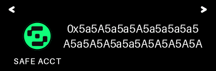 |
| 3 | `TXINFO` | 1 | id=TXINFO lab="TX INFO" cap="" \| r:Execute now \| r:Op: Call |  |
| 4 | `EMPTYCAL` | 1 | id=EMPTYCAL lab="EMPTY CALL" cap="" \| r:0xA5A5A5A5A5A5 \| r:A5A5A5A5a5a5a5 \| r:a5a5a5A5a5a5a5 | 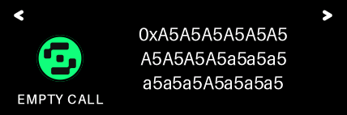 |
| 5 | `CONFIRM` | 1 | id=CONFIRM lab="" cap="CONFIRM?" |  |
| 6 | `MAXFEE` | 1 | id=MAXFEE lab="MAX FEE" cap="" \| r:Fees: max / tip \| r:10 gwei \| r:2 gwei | 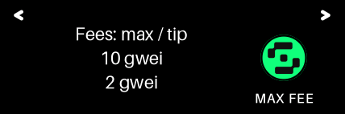 |
| 7 | `WORST` | 1 | id=WORST lab="WORST CASE" cap="" \| r:Worst-case: \| r:0.0045 ETH \| r:(gas: 450000) | 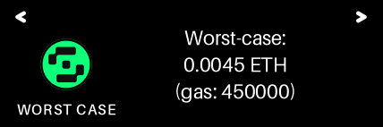 |
| 8 | `SIGNER` | 1 | id=SIGNER lab="SIGNER" cap="" \| s:Signer acct #0 \| r:0xBEe6A6E73E418D42eF3 \| r:82ECF8E8025740e97c2fE | 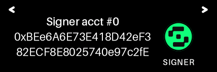 |
| 9 | `TARGET` | 1 | id=TARGET lab="TARGET" cap="" \| r:0x5a5A5a5a5A5a5a5a5a5 \| r:A5a5A5A5a5a5A5A5A5A5A | 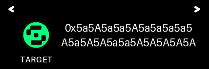 |
| 10 | `GASLANE` | 1 | id=GASLANE lab="GAS LANE" cap="" \| r:Call:50000 \| r:Verify:300000 \| r:PreVer:100000 |  |
| 10 | `GASLANE` | 2 | id=GASLANE lab="GAS LANE" cap="" \| r:Total:450000 |  |
| 11 | `FP8213` | 1 | id=FP8213 lab="ERC-8213" cap="" \| r:8213 Fingerprint \| r:CalldataDigest |  |
| 12 | `DIGEST` | 1 | id=DIGEST lab="DIGEST" cap="" \| r:0x65a2f079b0f8a8dab455a6 \| r:d59796e93aa75e2bb981b9 \| r:d2da4c074b1c3e8bc4c4 | 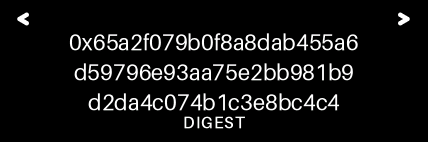 |
| 13 | `EXECUTE` | 1 | id=EXECUTE lab="" cap="EXECUTE SAFE TX?" | 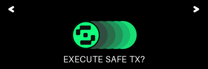 |

## Scenario 5: Safe approveHash clear-sign

| # | id | page | record text | frame |
|---|----|------|-------------|-------|
| 0 | `APPROVE` | 1 | id=APPROVE lab="" cap="APPROVE SAFE TX?" |  |
| 1 | `NETWORK` | 1 | id=NETWORK lab="" cap="" \| r:on Sepolia |  |
| 2 | `SAFEACCT` | 1 | id=SAFEACCT lab="SAFE ACCT" cap="" \| r:0x5aFE000000000000000 \| r:000000000000000000001 | 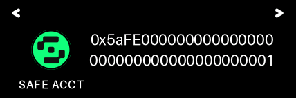 |
| 3 | `TXINFO` | 1 | id=TXINFO lab="TX INFO" cap="" \| r:Nonce: 17 \| r:Op: Call |  |
| 4 | `UNVERIF` | 1 | id=UNVERIF lab="UNVERIFIED" cap="" \| r:ERC-20 call \| r:token unknown |  |
| 5 | `CONFIRM` | 1 | id=CONFIRM lab="" cap="CONFIRM?" |  |
| 6 | `RAWAMT` | 1 | id=RAWAMT lab="RAW AMOUNT" cap="" \| r:250000000 units | 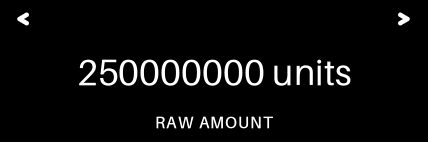 |
| 7 | `TO` | 1 | id=TO lab="TO" cap="" \| r:0xABaBaBaBABab \| r:ABabAbAbABAbAB \| r:abababaBaBABaB |  |
| 8 | `CONTRACT` | 1 | id=CONTRACT lab="CONTRACT" cap="" \| r:0xA0b86991c6218b36c1d \| r:19D4a2e9Eb0cE3606eB48 | 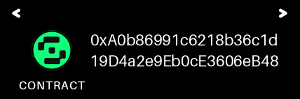 |
| 9 | `MAXFEE` | 1 | id=MAXFEE lab="MAX FEE" cap="" \| r:Fees: max / tip \| r:10 gwei \| r:2 gwei |  |
| 10 | `WORST` | 1 | id=WORST lab="WORST CASE" cap="" \| r:Worst-case: \| r:0.0045 ETH \| r:(gas: 450000) |  |
| 11 | `SIGNER` | 1 | id=SIGNER lab="SIGNER" cap="" \| s:Signer acct #0 \| r:0xBEe6A6E73E418D42eF3 \| r:82ECF8E8025740e97c2fE | 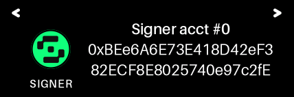 |
| 12 | `TARGET` | 1 | id=TARGET lab="TARGET" cap="" \| r:0x5aFE000000000000000 \| r:000000000000000000001 | 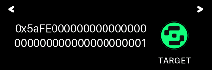 |
| 13 | `GASLANE` | 1 | id=GASLANE lab="GAS LANE" cap="" \| r:Call:50000 \| r:Verify:300000 \| r:PreVer:100000 | 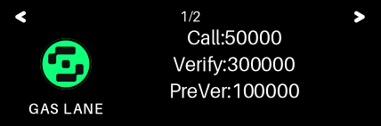 |
| 13 | `GASLANE` | 2 | id=GASLANE lab="GAS LANE" cap="" \| r:Total:450000 |  |
| 14 | `FP8213` | 1 | id=FP8213 lab="ERC-8213" cap="" \| r:8213 Fingerprint \| r:CalldataDigest |  |
| 15 | `DIGEST` | 1 | id=DIGEST lab="DIGEST" cap="" \| r:0x20d91e6a7ee38f31d0d8d8 \| r:88544c928f98b94e3e71b6 \| r:8934caef277f253c4600 | 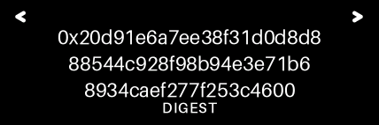 |
| 16 | `APPROVE` | 1 | id=APPROVE lab="" cap="APPROVE SAFE TX?" |  |

## Scenario 5q: Safe-wrapped CoW presign clear-sign

| # | id | page | record text | frame |
|---|----|------|-------------|-------|
| 0 | `APPROVE` | 1 | id=APPROVE lab="" cap="APPROVE SAFE TX?" |  |
| 1 | `NETWORK` | 1 | id=NETWORK lab="" cap="" \| r:on Sepolia |  |
| 2 | `SAFEACCT` | 1 | id=SAFEACCT lab="SAFE ACCT" cap="" \| r:0x5AFE000000000000000 \| r:000000000000000000002 |  |
| 3 | `TXINFO` | 1 | id=TXINFO lab="TX INFO" cap="" \| r:Nonce: 18 \| r:Op: Call |  |
| 4 | `COWORDER` | 1 | id=COWORDER lab="COW ORDER" cap="" \| r:SELL order \| r:owner: this Safe |  |
| 5 | `CONFIRM` | 1 | id=CONFIRM lab="" cap="CONFIRM?" |  |
| 6 | `SELLTOK` | 1 | id=SELLTOK lab="SELL TOKEN" cap="" \| r:0xA0b86991c6218b36c1d \| r:19D4a2e9Eb0cE3606eB48 | 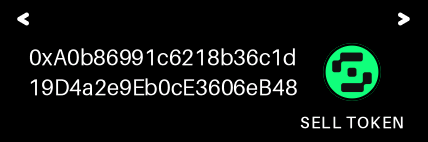 |
| 7 | `SELLAMT` | 1 | id=SELLAMT lab="SELL" cap="" \| r:0x0000000000000000000000 \| r:0000000000000000000000 \| r:0000000000003b9aca00 |  |
| 8 | `BUYTOK` | 1 | id=BUYTOK lab="BUY TOKEN" cap="" \| r:0xC02aaA39b223 \| r:FE8D0A0e5C4F27 \| r:eAD9083C756Cc2 | 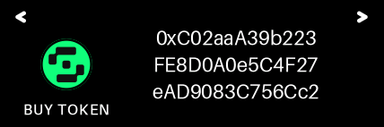 |
| 9 | `BUYAMT` | 1 | id=BUYAMT lab="BUY MIN" cap="" \| r:0x0000000000000000000000 \| r:0000000000000000000000 \| r:000006f05b59d3b20000 |  |
| 10 | `RECEIVER` | 1 | id=RECEIVER lab="RECEIVER" cap="" \| r:= the Safe | 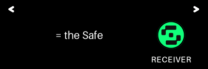 |
| 11 | `EXPIRES` | 1 | id=EXPIRES lab="EXPIRES" cap="" \| r:unix 1744830464 \| r:Partial: no |  |
| 12 | `FEE` | 1 | id=FEE lab="FEE (SELL)" cap="" \| r:0 units |  |
| 13 | `SOURCES` | 1 | id=SOURCES lab="SOURCES" cap="" \| r:sell: erc20 \| r:buy: erc20 |  |
| 14 | `APPDATA` | 1 | id=APPDATA lab="APP DATA" cap="" \| r:0x0000000000000000 \| r:0000000000000000 | 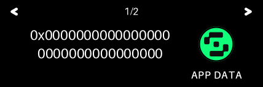 |
| 14 | `APPDATA` | 2 | id=APPDATA lab="APP DATA" cap="" \| r:0000000000000000 \| r:0000000000000000 | 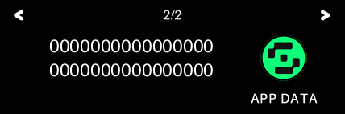 |
| 15 | `MAXFEE` | 1 | id=MAXFEE lab="MAX FEE" cap="" \| r:Fees: max / tip \| r:10 gwei \| r:2 gwei |  |
| 16 | `WORST` | 1 | id=WORST lab="WORST CASE" cap="" \| r:Worst-case: \| r:0.0045 ETH \| r:(gas: 450000) | 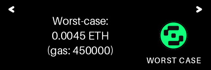 |
| 17 | `SIGNER` | 1 | id=SIGNER lab="SIGNER" cap="" \| s:Signer acct #0 \| r:0xBEe6A6E73E418D42eF3 \| r:82ECF8E8025740e97c2fE |  |
| 18 | `TARGET` | 1 | id=TARGET lab="TARGET" cap="" \| r:0x5AFE000000000000000 \| r:000000000000000000002 | 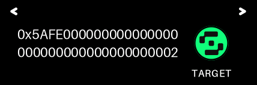 |
| 19 | `GASLANE` | 1 | id=GASLANE lab="GAS LANE" cap="" \| r:Call:50000 \| r:Verify:300000 \| r:PreVer:100000 |  |
| 19 | `GASLANE` | 2 | id=GASLANE lab="GAS LANE" cap="" \| r:Total:450000 |  |
| 20 | `FP8213` | 1 | id=FP8213 lab="ERC-8213" cap="" \| r:8213 Fingerprint \| r:CalldataDigest |  |
| 21 | `DIGEST` | 1 | id=DIGEST lab="DIGEST" cap="" \| r:0x3dee5d6d0369427ec99609 \| r:55135f1f30f980b42d9067 \| r:469b908aed5a14b959fd | 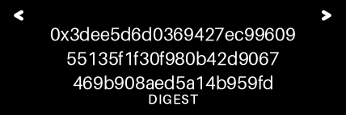 |
| 22 | `APPROVE` | 1 | id=APPROVE lab="" cap="APPROVE SAFE TX?" |  |

## Scenario 5s: multiSend (approve+presign) safe-wrapped CoW clear-sign

| # | id | page | record text | frame |
|---|----|------|-------------|-------|
| 0 | `APPROVE` | 1 | id=APPROVE lab="" cap="APPROVE SAFE TX?" |  |
| 1 | `NETWORK` | 1 | id=NETWORK lab="" cap="" \| r:on Sepolia |  |
| 2 | `SAFEACCT` | 1 | id=SAFEACCT lab="SAFE ACCT" cap="" \| r:0x5AFE000000000000000 \| r:000000000000000000002 | 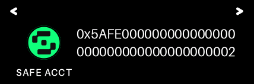 |
| 3 | `TXINFO` | 1 | id=TXINFO lab="TX INFO" cap="" \| r:Nonce: 20 \| r:Op: MultiSend x2 |  |
| 4 | `RECORD1` | 1 | id=RECORD1 lab="RECORD 1/2" cap="" \| r:0xA0b86991c6218b36c1d \| r:19D4a2e9Eb0cE3606eB48 |  |
| 5 | `CONFIRM` | 1 | id=CONFIRM lab="" cap="CONFIRM?" |  |
| 6 | `UNVERIF` | 1 | id=UNVERIF lab="UNVERIFIED" cap="" \| r:ERC-20 call \| r:token unknown | 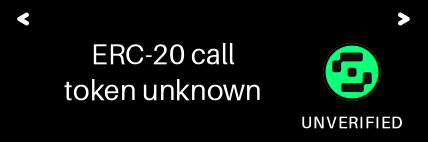 |
| 7 | `RAWAMT` | 1 | id=RAWAMT lab="RAW AMOUNT" cap="" \| r:1000000000 units | 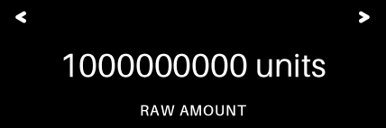 |
| 8 | `SPENDER` | 1 | id=SPENDER lab="SPENDER" cap="" \| s:CoW VaultRelayer \| r:0xC92E8bdf79f0507f65a \| r:392b0ab4667716BFE0110 | 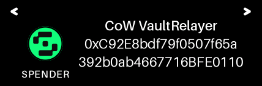 |
| 9 | `CONTRACT` | 1 | id=CONTRACT lab="CONTRACT" cap="" \| r:0xA0b86991c6218b36c1d \| r:19D4a2e9Eb0cE3606eB48 | 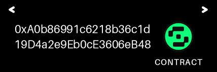 |
| 10 | `RECORD2` | 1 | id=RECORD2 lab="RECORD 2/2" cap="" \| r:0x9008D19f58AAbD9eD0D \| r:60971565AA8510560ab41 | 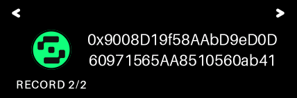 |
| 11 | `COWORDER` | 1 | id=COWORDER lab="COW ORDER" cap="" \| r:SELL order \| r:owner: this Safe | 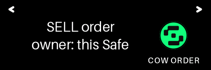 |
| 12 | `SELLTOK` | 1 | id=SELLTOK lab="SELL TOKEN" cap="" \| r:0xA0b86991c6218b36c1d \| r:19D4a2e9Eb0cE3606eB48 | 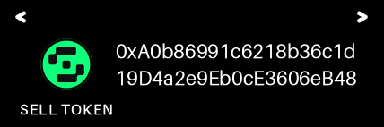 |
| 13 | `SELLAMT` | 1 | id=SELLAMT lab="SELL" cap="" \| r:0x0000000000000000000000 \| r:0000000000000000000000 \| r:0000000000003b9aca00 | 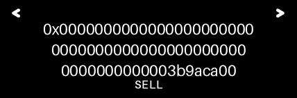 |
| 14 | `BUYTOK` | 1 | id=BUYTOK lab="BUY TOKEN" cap="" \| r:0xC02aaA39b223 \| r:FE8D0A0e5C4F27 \| r:eAD9083C756Cc2 | 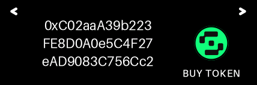 |
| 15 | `BUYAMT` | 1 | id=BUYAMT lab="BUY MIN" cap="" \| r:0x0000000000000000000000 \| r:0000000000000000000000 \| r:000006f05b59d3b20000 | 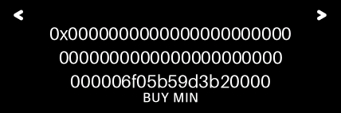 |
| 16 | `RECEIVER` | 1 | id=RECEIVER lab="RECEIVER" cap="" \| r:= the Safe |  |
| 17 | `EXPIRES` | 1 | id=EXPIRES lab="EXPIRES" cap="" \| r:unix 1744830464 \| r:Partial: no |  |
| 18 | `FEE` | 1 | id=FEE lab="FEE (SELL)" cap="" \| r:0 units |  |
| 19 | `SOURCES` | 1 | id=SOURCES lab="SOURCES" cap="" \| r:sell: erc20 \| r:buy: erc20 |  |
| 20 | `APPDATA` | 1 | id=APPDATA lab="APP DATA" cap="" \| r:0x0000000000000000 \| r:0000000000000000 | 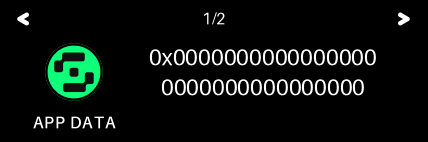 |
| 20 | `APPDATA` | 2 | id=APPDATA lab="APP DATA" cap="" \| r:0000000000000000 \| r:0000000000000000 | 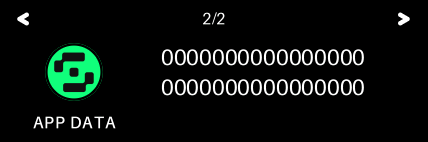 |
| 21 | `MAXFEE` | 1 | id=MAXFEE lab="MAX FEE" cap="" \| r:Fees: max / tip \| r:10 gwei \| r:2 gwei |  |
| 22 | `WORST` | 1 | id=WORST lab="WORST CASE" cap="" \| r:Worst-case: \| r:0.0045 ETH \| r:(gas: 450000) |  |
| 23 | `SIGNER` | 1 | id=SIGNER lab="SIGNER" cap="" \| s:Signer acct #0 \| r:0xBEe6A6E73E418D42eF3 \| r:82ECF8E8025740e97c2fE |  |
| 24 | `TARGET` | 1 | id=TARGET lab="TARGET" cap="" \| r:0x5AFE000000000000000 \| r:000000000000000000002 |  |
| 25 | `GASLANE` | 1 | id=GASLANE lab="GAS LANE" cap="" \| r:Call:50000 \| r:Verify:300000 \| r:PreVer:100000 |  |
| 25 | `GASLANE` | 2 | id=GASLANE lab="GAS LANE" cap="" \| r:Total:450000 |  |
| 26 | `FP8213` | 1 | id=FP8213 lab="ERC-8213" cap="" \| r:8213 Fingerprint \| r:CalldataDigest |  |
| 27 | `DIGEST` | 1 | id=DIGEST lab="DIGEST" cap="" \| r:0x01760b8c573c5a9b15a4bd \| r:64d44cb09516189a01ba1b \| r:b28f7229e0264e03682c | 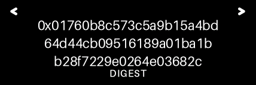 |
| 28 | `APPROVE` | 1 | id=APPROVE lab="" cap="APPROVE SAFE TX?" |  |

